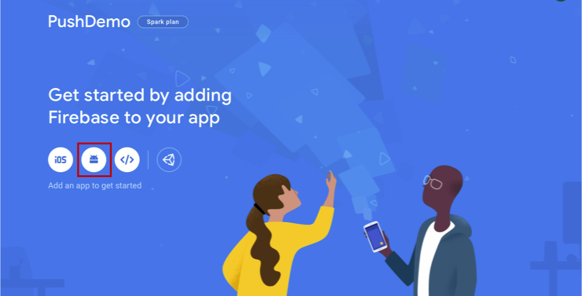
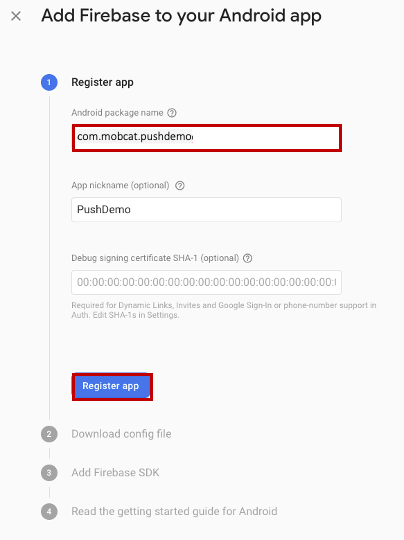
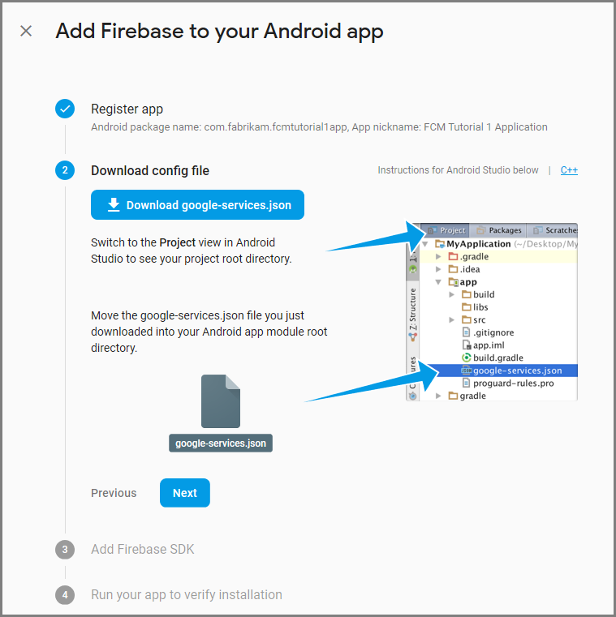
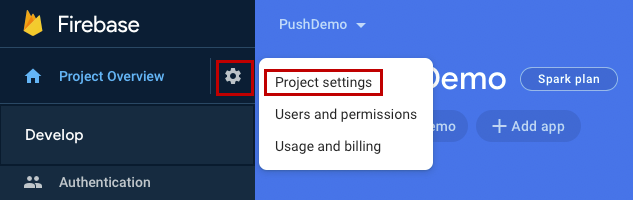
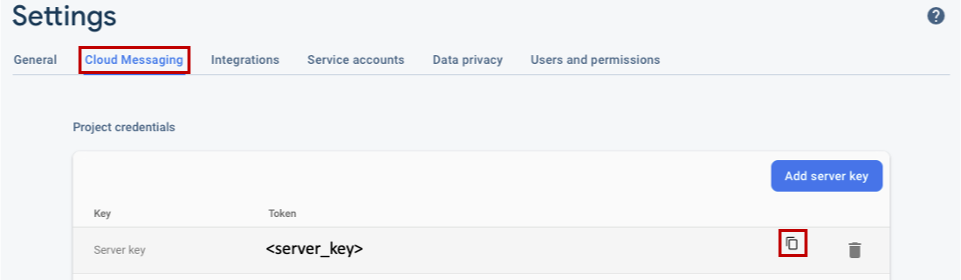

### Create a Firebase project and enable Firebase Cloud Messaging for Android

1. Sign in to the [Firebase console](https://firebase.google.com/console/). Create a new Firebase project entering **PushDemo** as the **Project name**.

    > [!NOTE]
    > A unique name will be generated for you. By default this is comprised of a lowercase variant of the name you provided plus a generated number separated by a dash. You can change this if you want provided it is still globally unique.

1. After you create your project, select **Add Firebase to your Android app**.

    

1. On the **Add Firebase to your Android app** page, take the following steps.
    1. For the **Android package name**, enter a name for your package. For example: `com.<organization_identifier>.<package_name>`.

        
    1. Select **Register app**.  
    1. Select **Download google-services.json**. Then save the file into a local folder for use later on and select **Next**.  

        
    1. Select **Next**.
    1. Select **Continue to console**

        > [!NOTE]
        > If the **Continue to console** button is not enabled, due to the *verify installation* check, then choose **Skip this step**.

1. In the Firebase console, select the cog for your project. Then select **Project Settings**.

    

    > [!NOTE]
    > If you haven't downloaded the **google-services.json** file, you can do download it on this page.

1. Switch to the **Cloud Messaging** tab at the top. Copy and save the **Server key** for later use. You use this value to configure your notification hub.

    
