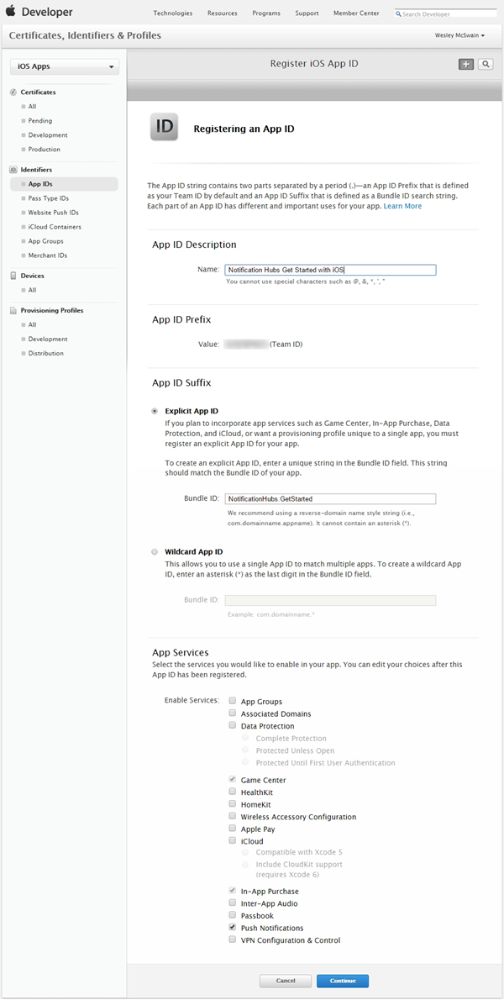
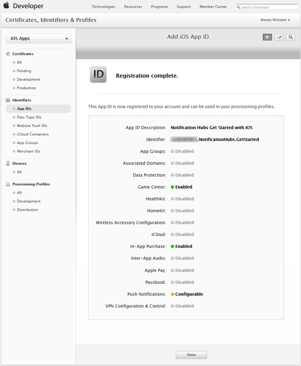
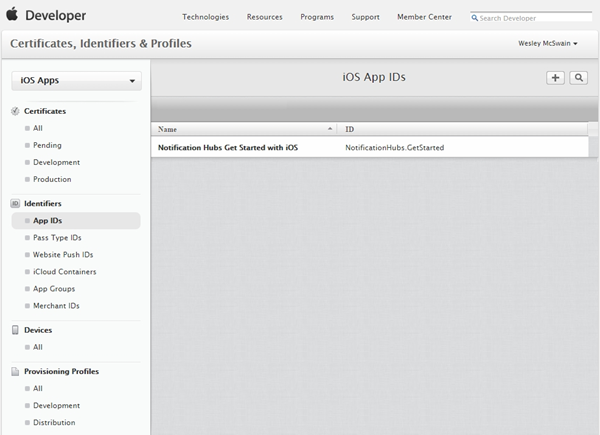
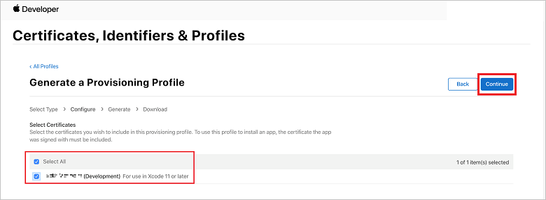

## Generate the certificate signing request file

The Apple Push Notification Service (APNS) uses certificates to authenticate your push notifications. Follow these instructions to create the necessary push certificate to send and receive notifications. For more information on these concepts, see the official [Apple Push Notification Service](https://developer.apple.com/library/archive/documentation/NetworkingInternet/Conceptual/RemoteNotificationsPG/APNSOverview.html) documentation.

Generate the Certificate Signing Request (CSR) file, which is used by Apple to generate a signed push certificate.

1. On your Mac, run the **Keychain Access** tool. It can be opened from the **Utilities** folder or the **Other** folder on the launch pad.
2. Click **Keychain Access**, expand **Certificate Assistant**, then click **Request a Certificate from a Certificate Authority...**.

    
3. Select your **User Email Address** and **Common Name**, make sure that **Saved to disk** is selected, and then click **Continue**. Leave the **CA Email Address** field blank as it is not required.

    

4. Type a name for the Certificate Signing Request (CSR) file in **Save As**, select the location in **Where**, then click **Save**.

    

    This action saves the CSR file in the selected location; the default location is in the Desktop. Remember the location chosen for the file.

Next, you register your app with Apple, enable push notifications, and upload the exported CSR to create a push certificate.

## Register your app for push notifications

To be able to send push notifications to an iOS app, you must register your application with Apple and also register for push notifications.  

1. If you have not already registered your app, navigate to the [iOS Provisioning Portal](http://go.microsoft.com/fwlink/p/?LinkId=272456) at the Apple Developer Center, sign in with your Apple ID, click **Identifiers**, then click **App IDs**, and finally click on the **+** sign to register a new app.

    

2. Update the following three fields for your new app and then click **Continue**:

    * **Name**: Type a descriptive name for your app in the **Name** field in the **App ID Description** section.
    * **Bundle Identifier**: Under the **Explicit App ID** section, enter a **Bundle Identifier** in the form `<Organization Identifier>.<Product Name>` as mentioned in the [App Distribution Guide](https://help.apple.com/xcode/mac/current/#/dev91fe7130a). The *Organization Identifier* and *Product Name* you use must match the organization identifier and product name you use when you create your XCode project. In the following screenshot *NotificationHubs* is used as an organization identifier and *GetStarted* is used as the product name. Making sure this value matches the value you use in your XCode project allows you to use the correct publishing profile with XCode.
    * **Push Notifications**: Check the **Push Notifications** option in the **App Services** section.

    

    This action generates your App ID and requests you to confirm the information. Click **Register** to confirm the new App ID.

    Once you click **Register**, you see the **Registration complete** screen, as shown in the following image. Click **Done**.

    

3. In the Developer Center, under App IDs, locate the app ID that you created, and click on its row.

    

    Clicking on the app ID displays the app details. Click the **Edit** button at the bottom.

    

4. Scroll to the bottom of the screen, and click the **Create Certificate...** button under the section **Development Push SSL Certificate**.

    

    You see the **Add iOS Certificate** assistant.

    > [!NOTE]
    > This tutorial uses a development certificate. The same process is used when registering a production certificate. Just make sure that you use the same certificate type when sending notifications.

5. Click **Choose File**, browse to the location where you saved the CSR file that you created in the first task, then click **Generate**.

    

6. After the certificate is created by the portal, click the **Download** button, and click **Done**.

    

    It downloads the certificate and saves it to your computer in your **Downloads** folder.

    

    > [!NOTE]
    > By default, the downloaded file a development certificate is named **aps_development.cer**.

7. Double-click the downloaded push certificate **aps_development.cer**.

    This action installs the new certificate in the Keychain, as shown in the following image:

    

    > [!NOTE]
    > The name in your certificate might be different, but it will be prefixed with **Apple Development iOS Push Services**.

8. In Keychain Access, right-click the new push certificate that you created in the **Certificates** category. Click **Export**, name the file, select the **.p12** format, and then click **Save**.

    

    Make a note of the file name and location of the exported .p12 certificate. It is used to enable authentication with APNS.

    > [!NOTE]
    > This tutorial creates a QuickStart.p12 file. Your file name and location might be different.

## Create a provisioning profile for the app

1. Back in the [iOS Provisioning Portal](http://go.microsoft.com/fwlink/p/?LinkId=272456), select **Provisioning Profiles**, select **All**, and then click the **+** (plus) button to create a new profile. You see the **Add iOS Provisioning Profile** wizard:

    

2. Select **iOS App Development** under **Development** as the provisioning profile type, and click **Continue**.

3. Next, select the app ID you created from the **App ID** drop-down list, and click **Continue**

    

4. In the **Select certificates** screen, select your usual development certificate used for code signing, and click **Continue**. This certificate is not the push certificate you created.

    

5. Next, select the **Devices** to use for testing, and click **Continue**

    

6. Finally, pick a name for the profile in **Profile Name**, click **Generate**.

    

7. When the new provisioning profile is created click to download it and install it on your Xcode development machine. Then click **Done**.

    
