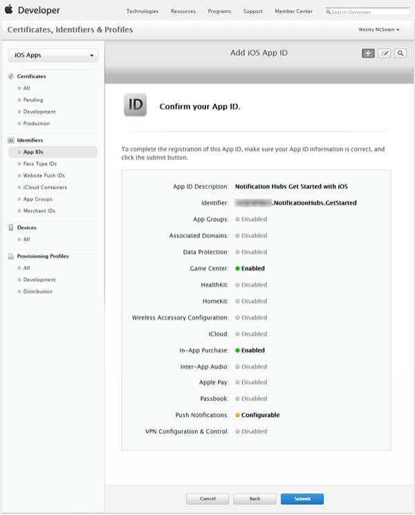

The Apple Push Notification Service (APNS) uses certificates to authenticate your push notifications. Follow these instructions to create the necessary push certificate to send and receive notifications. For the official APNS feature documentation, see [Apple Push Notification Service](http://go.microsoft.com/fwlink/p/?LinkId=272584).

##Generate the Certificate Signing Request file

First you must generate the Certificate Signing Request (CSR) file, which is used by Apple to generate a signed push certificate.

1. From the **Utilities** folder or the **Other** folder, run the Keychain Access tool.

2. Click **Keychain Access**, expand **Certificate Assistant**, then click **Request a Certificate from a Certificate Authority...**.

  	

3. Select your **User Email Address** and **Common Name** , make sure that **Saved to disk** is selected, and then click **Continue**. Leave the **CA Email Address** field blank as it is not required.

  	

4. Type a name for the Certificate Signing Request (CSR) file in **Save As**, select the location in **Where**, then click **Save**.

  	

  	This saves the CSR file in the selected location; the default location is in the Desktop. Remember the location chosen for this file.

Next, you will register your app with Apple, enable push notifications, and upload this exported CSR to create a push certificate.

##Register your app for push notifications

To be able to send push notifications to an iOS app, you must register your application with Apple and also register for push notifications.  

1. If you have not already registered your app, navigate to the <a href="http://go.microsoft.com/fwlink/p/?LinkId=272456" target="_blank">iOS Provisioning Portal</a> at the Apple Developer Center, log on with your Apple ID, click **Identifiers**, then click **App IDs**, and finally click on the **+** sign to register a new app.

   	

2. Type a descriptive name for your app in **App ID Description** name. 

	Under **Explicit App ID**, enter a **Bundle Identifier** in the form `<Organization Identifier>.<Product Name>` as mentioned in the [App Distribution Guide](http://go.microsoft.com/fwlink/?LinkId=613485). The *Organization Identifier* and *Product Name* you use must match the organization identifier and product name you will use when you create your XCode project. In the screeshot below *NotificationHubs* is used as a organization idenitifier and *GetStarted* is used as the product name. Making sure this matches the values you will use in your XCode project will allow you to use the correct publishing profile with XCode. 
	
	Check the **Push Notifications** option in the App Services section, and then click **Continue**.

	

   	This generates your app ID and requests you to confirm the information. Click **Submit**

    

   	Once you click **Submit**, you will see the **Registration complete** screen, as shown below. Click **Done**.

    

3. Locate the app ID that you just created, and click on its row.

   	

   	Clicking on the app ID will display the app details. Click the **Edit** button.

   	

4. Scroll to the bottom of the screen, and click the **Create Certificate...** button under the section **Development Push SSL Certificate**.

   	

   	This displays the "Add iOS Certificate" assistant.

    > [AZURE.NOTE] This tutorial uses a development certificate. The same process is used when registering a production certificate. Just make sure that you use the same certificate type when send notifications.

5. Click **Choose File**, browse to the location where you saved the CSR file that you created in the first task, then click **Generate**.

  	

6. After the certificate is created by the portal, click the **Download** button, and click **Done**.

  	

   	This downloads the signing certificate and saves it to your computer in your Downloads folder.

  	

    > [AZURE.NOTE] By default, the downloaded file a development certificate is named **aps_development.cer**.

7. Double-click the downloaded push certificate **aps_development.cer**.

   	This installs the new certificate in the Keychain, as shown below:

   	

    > [AZURE.NOTE] The name in your certificate might be different, but it will be prefixed with **Apple Development iOS Push Services:**.

Later, you will use this certificate to generate a .p12 file to enable authentication with APNS.

##Create a provisioning profile for the app

1. Back in the <a href="http://go.microsoft.com/fwlink/p/?LinkId=272456" target="_blank">iOS Provisioning Portal</a>, select **Provisioning Profiles**, select **All**, and then click the **+** button to create a new profile. This launches the **Add iOS Provisiong Profile** Wizard

   	

2. Select **iOS App Development** under **Development** as the provisiong profile type, and click **Continue**. 

3. Next, select the app ID you just created from the **App ID** drop-down list, and click **Continue**

   	

4. In the **Select certificates** screen, select your usual development certificate used for code signing, and click **Continue**. This is not the push certificate you just created.

   	

5. Next, select the **Devices** to use for testing, and click **Continue**

   	

6. Finally, pick a name for the profile in **Profile Name**, click **Generate**, and click **Done**

   	

  	This creates a new provisioning profile.

   	

