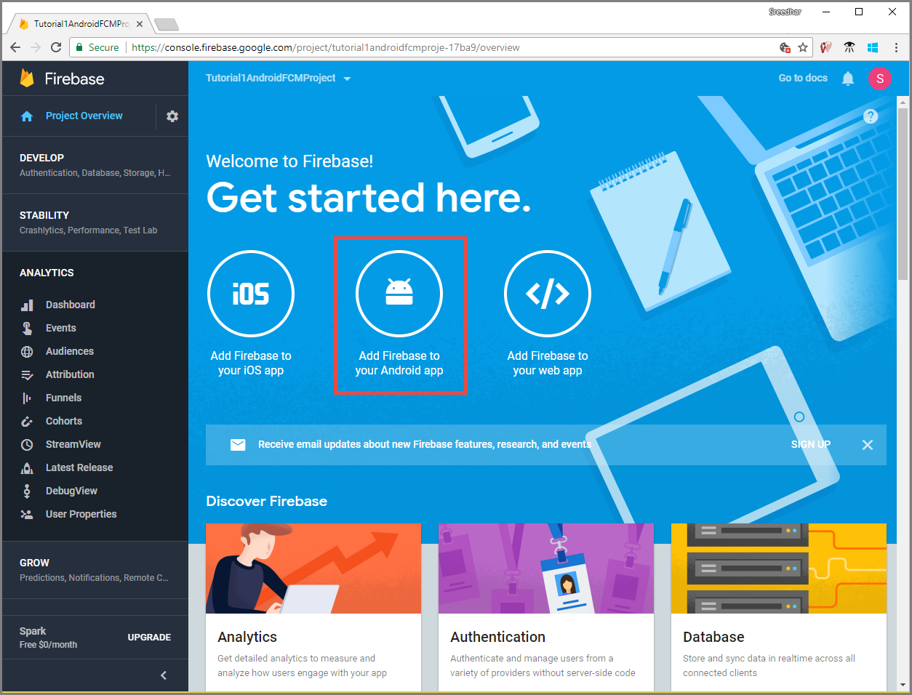
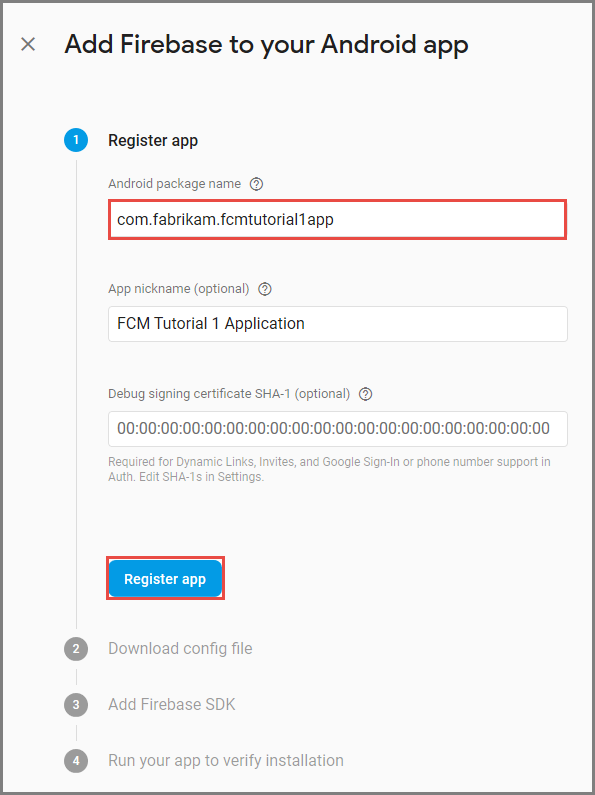
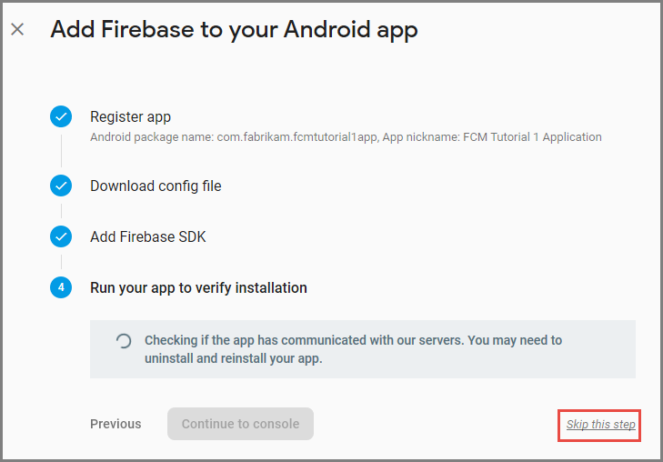
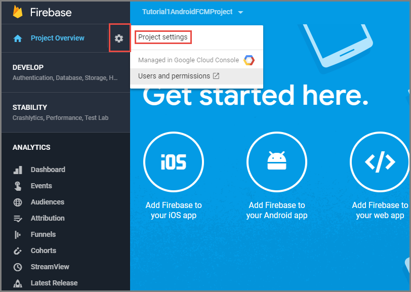

1. Sign in to the [Firebase console](https://firebase.google.com/console/). Create a new Firebase project if you don't already have one.
2. After you create your project, select **Add Firebase to your Android app**. 

    

3. On the **Add Firebase to your Android app** page, take the following steps: 
1. 
    1. For the **Android package name**, enter a name for your package. For example: `tutorials.tutoria1.xamarinfcmapp`. 

        

2. Select **Register app**. 
1. 
1. Select **Download google-services.json**. Then save the file into the **app** folder of your project and  select **Next**. 

    

6. Select **Next**. 
7. Select **Skip this step**. 

    

8. In the Firebase console, select the cog for your project. Then select **Project Settings**.

    

4. If you haven't downloaded the **google-services.json** file, you can do download it on this page. 

1. Switch to the **Cloud Messaging** tab at the top. 

1. Copy and save the **Legacy Server key** for later use. You use this value to configure your notification hub.
