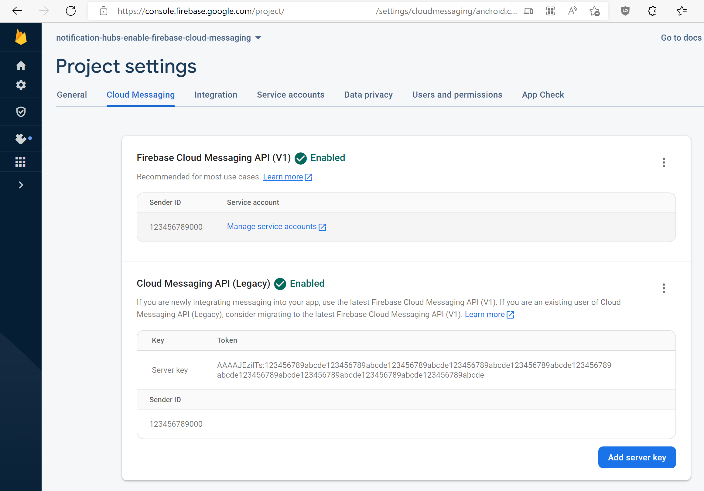

1. Sign in to the [Firebase console](https://console.firebase.google.com/). Create a new Firebase project if you don't already have one.
2. After you create your project, select **Add Firebase to your Android app**. 

    
3. On the **Add Firebase to your Android app** page, take the following steps: 
    1. For **Android package name**, copy the value of your **applicationId** in your application's build.gradle file. In this example, it's `com.fabrikam.fcmtutorial1app`. 

        
    2. Select **Register app**. 
4. Select **Download google-services.json**, save the file into the **app** folder of your project, and then select **Next**. 

    
5. Make the following **configuration changes** to your project in Android Studio. 
    1.  In your project-level build.gradle file (&lt;project&gt;/build.gradle), add the following statement to the **dependencies** section. 

        ```
        classpath 'com.google.gms:google-services:4.0.1'
        ```
    2. In your app-level build.gradle file (&lt;project&gt;/&lt;app-module&gt;/build.gradle), add the following statements to the **dependencies** section. 

        ```
        implementation 'com.google.firebase:firebase-core:16.0.8'
        implementation 'com.google.firebase:firebase-messaging:17.3.4'
        ```

    3. Add the following line to the end of the app-level build.gradle file after the dependencies section. 

        ```
        apply plugin: 'com.google.gms.google-services'
        ```        
    4. Select **Sync now** on the toolbar. 
 
        
6. Select **Next**. 
7. Select **Skip this step**. 

    
8. In the Firebase console, select the cog for your project. Then select **Project Settings**.

    
4. If you haven't downloaded the google-services.json file into the **app** folder of your Android Studio project, you can do so on this page. 
5. Switch to the **Cloud Messaging** tab at the top. 
6. Copy and save the **Server key** for later use. You use this value to configure your hub. 
7. If you do not see a **Server key** on the firebase Cloud Messaging tab, follow these additional steps.
    1. Click on the three-dots menu of the "Cloud Messaging API (Legacy) 🚫 Disabled" Heading
    2. Follow the offered link to "Manage API in Google Cloud Console".
    3. In google cloud console, press the button to enable the googlecloudmessaging API.
    3. Wait a few minutes.
    4. Go back to your firebase console project Cloud Messaging tab, and refresh the page.
    5. See that the Cloud Messaging API header has changed to "Cloud Messaging API (Legacy) ✅ Enabled" and now shows a Server Key.
    
    
    
