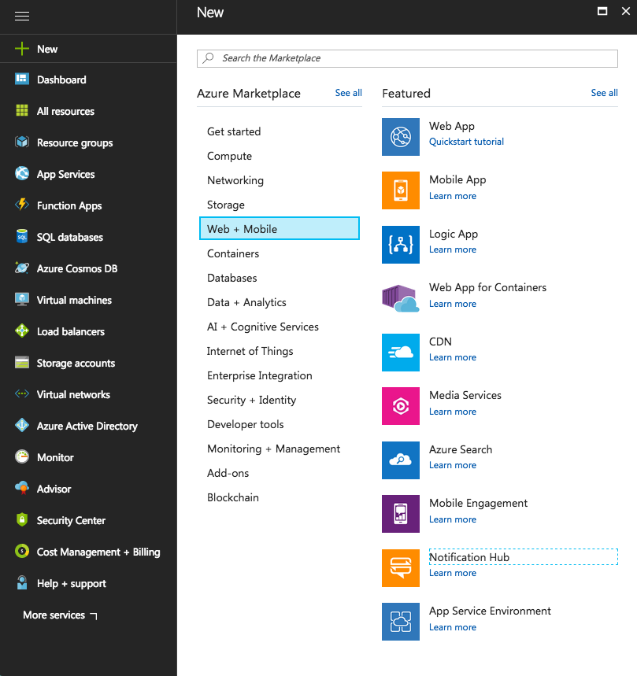
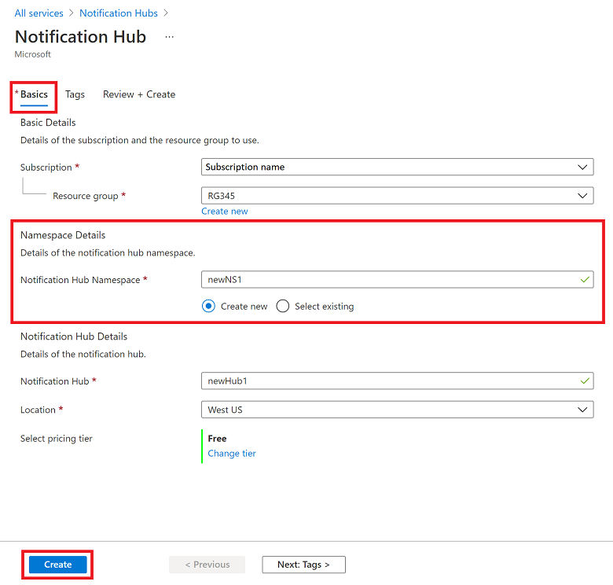
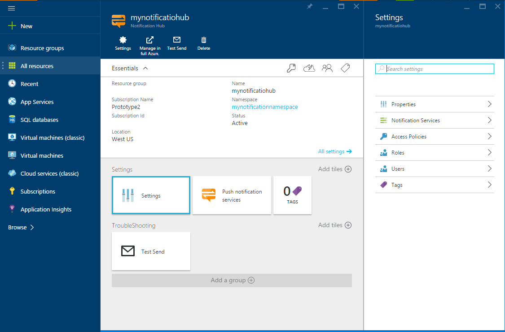
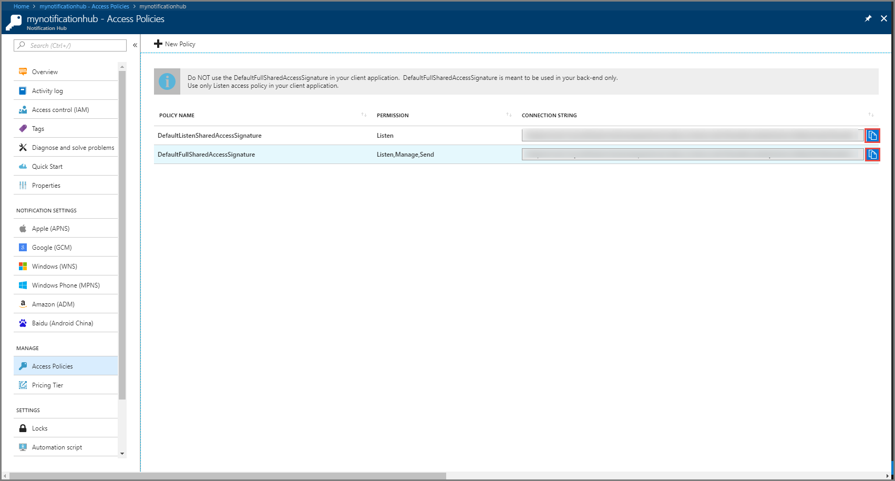

1. Log on to the [Azure Portal](https://portal.azure.com), and then click **+NEW** at the top left of the screen.

2. Click on **New**, then **Web + Mobile**. Scroll down if necessary and click **Notification Hub**.

   	

3. Make sure you specify a unique name in the **Notification Hub** field. Select your desired **Region**, **Subscription** and **Resource Group** (if you have one already). 
 
	If you already have a service bus namespace that you want to create the hub in, select it through the **Select Existing** option in the **Namespace** field.  Otherwise, you can use the default name which will be created based on the hub name as long as the namespace name is available. 

	Once ready, click **Create**.

   	

4. Once the namespace and notification hub are created, you will be taken to the respective portal page. 

   	
       
5. Click on **Settings** and then **Access Policies** - take note of the two connection strings that are made available to you, as you will need them to handle push notifications later.

   	
