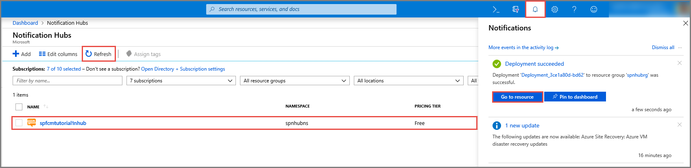

1. Sign in to the [Azure portal](https://portal.azure.com).

1. Select **All services** on the left menu, and then select **Notification Hubs** in the **Mobile** section. Select the star icon next to the service name to add the service to the **FAVORITES** section on the left menu. After you add **Notification Hubs** to **FAVORITES**, select it on the left menu.

      

1. On the **Notification Hubs** page, select **Add** on the toolbar.

      

1. On the **Notification Hub** page, do the following steps:

    1. Enter a name in **Notification Hub**.  

    1. Enter a name in **Create a new namespace**. A namespace contains one or more hubs.

    1. Select a value from the **Location** drop-down list box. This value specifies the location in which you want to create the hub.

    1. Select an existing resource group in **Resource Group**, or create a name for a new resource group.

    1. Select **Create**.

        

1. Select **Notifications** (the bell icon), and then select **Go to resource**. You can also refresh the list on the **Notification Hubs** page and select your hub.

      

1. Select **Access Policies** from the list. Note that the two connection strings are available to you. You'll need them later to handle push notifications.

      >[!IMPORTANT]
      >Do *not* use the **DefaultFullSharedAccessSignature** policy in your application. This is meant to be used in your back end only.
      >

      
