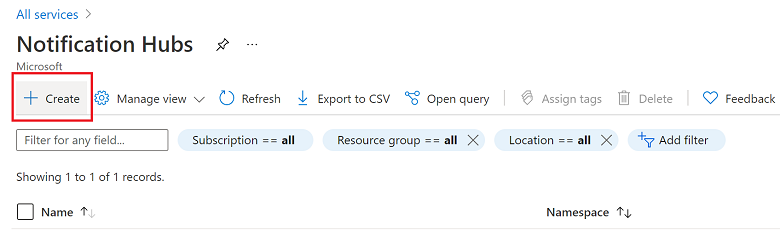

1. Sign in to the [Azure portal](https://portal.azure.com).

1. Select **All services** on the left menu, and then select **Notification Hubs** in the **Mobile** section. Select the star icon next to the service name to add the service to the **FAVORITES** section on the left menu. After you add **Notification Hubs** to **FAVORITES**, select it on the left menu.

      

1. On the **Notification Hubs** page, select **Create** on the toolbar.

      

1. In the **Basics** tab on the **Notification Hub** page, do the following steps:

    1. In **Subscription**, select the name of the Azure subscription you want to use, and then select an existing resource group, or create a new one.  

    1. Enter a unique name for the new namespace in **Namespace Details**. 

    1. A namespace contains one or more notification hubs, so type a name for the hub in **Notification Hub Details**. Or, select an existing namespace from the drop-down.

    1. Select a value from the **Location** drop-down list box. This value specifies the location in which you want to create the hub.

       :::image type="content" source="./media/notification-hubs-portal-create-new-hub/notification-hub-details.png" alt-text="Screenshot showing notification hub details." lightbox="./media/notification-hubs-portal-create-new-hub/notification-hub-details.png":::

    1. Review the [**Availability zones**](../articles/notification-hubs/notification-hubs-high-availability.md#zone-redundant-resiliency) option. If you chose a region that has availability zones, the check box is selected by default. Availability zones is a paid feature, so an additional fee is added to your tier.

    1. Choose a **Disaster recovery** option: **None**, **Paired recovery region**, or **Flexible recovery region**. If you choose **Paired recovery region**, the failover region is displayed. If you select **Flexible recovery region**, use the drop-down to choose from a list of recovery regions.

       :::image type="content" source="./media/notification-hubs-portal-create-new-hub/availability-zones.png" alt-text="Screenshot showing availability zone details." lightbox="./media/notification-hubs-portal-create-new-hub/availability-zones.png":::

    1. Select **Create**.

1. Select **Notifications** (the bell icon), and then select **Go to resource**. You can also refresh the list on the **Notification Hubs** page and select your hub.

      

1. Select **Access Policies** from the list. There are two connection strings available to you. You need them later to handle push notifications.

      >[!IMPORTANT]
      >Do *not* use the **DefaultFullSharedAccessSignature** policy in your application. This is meant to be used in your back end only.
      >

      
