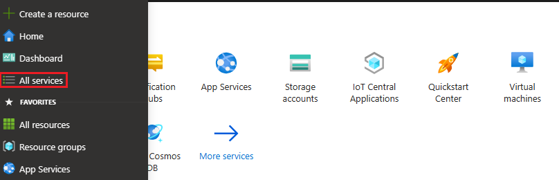
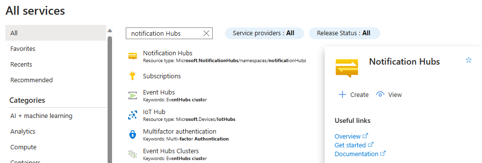

1. Sign in to the [Azure portal](https://portal.azure.com).

1. Select **All services** on the left menu.
    

1. Type **Notification Hubs** in the **Filter services** text box. Select the star icon next to the service name to add the service to the **FAVORITES** section on the left menu. Select **Notification Hubs**.

      

1. On the **Notification Hubs** page, select **Create** on the toolbar.

      

1. In the **Basics** tab on the **Notification Hub** page, do the following steps:

    1. In **Subscription**, select the name of the Azure subscription you want to use, and then select an existing resource group, or create a new one.  

    1. Enter a unique name for the new namespace in **Namespace Details**. 

    1. A namespace contains one or more notification hubs, so type a name for the hub in **Notification Hub Details**.

    1. Select a value from the **Location** drop-down list box. This value specifies the location in which you want to create the hub.

       :::image type="content" source="../articles/notification-hubs/media/create-notification-hub-portal/notification-hub-details.png" alt-text="Screenshot showing notification hub details." lightbox="../articles/notification-hubs/media/create-notification-hub-portal/notification-hub-details.png":::

    1. Review the [**Availability Zones**](../articles/notification-hubs/notification-hubs-high-availability.md#zone-redundant-resiliency) option. If you chose a region that has availability zones, the check box is selected by default. Availability Zones is a paid feature, so an additional fee is added to your tier.

       > [!NOTE]
       > Availability zones, and the ability to edit cross region disaster recovery options, are public preview features. Availability Zones are available for an additional cost; however, you will not be charged while the feature is in preview. For more information, see [High availability for Azure Notification Hubs](../articles/notification-hubs/notification-hubs-high-availability.md).

    1. Choose a **Disaster recovery** option: **None**, **Paired recovery region**, or **Flexible recovery region**. If you choose **Paired recovery region**, the failover region is displayed. If you select **Flexible recovery region**, use the drop-down to choose from a list of recovery regions. 

       :::image type="content" source="../articles/notification-hubs/media/create-notification-hub-portal/availability-zones.png" alt-text="Screenshot showing availability zone details." lightbox="../articles/notification-hubs/media/create-notification-hub-portal/availability-zones.png":::

    1. Select **Create**.

1. When the deployment is complete select **Go to resource**. 
