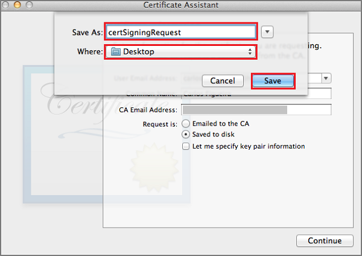
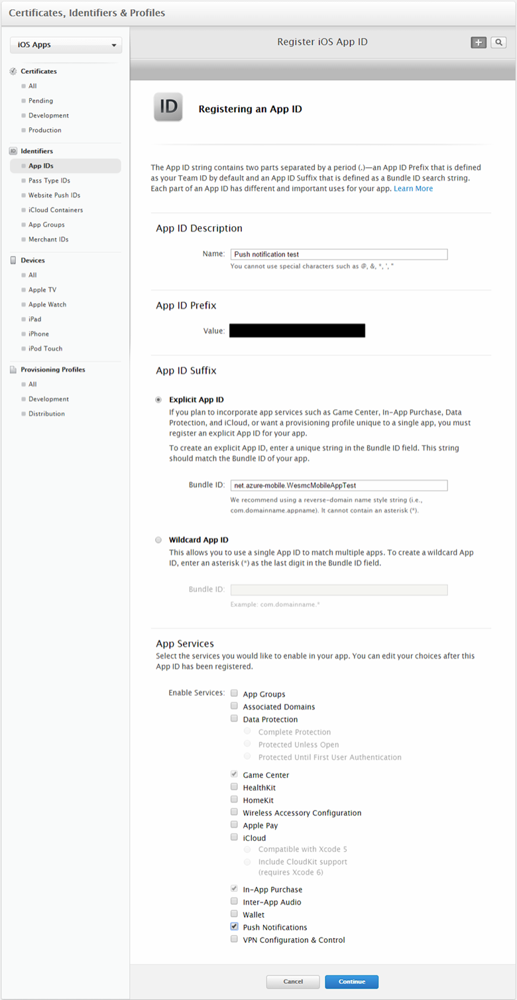
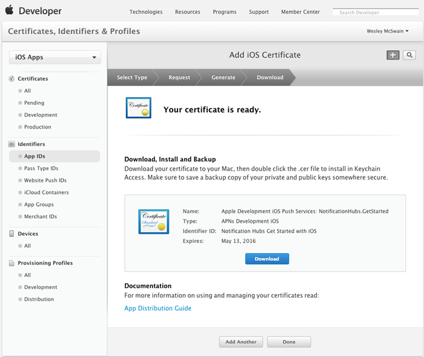
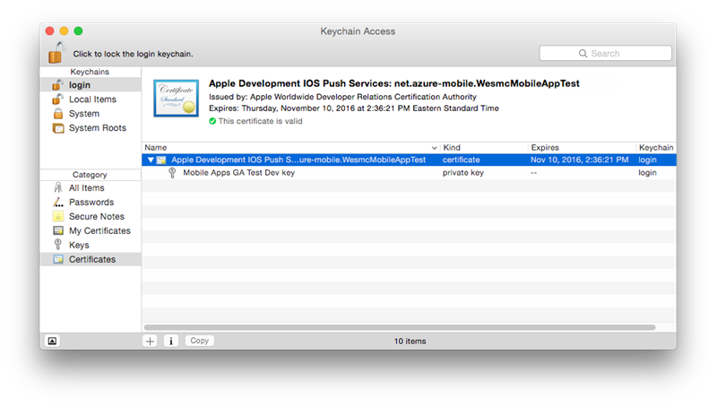
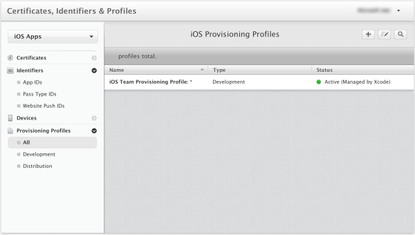
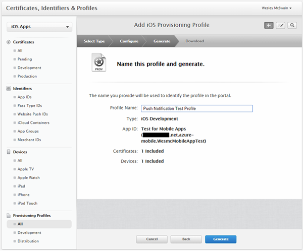

To register the app for push notifications through Apple Push Notification Service (APNS), you must create a push certificate, App ID, and provisioning profile for the project on Apple's developer portal.

The App ID contains the configuration settings that enable your app to send and receive push notifications. These settings include the push notification certificate that's needed to authenticate with APNS when the app is sending and receiving push notifications.

For more information about these concepts, see the official [Apple Push Notification Service](https://developer.apple.com/library/content/documentation/NetworkingInternet/Conceptual/RemoteNotificationsPG/APNSOverview.html#//apple_ref/doc/uid/TP40008194-CH8-SW1) documentation.

## Generate the certificate signing request file for the push certificate
These steps walk you through the process of creating the certificate signing request, which generates a push certificate that's used with APNS.

1. On your Mac, run the Keychain Access tool. It can be opened from the **Utilities** folder or the **Other** folder on the launch pad.

2. Select **Keychain Access**, expand **Certificate Assistant**, and then select **Request a Certificate from a Certificate Authority...**.

      

3. Select your **User Email Address** and **Common Name**.

4. Make sure that **Saved to disk** is selected, and then select **Continue**. Leave the **CA Email Address** field blank, since it's not required.

      

4. Type a name for the certificate signing request (CSR) file in **Save As**.
5. Select the location in **Where**, and then select **Save**.

      

      This saves the CSR file in the selected location. (The default location is your desktop.) Remember the location that you choose for this file.

## Register your app for push notifications
Create a new Explicit App ID for your application with Apple, and then configure it for push notifications.  

1. Navigate to the [iOS Provisioning Portal](http://go.microsoft.com/fwlink/p/?LinkId=272456) at the Apple Developer Center, and then sign in with your Apple ID.

2. Select **Identifiers**, and then select **App IDs**.

3. Select the **+** sign to register a new app.

      

4. Update the following three fields for your new app, and then select **Continue**:

   * **Name**: In the **App ID Description** section, type a descriptive name for your app.

   * **Bundle Identifier**: Under the **Explicit App ID** section, enter a **Bundle Identifier** in the form `<Organization Identifier>.<Product Name>`, as described in the [App Distribution Guide](https://developer.apple.com/library/mac/documentation/IDEs/Conceptual/AppDistributionGuide/ConfiguringYourApp/ConfiguringYourApp.html#//apple_ref/doc/uid/TP40012582-CH28-SW8). This must match what's used in the XCode, Xamarin, or Cordova project for your app.

   * **Push Notifications**: Select the **Push Notifications** option in the **App Services** section.

     

5. On the **Confirm your App ID screen**, review the settings. After you've verified them, select **Register**.

6. After submitting the new App ID, you see the **Registration complete** screen. Select **Done**.

7. In the Developer Center, under **App IDs**, locate the app ID that you created, and select its row. Selecting the app ID row displays the app details. Then select the **Edit** button at the bottom.

8. Scroll to the bottom of the screen, and then select the **Create Certificate...** button under the section **Development SSL Certificate**.

      

 This displays the "Add iOS Certificate" assistant.

   > [!NOTE]
   > This tutorial uses a development certificate. You use the same process when you register a production certificate. Make sure that you use the same certificate type when sending notifications.
   >

9. Select **Choose File**, and then browse to the location where you saved the CSR for your push certificate. Then select **Generate**.

      

10. After the certificate has been created by the portal, select the **Download** button.

      

       This downloads the signing certificate and saves it to your computer in your Downloads folder.

      

   > [!NOTE]
   > By default, the downloaded file is a development certificate that's named **aps_development.cer**.
   >
   >
11. Double-click the downloaded push certificate **aps_development.cer**. This installs the new certificate in the Keychain, as shown in the following screenshot:

       

   > [!NOTE]
   > The name in your certificate might be different, but it is prefixed with **Apple Development iOS Push Services**.
   >
   >
12. In **Keychain Access**, select the new push certificate that you created in the **Certificates** category. Select **Export**, name the file, select the **.p12** format, and then select **Save**.

    Remember the file name and location of the exported .p12 push certificate. You use it to enable authentication with APNS by uploading it on the Azure classic portal. If the **.p12** format option is not available, you might need to restart Keychain Access.

## Create a provisioning profile for the app
1. Back in the <a href="http://go.microsoft.com/fwlink/p/?LinkId=272456" target="_blank">iOS Provisioning Portal</a>, select **Provisioning Profiles**, select **All**, and then select the **+** button to create a profile. This launches the **Add iOS Provisioning** profile tool.

      

2. Under **Development**, select **iOS App Development** as the provisioning profile type, and then select **Continue**.

3. In the **App ID** drop-down list, select the app ID you created, and then select **Continue**.

      

4. In the **Select certificates** screen, select the development certificate that you use for code signing, and then select **Continue**. This is a signing certificate, not the push certificate you created.

       

5. Select the **Devices** to use for testing, and then select **Continue**.

     

6. Finally, in **Profile Name**, pick a name for the profile, and then select **Generate**.

      
