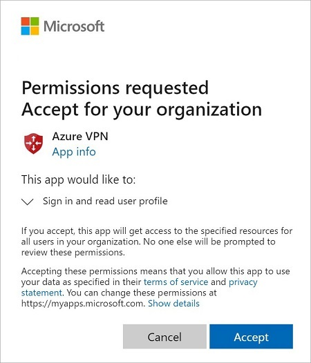
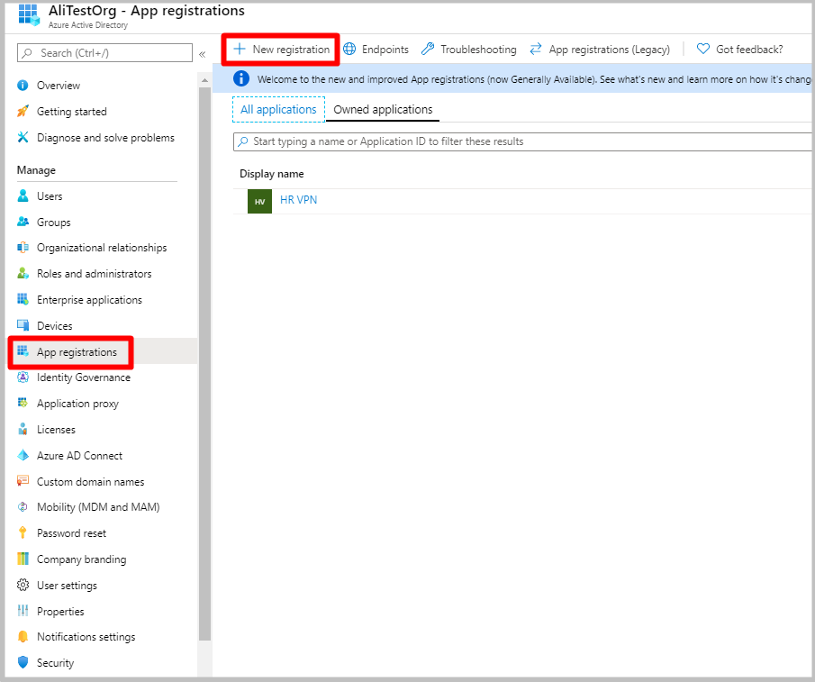
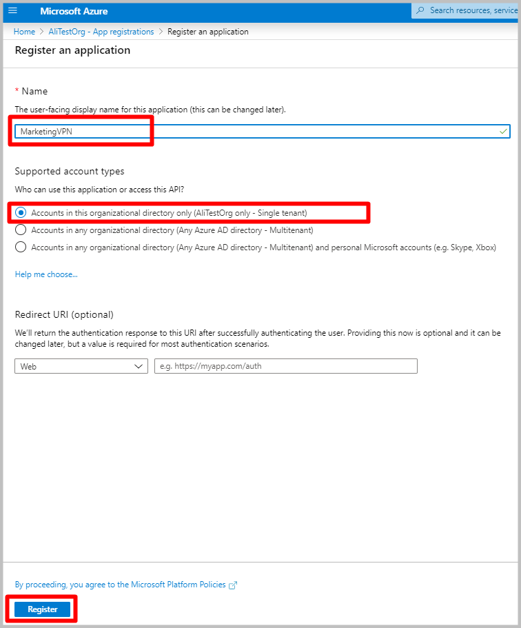
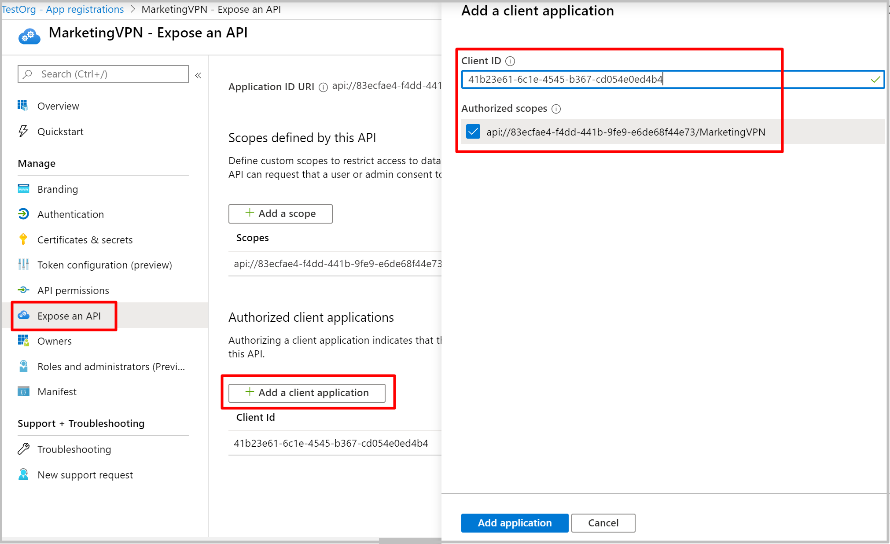
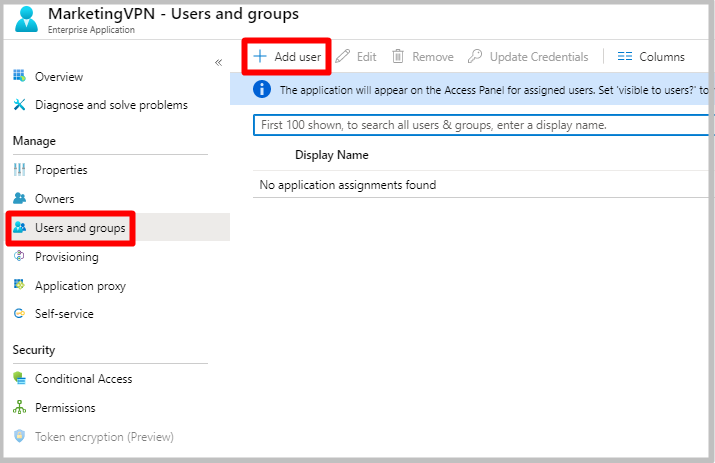
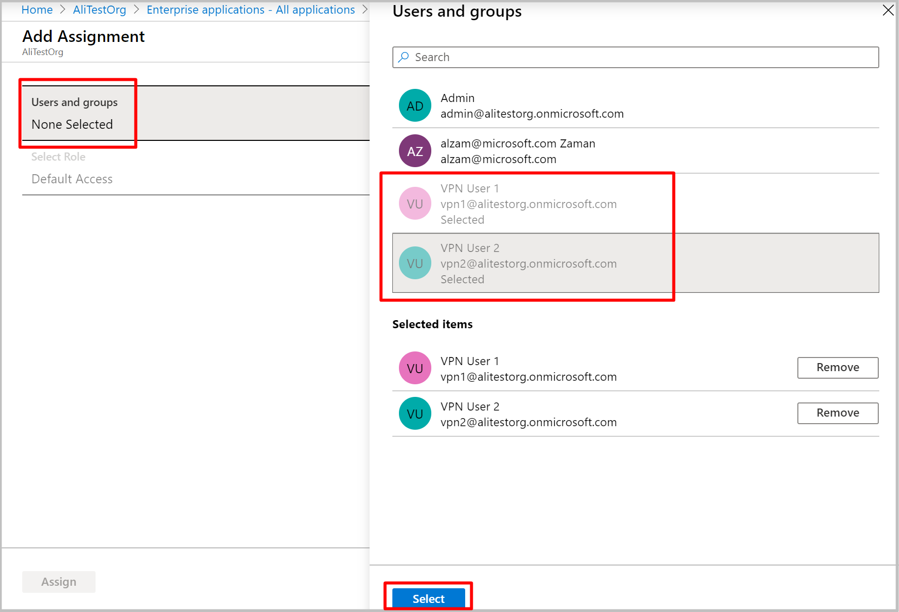

## <a name="tenant"></a>1. Create the Azure AD tenant

Create an Azure AD tenant using the steps in the [Create a new tenant](../articles/active-directory/fundamentals/active-directory-access-create-new-tenant.md) article:

* Organizational name
* Initial domain name

  Example:

   

## <a name="users"></a>2. Create tenant users

In this step, you create two Azure AD tenant users: One Global Admin account and one master user account. The master user account is used as your master embedding account (service account). When you create an Azure AD tenant user account, you adjust the Directory role for the type of user that you want to create. Use the steps in [this article](../articles/active-directory/fundamentals/add-users-azure-active-directory.md) to create at least two users for your Azure AD tenant. Be sure to change the **Directory Role** to create the account types:

* Global Admin
* User

## <a name="register-client"></a>3. Register the VPN Client

Register the VPN client in the Azure AD tenant.

1. Locate the Directory ID of the directory that you want to use for authentication. It is listed in the properties section of the Active Directory page.

    

2. Copy the Directory ID.

3. Sign in to the Azure portal as a user that is assigned the **Global administrator** role.

4. Next, give admin consent. Copy and paste the URL that pertains to your deployment location in the address bar of your browser:

    Public

    ```
    https://login.microsoftonline.com/common/oauth2/authorize?client_id=41b23e61-6c1e-4545-b367-cd054e0ed4b4&response_type=code&redirect_uri=https://portal.azure.com&nonce=1234&prompt=admin_consent
    ````

    Azure Government

    ```
    https://login.microsoftonline.us/common/oauth2/authorize?client_id=51bb15d4-3a4f-4ebf-9dca-40096fe32426&response_type=code&redirect_uri=https://portal.azure.us&nonce=1234&prompt=admin_consent
    ````

    Microsoft Cloud Germany

    ```
    https://login-us.microsoftonline.de/common/oauth2/authorize?client_id=538ee9e6-310a-468d-afef-ea97365856a9&response_type=code&redirect_uri=https://portal.microsoftazure.de&nonce=1234&prompt=admin_consent
    ````

    Azure China 21Vianet

    ```
    https://https://login.chinacloudapi.cn/common/oauth2/authorize?client_id=49f817b6-84ae-4cc0-928c-73f27289b3aa&response_type=code&redirect_uri=https://portal.azure.cn&nonce=1234&prompt=admin_consent
    ```

5. Select the **Global Admin** account if prompted.

    

6. Select **Accept** when prompted.

    

7. Under your Azure AD, in **Enterprise applications**, you will see **Azure VPN** listed.

     

## <a name="register-apps"></a>4. Register additional applications

In this step, you register additional applications for various users and groups.

1. Under your Azure Active Directory, click **App registrations** and then **+ New registration**.

    

2. On the **Register an application** page, enter the **Name**. Select the desired **Supported account types**, then click **Register**.

    

3. Once the new app has been registered, click **Expose an API** under the app blade.

4. Click **+ Add a scope**.

5. Leave the default **Application ID URI**. Click **Save and continue**.

    

6. Fill in the required fields and ensure that **State** is **Enabled**. Click **Add scope**.

    

7. Click **Expose an API** then **+ Add a client application**.  For **Client ID**, enter the following values depending on the cloud:

    - Enter **41b23e61-6c1e-4545-b367-cd054e0ed4b4** for Azure **Public**
    - Enter **51bb15d4-3a4f-4ebf-9dca-40096fe32426** for Azure **Government**
    - Enter **538ee9e6-310a-468d-afef-ea97365856a9** for Azure **Germany**
    - Enter **49f817b6-84ae-4cc0-928c-73f27289b3aa** for Azure **China 21Vianet**

8. Click **Add application**.

    

9. Copy the **Application (client) ID** from the **Overview** page. You will need this information to configure your VPN gateway(s).

    

10. Repeat the steps in this [register additional applications](#register-apps) section to create as many applications that are needed for your security requirement. Each application will be associated to a VPN gateway and can have a different set of users. Only one application can be associated to a gateway.

## <a name="assign-users"></a>5. Assign users to applications

Assign the users to your applications.

1. Under **Azure AD -> Enterprise applications**, select the newly registered application and click **Properties**. Ensure that **User assignment required?** is set to **yes**. Click **Save**.

    

2. On the app page, click **Users and groups**, and then click **+Add user**.

    

3. Under **Add Assignment**, click **Users and groups**. Select the users that you want to be able to access this VPN application. Click **Select**.

    
