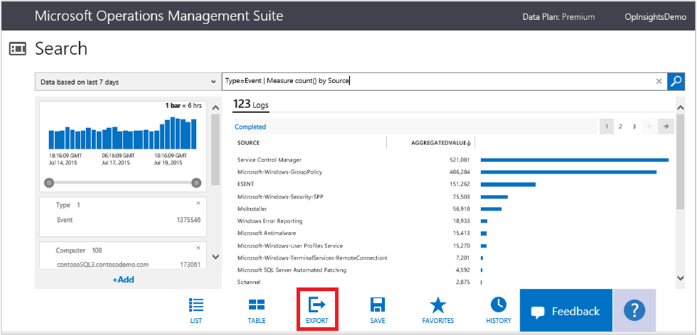
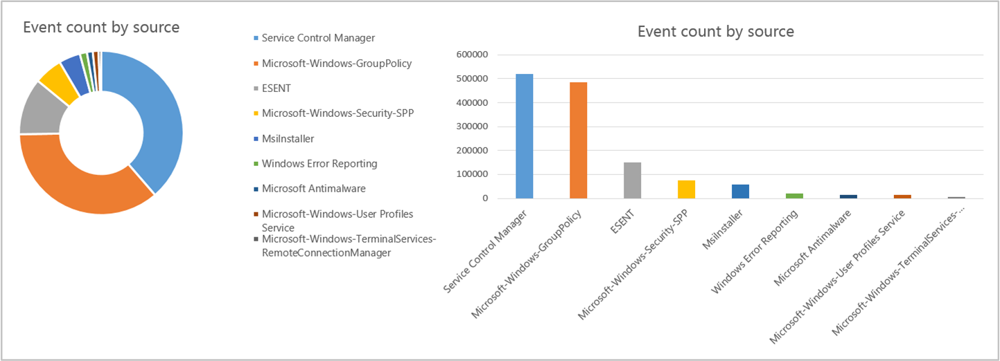

## Export search results

You can export your search results to Excel by saving a .csv file so you can discover more insights and visualize the data any way you like.

### To export search results

1. From any search result, click **Export** at the bottom of the search page.
    
2. In your browser, you are prompted to save the .csv file. Either open or save the file.
3. Open the file in Excel or other application. Review and customize your data any way you want.
    
