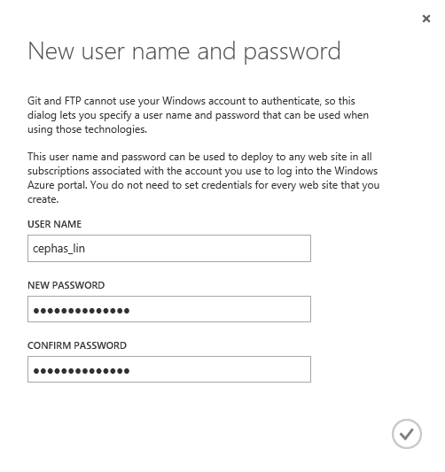

# Publish to Azure Websites with Git

Azure Websites supports continuous deployment from source code control and repository tools like BitBucket, CodePlex, Dropbox, Git, GitHub, Mercurial, and TFS. You can use these tools to maintain the content and code for your website, and then quickly and easily push changes to your site when you want.

In this article, you will learn how to use Git to publish directly from your local computer to an Azure Website (in Azure, this method of publishing is called **Local Git**). You will also learn how to enable continuous deployment from repository websites like BitBucket, CodePlex, Dropbox, GitHub, or Mercurial. For information about using TFS for continuous deployment, see [Continuous delivery to Azure using Visual Studio Online].

> [AZURE.NOTE] Many of the Git commands described in this article are performed automatically when creating a Website using the [Azure Command-Line Tools for Mac and Linux](../xplat-cli/).

## Step 1: Install Git

The steps required to install Git vary between operating systems. See [Installing Git] for operating system specific distributions and installation guidance.

> [AZURE.NOTE] On some operating systems, both a command-line and GUI version of Git will are available. The instructions provided in this article use the command-line version.

## Step 2: Create a local repository

Perform the following tasks to create a new Git repository.

1. Create a directory named MyGitRepository to contain your Git repository and website files.

2. Open a command-line, such as **GitBash** (Windows) or **Bash** (Unix Shell). On OS X systems you can access the command-line through the **Terminal** application.

3. From the command line, change to the MyGitRepository directory.

		cd MyGitRepository

4. Use the following command to initialize a new Git repository:

		git init

	This should return a message such as **Initialized empty Git repository in [path]**.

## Step 3: Add a web page

Azure Websites support applications created in a variety of programming languages. For this example, you will use a static .html file. For information on publishing websites in other programming languages to Azure, see the [Azure Developer Center].

1. Using a text editor, create a new file named **index.html** in the root of the Git repository (the MyGitRepository directory that you created earlier).

2. Add the following text as the contents for the index.html file and save it.

		Hello Git!

3. From the command-line, verify that you are in the root of your Git repository. Then use the following command to add the **index.html** file to the repository:

		git add index.html 

	> [AZURE.NOTE] You can find help for any git command by typing -help or --help after the command. For example, for parameter options for the add command, type 'git add -help' for command-line help or 'git add --help' for more detailed help.

4. Next, commit the changes to the repository by using the following command:

		git commit -m "Adding index.html to the repository"

	You should see output similar to the following:

		[master (root-commit) 369a79c] Adding index.html to the repository
		 1 file changed, 1 insertion(+)
		 create mode 100644 index.html

## Step 4: Enable the website repository

Perform the following steps to enable a Git repository for your website by using the Azure portal:

1. Login to the [Azure portal].

2. Click the NEW button to create a new website for which you will enable a repository.

2. Wait until the website creation process is finished in the **Websites** view, and then select the website.

	![An image displaying a selected web site][portal-select-website]

3. Select the **DASHBOARD** tab.

4. In the **quick glance** section, select **Set up deployment from source control**.  The following **SET UP DEPLOYMENT** dialog appears.

	![git-WhereIsYourSourceCode][git-WhereIsYourSourceCode]

4. Choose **Local Git**, and then click the **Next** arrow.

4. If this is your first time setting up a repository in Azure, you need to create login credentials for it. You will use them to log into the Azure repository and push changes from your local Git repository. 

	
	
5. After a short delay, you should be presented with a message that your repository is ready. 

	![git-instructions][git-instructions]

## Step 5: Deploy your project

* [Pushing local files to Azure (Local Git)](#Step6)
* [Deploy files from a repository web site like BitBucket, CodePlex, Dropbox, GitHub, or  Mercurial](#Step7)
* [Deploy a Visual Studio solution from BitBucket, CodePlex, Dropbox, GitHub, or  Mercurial](#Step75)

### Push local files to Azure (Local Git)

At this point, the portal displays instructions for initializing a local repository and adding files. You have already done this in the previous steps in this topic. However, if you have not set up your deployment credentials, you must go back to the **DASHBOARD** tab in the portal and click **Reset your deployment credentials**.

Use the following steps to publish your website to Azure using Local Git:

1. Using the command-line, verify that you are in the root of your local Git repository that contains the previously created index.html file.

2. Copy git remote add command listed in step 3 of the instructions returned by the portal. It will look similar to the following command:

		git remote add azure https://username@needsmoregit.scm.azurewebsites.net:443/NeedsMoreGit.git

    > [AZURE.NOTE] The **remote** command adds a named reference to a remote repository. In this example, it creates a reference named 'azure' for your Azure Website repository.

1. Use the following from the command-line to push the current repository contents from the local repository to the 'azure' remote:

		git push azure master

	You will be prompted for the password you created earlier when you reset your deployment credentials in the portal. Enter the password (note that Gitbash does not echo asterisks to the console as you type your password). You should see output similar to the following:

		Counting objects: 6, done.
		Compressing objects: 100% (2/2), done.
		Writing objects: 100% (6/6), 486 bytes, done.
		Total 6 (delta 0), reused 0 (delta 0)
		remote: New deployment received.
		remote: Updating branch 'master'.
		remote: Preparing deployment for commit id '369a79c929'.
		remote: Preparing files for deployment.
		remote: Deployment successful.
		To https://username@needsmoregit.scm.azurewebsites.net:443/NeedsMoreGit.git
		* [new branch]		master -> master

	> [AZURE.NOTE] The repository created for your Azure website expects push requests to target the <strong>master</strong> branch of its repository, which will then be used as the content of the website.

2. In the portal, click the **BROWSE** link at the bottom of the portal to verify that the **index.html** has been deployed. A page containing 'Hello Git!' will appear.

	![A webpage containing 'Hello Git!'][hello-git]

3. Using a text editor, change the **index.html** file so that it contains 'Yay!', and then save the file.

4. Use the following commands from the command-line to **add** and **commit** the changes, and then **push** the changes to the remote repository:

		git add index.html
		git commit -m "Celebration"
		git push azure master

	Once the **push** command has completed, refresh the browser (you may have to press Ctrl+F5 for the browser to properly refresh) and note that the content of the page now reflects the latest commit change.

	![A webpage containing 'Yay!'][yay]

### Deploy files from a repository website like BitBucket, CodePlex, Dropbox, GitHub, or Mercurial

Pushing local files to Azure by using Local Git allows you to manually push updates from a local project to your Azure Website, while deploying from BitBucket, CodePlex, Dropbox, GitHub, or  Mercurial results in a continuous deployment process where Azure will pull in the most recent updates from your project.

While both methods result in your project being deployed to an Azure Website, continuous deployment is useful when you have multiple people working on a project and want to ensure that the latest version is always published regardless of who made the most recent update. Continuous deployment is also useful if you are using one of the above mentioned tools as the central repository for your application.

Deploying files from either GitHub, CodePlex, or BitBucket requires that you have published your local project to one of these services. For more information on publishing your project to these services, see [Create a Repo (GitHub)], [Using Git with CodePlex], [Create a Repo (BitBucket)], [Using Dropbox to Share Git Repositories], or [Quick Start - Mercurial].

1. First put your website files into the selected repository that will be used for continuous deployment.

2. In the Azure Portal for your website,  go to the **DASHBOARD** tab. In the **quick glance** section, select **Set up deployment from source control**.  The **Set Up Deployment dialog** appears that asks **Where is your source code?**. 

2. Choose the source control method that you want to use for continuous deployment.
	
3. When prompted, enter your credentials for the service you selected.

4. After you have authorized Azure to access your account, you will be prompted with a list of repositories. 

	![git-ChooseARepositoryToDeploy][git-ChooseARepositoryToDeploy]
  
5. Select the repository that you want to associate with your Azure Website. Click the checkmark to continue.

	> [AZURE.NOTE] When enabling continuous deployment with GitHub or BitBucket, both public and private projects will be displayed.

6. Azure creates an association with the selected repository, and pulls in the files from the master branch. After this process completes, the **deployment history** on the **Deployments** page will show an **Active Deployment** message like the following:

	![git-githubdeployed][git-githubdeployed]

7. At this point your project has been deployed from your repository of choice to your Azure website. To verify that the site is active, click the **Browse** link at the bottom of the portal. The browser should navigate to the website.

8. To verify that continuous deployment is occurring, make a change to your project and then push the update to the repository you have associated with this website. Your website should update to reflect the changes shortly after the push to the repository completes. You can verify that it has pulled in the update on the **Deployments** page of your Website.

	![git-GitHubDeployed-Updated][git-GitHubDeployed-Updated]

### Deploy a Visual Studio solution from BitBucket, CodePlex, Dropbox, GitHub, or Mercurial

Pushing a Visual Studio solution to an Azure Website is just as easy as pushing a simple index.html file. The Azure Websites deployment process streamlines all the details, including restore NuGet dependencies and building the application binaries. You can follow the source control best practices of maintaining code only in your Git repository, and let Azure Website deployment take care of the rest.

The steps for pushing your Visual Studio solution to an Azure Website is the same as in the [previous section](#Step7), provided that you configure your solution and repository as follows:

-	In your repository root, add a `.gitignore` file, then specify all files and folders that you want to exclude from your repository, such as the `Obj`, `Bin`, and `packages` folders (see [gitignore documentation](http://git-scm.com/docs/gitignore) for formatting information). For example:

		[Oo]bj/
		[Bb]in/
		*.user
		/TestResults
		*.vspscc
		*.vssscc
		*.suo
		*.cache
		*.csproj.user
		packages/*
		App_Data/
		/apps
		msbuild.log
		_app/
		nuget.exe

	>[AZURE.NOTE] If you use GitHub, you can optionally generate a Visual Studio specific .gitignore file when you create your repository, which includes all the common temporary files, build results, etc. You can then customize it to suit your specific needs.

-	Add the entire solution's directory tree to your repository, with the .sln file in the repository root.

-	In your Visual Studio solution, [enable NuGet Package Restore](http://docs.nuget.org/docs/workflows/using-nuget-without-committing-packages) to make Visual Studio automatically restore missing packages.

Once you have set up your repository as described, and configured your Azure Website for continuous publishing from one of the online Git repositories, you can develop your ASP.NET application locally in Visual Studio and continuously deploy your code simply by pushing your changes to your online Git repository.

<h4>How continuous deployment works</h4>
Continuous deployment works by providing the **DEPLOYMENT TRIGGER URL** found in the **deployments** section of your site's **Configure** tab.

![git-DeploymentTrigger][git-DeploymentTrigger]

When updates are made to your repository, a POST request is sent to this URL, which notifies your Azure Website that the repository has been updated. At this point it retrieves the update and deploys it to your website.

For more information on the engine behind the Git deployment process for Azure Websites, see [Project Kudu](https://github.com/projectkudu/kudu/wiki).

<h4>Specifying the branch to use</h4>

When you enable continuous deployment, it will default to the **master** branch of the repository. If you want to use a different branch, perform the following steps:

1. In the portal, select your website and then select **CONFIGURE**.

2. In the **deployments** section of the page, enter the branch you wish to use in the **BRANCH TO DEPLOY** field, and then hit enter. Finally, click **SAVE**.

	Azure should immediately begin updating based on changes to the new branch.

#### Disabling continuous deployment

Continuous deployment can be disabled from the Azure **Dashboard**. Under the **quick glance** section, choose the option to disconnect from the repository that you are using:

![git-DisconnectFromGitHub][git-DisconnectFromGitHub]	

After answering **Yes** to the confirmation message, you can return to **quick glance** and click **Set up deployment from source control** if you would like to set up publishing from another source.

## Troubleshooting

The following are errors or problems commonly encountered when using Git to publish to an Azure website:

****

**Symptom**: Unable to access '[siteURL]': Failed to connect to [scmAddress]

**Cause**: This error can occur if the website is not up and running.

**Resolution**: Start the website in the Azure portal. Git deployment will not work unless the website is running. 

****

**Symptom**: Couldn't resolve host 'hostname'

**Cause**: This error can occur if the address information entered when creating the 'azure' remote was incorrect.

**Resolution**: Use the `git remote -v` command to list all remotes, along with the associated URL. Verify that the URL for the 'azure' remote is correct. If needed, remove and recreate this remote using the correct URL.

****

**Symptom**: No refs in common and none specified; doing nothing. Perhaps you should specify a branch such as 'master'.

**Cause**: This error can occur if you do not specify a branch when performing a git push operation, and have not set the push.default value used by Git.

**Resolution**: Perform the push operation again, specifying the master branch. For example:

	git push azure master

****

**Symptom**: src refspec [branchname] does not match any.

**Cause**: This error can occur if you attempt to push to a branch other than master on the 'azure' remote.

**Resolution**: Perform the push operation again, specifying the master branch. For example:

	git push azure master

****

**Symptom**: Error - Changes commited to remote repository but your website not updated.

**Cause**: This error can occur if you are deploying a Node.js application containing a package.json file that specifies additional required modules.

**Resolution**: Additional messages containing 'npm ERR!' should be logged prior to this error, and can provide additional context on the failure. The following are known causes of this error and the corresponding 'npm ERR!' message:

* **Malformed package.json file**: npm ERR! Couldn't read dependencies.

* **Native module that does not have a binary distribution for Windows**:

	* npm ERR! \`cmd "/c" "node-gyp rebuild"\` failed with 1

		OR

	* npm ERR! [modulename@version] preinstall: \`make || gmake\`

## Additional Resources

* [How to use PowerShell for Azure]
* [How to use the Azure Command-Line Tools for Mac and Linux]
* [Git Documentation]
* [Project Kudu](https://github.com/projectkudu/kudu/wiki)

[Azure Developer Center]: /develop/overview/
[Azure portal]: http://manage.windowsazure.com
[Git website]: http://git-scm.com
[Installing Git]: http://git-scm.com/book/en/Getting-Started-Installing-Git
[How to use PowerShell for Azure]: ../install-configure-powershell/
[How to use the Azure Command-Line Tools for Mac and Linux]: ../xplat-cli/
[Git Documentation]: http://git-scm.com/documentation

[portal-select-website]: ./media/publishing-with-git/git-select-website.png
[git-WhereIsYourSourceCode]: ./media/publishing-with-git/git-WhereIsYourSourceCode.png
[git-instructions]: ./media/publishing-with-git/git-instructions.png
[portal-deployment-credentials]: ./media/publishing-with-git/git-deployment-credentials.png

[git-ChooseARepositoryToDeploy]: ./media/publishing-with-git/git-ChooseARepositoryToDeploy.png
[hello-git]: ./media/publishing-with-git/git-hello-git.png
[yay]: ./media/publishing-with-git/git-yay.png
[git-githubdeployed]: ./media/publishing-with-git/git-GitHubDeployed.png
[git-GitHubDeployed-Updated]: ./media/publishing-with-git/git-GitHubDeployed-Updated.png
[git-DisconnectFromGitHub]: ./media/publishing-with-git/git-DisconnectFromGitHub.png
[git-DeploymentTrigger]: ./media/publishing-with-git/git-DeploymentTrigger.png
[Create a Repo (GitHub)]: https://help.github.com/articles/create-a-repo
[Using Git with CodePlex]: http://codeplex.codeplex.com/wikipage?title=Using%20Git%20with%20CodePlex&referringTitle=Source%20control%20clients&ProjectName=codeplex
[Create a Repo (BitBucket)]: https://confluence.atlassian.com/display/BITBUCKET/Create+an+Account+and+a+Git+Repo
[Quick Start - Mercurial]: http://mercurial.selenic.com/wiki/QuickStart
[Using Dropbox to Share Git Repositories]: https://gist.github.com/trey/2722927
[Continuous delivery to Azure using Visual Studio Online]: ../cloud-services-continuous-delivery-use-vso/
