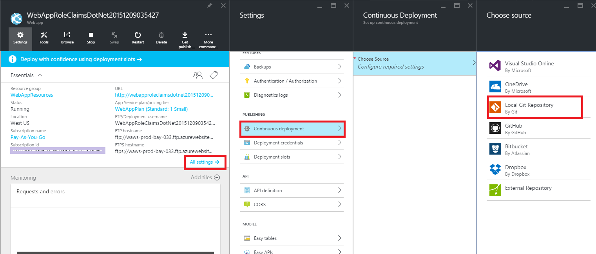
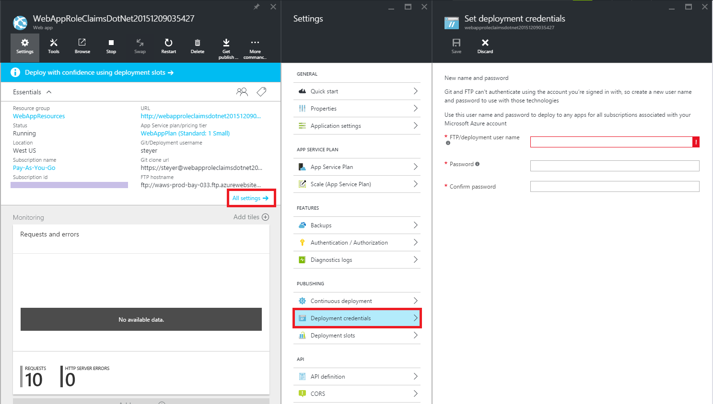
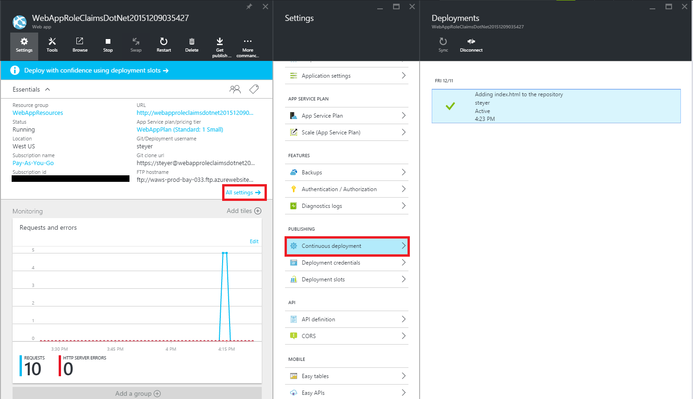
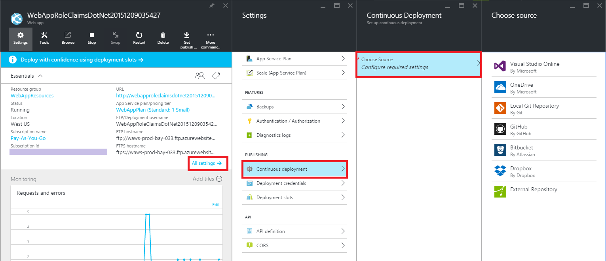
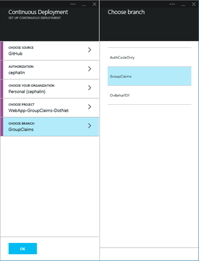
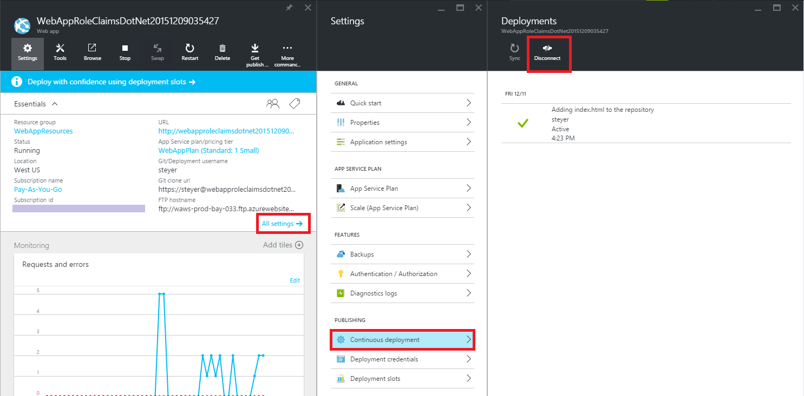

# Continuous deployment using GIT in Azure App Service

[Azure App Service](http://go.microsoft.com/fwlink/?LinkId=529714) supports continuous deployment to Web Apps from source code control and repository tools like BitBucket, CodePlex, Dropbox, Git, GitHub, Mercurial, and TFS. You can use these tools to maintain the content and code for your application, and then quickly and easily push changes to your Azure web app when you want.

In this article, you will learn how to use Git to publish directly from your local computer to Web Apps (in Azure, this method of publishing is called **Local Git**). You will also learn how to enable continuous deployment from repository sites like BitBucket, CodePlex, Dropbox, GitHub, or Mercurial. For information about using TFS for continuous deployment, see [Continuous delivery to Azure using Visual Studio Online].

> [AZURE.NOTE] Many of the Git commands described in this article are performed automatically when creating a web app using the [Azure Command-Line Tools for Mac and Linux](/develop/nodejs/how-to-guides/command-line-tools/).

<h2>Installing Git</h2>

The steps required to install Git vary between operating systems. See [Installing Git] for operating system specific distributions and installation guidance.

> [AZURE.NOTE] On some operating systems, both a command-line and GUI version of Git will are available. The instructions provided in this article use the command-line version.

## Step 2: Create a local repository

Perform the following tasks to create a new Git repository.

1. Create a directory named MyGitRepository to contain your Git repository and web app files.

2. Open a command-line, such as **GitBash** (Windows) or **Bash** (Unix Shell). On OS X systems you can access the command-line through the **Terminal** application.

3. From the command line, change to the MyGitRepository directory.

		cd MyGitRepository

4. Use the following command to initialize a new Git repository:

		git init

	This should return a message such as **Initialized empty Git repository in [path]**.

## Step 3: Add a web page

Web Apps supports applications created in a variety of programming languages. For this example, you will use a static .html file. For information on publishing web apps in other programming languages to Azure, see the [Azure Developer Center].

1. Using a text editor, create a new file named **index.html** in the root of the Git repository (the MyGitRepository directory that you created earlier).

2. Add the following text as the contents for the index.html file and save it.

		Hello Git!

3. From the command-line, verify that you are in the root of your Git repository. Then use the following command to add the **index.html** file to the repository:

		git add index.html 

	> [AZURE.NOTE] You can find help for any git command by typing -help or --help after the command. For example, for parameter options for the add command, type 'git add -help' for command-line help or 'git add --help' for more detailed help.

4. Next, commit the changes to the repository by using the following command:

		git commit -m "Adding index.html to the repository"

	You should see output similar to the following:

		[master (root-commit) 369a79c] Adding index.html to the repository
		 1 file changed, 1 insertion(+)
		 create mode 100644 index.html

<h2>Enable the web app repository</h2>

Perform the following steps to enable a Git repository for your web app by using the [Azure Portal](http://go.microsoft.com/fwlink/?LinkId=529715):

1. Log in to the [Azure portal].

2. In your web app's blade, scroll down to the **Deployment** section and click **Set up continous deployment**. Click **Choose Source**, then click **Local Git Repository**, and then click **OK**.  

2. Wait until the web app creation process is finished, and then select the web app in the Web Apps blade.

	

4. If this is your first time setting up a repository in Azure, you need to create login credentials for it. You will use them to log into the Azure repository and push changes from your local Git repository. From your web app's blade, click **Set deployment credentials**, then configure your deployment username and password. When you're done, click **OK**.

	

<h2>Deploy your project</h2>

* [Pushing local files to Azure (Local Git)](#Step6)
* [Deploy files from a repository web site like BitBucket, CodePlex, Dropbox, GitHub, or  Mercurial](#Step7)
* [Deploy a Visual Studio solution from BitBucket, CodePlex, Dropbox, GitHub, or  Mercurial](#Step75)

Use the following steps to publish your web app to Azure using Local Git:

1. In your web app's blade, in the Deployment section, click **No deployment found**.

	

	**Git URL** will be the remote reference to deploy to from your local repository later.

1. Using the command-line, verify that you are in the root of your local Git repository that contains the previously created index.html file.

2. Use git remote to add the remote reference listed in **Git URL** from step 1. Your command will look similar to the following:

		git remote add azure https://username@needsmoregit.scm.azurewebsites.net:443/NeedsMoreGit.git

    > [AZURE.NOTE] The **remote** command adds a named reference to a remote repository. In this example, it creates a reference named 'azure' for your web app's repository.

1. Use the following from the command-line to push the current repository contents from the local repository to the 'azure' remote:

		git push azure master

	You will be prompted for the password you created earlier when you reset your deployment credentials in the portal. Enter the password (note that Gitbash does not echo asterisks to the console as you type your password). You should see output similar to the following:

		Counting objects: 6, done.
		Compressing objects: 100% (2/2), done.
		Writing objects: 100% (6/6), 486 bytes, done.
		Total 6 (delta 0), reused 0 (delta 0)
		remote: New deployment received.
		remote: Updating branch 'master'.
		remote: Preparing deployment for commit id '369a79c929'.
		remote: Preparing files for deployment.
		remote: Deployment successful.
		To https://username@needsmoregit.scm.azurewebsites.net:443/NeedsMoreGit.git
		* [new branch]		master -> master

	> [AZURE.NOTE] The repository created for your web app expects push requests to target the <strong>master</strong> branch of its repository, which will then be used as the content of the web app.

2. Go back to your web app's blade in the Azure portal. **No deployment found** should be changed to **Active Deployment** with a log entry of your most recent push. 

	

2. Click the URL at the top of the portal to verify that the **index.html** has been deployed. A page containing 'Hello Git!' will appear.

	![A webpage containing 'Hello Git!'][hello-git]

3. Using a text editor, change the **index.html** file so that it contains 'Yay!', and then save the file.

4. Use the following commands from the command-line to **add** and **commit** the changes, and then **push** the changes to the remote repository:

		git add index.html
		git commit -m "Celebration"
		git push azure master

	Once the **push** command has completed, refresh the browser (you may have to press Ctrl+F5 for the browser to properly refresh) and note that the content of the page now reflects the latest commit change.

	![A webpage containing 'Yay!'][yay]

<h3>Deploy files from a repository site like BitBucket, CodePlex, Dropbox, GitHub, or Mercurial</h3>

Pushing local files to Azure by using Local Git allows you to manually push updates from a local project to your web app in Azure, while deploying from BitBucket, CodePlex, Dropbox, GitHub, or  Mercurial results in a continuous deployment process where Azure will pull in the most recent updates from your project.

While both methods result in your project being deployed to Web Apps, continuous deployment is useful when you have multiple people working on a project and want to ensure that the latest version is always published regardless of who made the most recent update. Continuous deployment is also useful if you are using one of the above mentioned tools as the central repository for your application.

Deploying files from either GitHub, CodePlex, or BitBucket requires that you have published your local project to one of these services. For more information on publishing your project to these services, see [Create a Repo (GitHub)], [Using Git with CodePlex], [Create a Repo (BitBucket)], [Using Dropbox to Share Git Repositories], or [Quick Start - Mercurial].

1. First put your web app files into the selected repository that will be used for continuous deployment.

2. In your web app's blade in the portal, scroll down to the **Deployment** section and click **Set up continous deployment**. Click **Choose Source**, then click **GitHub**, for example.  

	
	
2. In the **Continous Deployment** blade, click **Authorization**, then click **Authorize**. The Azure portal will redirect you to the repository site to complete the authorization process. 

4. When you're done, go back to the Azure portal and click **OK** in the **Authorization** blade.

5. In the **Continous Deployment** blade, choose the organization, project, and branch you want to deploy from. When you're done, click **OK**.
  
	

	> [AZURE.NOTE] When enabling continuous deployment with GitHub or BitBucket, both public and private projects will be displayed.

Azure creates an association with the selected repository, and pulls in the files from the specified branch. After this process completes, the **Deployment** section of your web app's blade will show an **Active Deployment** message that indicates deployment has succeeded.

7. At this point your project has been deployed from your repository of choice to your web app. To verify that the web app is active, Click the **URL** at the top of the portal. The browser should navigate to the web app.

8. To verify that continuous deployment is occurring from the repository of your choice, push a change to the repository. Your web app should update to reflect the changes shortly after the push to the repository completes. You can verify that it has pulled in the update in the **Deployments** blade of your web app.

### Deploy a Visual Studio solution from BitBucket, CodePlex, Dropbox, GitHub, or Mercurial

Pushing a Visual Studio solution to Web Apps in Azure App Service is just as easy as pushing a simple index.html file. The Web Apps deployment process streamlines all the details, including restore NuGet dependencies and building the application binaries. You can follow the source control best practices of maintaining code only in your Git repository, and let Web Apps deployment take care of the rest.

The steps for pushing your Visual Studio solution to Web Apps is the same as in the [previous section](#Step7), provided that you configure your solution and repository as follows:

-	In your repository root, add a `.gitignore` file, then specify all files and folders that you want to exclude from your repository, such as the `Obj`, `Bin`, and `packages` folders (see [gitignore documentation](http://git-scm.com/docs/gitignore) for formatting information). For example:

		[Oo]bj/
		[Bb]in/
		*.user
		/TestResults
		*.vspscc
		*.vssscc
		*.suo
		*.cache
		*.csproj.user
		packages/*
		App_Data/
		/apps
		msbuild.log
		_app/
		nuget.exe

	>[AZURE.NOTE] If you use GitHub, you can optionally generate a Visual Studio specific .gitignore file when you create your repository, which includes all the common temporary files, build results, etc. You can then customize it to suit your specific needs.

-	Add the entire solution's directory tree to your repository, with the .sln file in the repository root.

-	In your Visual Studio solution, [enable NuGet Package Restore](http://docs.nuget.org/docs/workflows/using-nuget-without-committing-packages) to make Visual Studio automatically restore missing packages.

Once you have set up your repository as described, and configured your web app in Azure for continuous publishing from one of the online Git repositories, you can develop your ASP.NET application locally in Visual Studio and continuously deploy your code simply by pushing your changes to your online Git repository.

<h2>Disable continuous deployment</h2>

Continuous deployment can be disabled from the **Deployments** blade. From your web app's blade, in the **Deployment** section, click Active Deployment. Then click **Disconnect**.

	

After answering **Yes** to the confirmation message, you can return to your web app's blade and click **Set up continuous deployment** if you would like to set up publishing from another source.

## Troubleshooting

The following are errors or problems commonly encountered when using Git to publish to a web app in Azure:

****

**Symptom**: Unable to access '[siteURL]': Failed to connect to [scmAddress]

**Cause**: This error can occur if the web app is not up and running.

**Resolution**: Start the web app in the Azure portal. Git deployment will not work unless the web app is running. 

****

**Symptom**: Couldn't resolve host 'hostname'

**Cause**: This error can occur if the address information entered when creating the 'azure' remote was incorrect.

**Resolution**: Use the `git remote -v` command to list all remotes, along with the associated URL. Verify that the URL for the 'azure' remote is correct. If needed, remove and recreate this remote using the correct URL.

****

**Symptom**: No refs in common and none specified; doing nothing. Perhaps you should specify a branch such as 'master'.

**Cause**: This error can occur if you do not specify a branch when performing a git push operation, and have not set the push.default value used by Git.

**Resolution**: Perform the push operation again, specifying the master branch. For example:

	git push azure master

****

**Symptom**: src refspec [branchname] does not match any.

**Cause**: This error can occur if you attempt to push to a branch other than master on the 'azure' remote.

**Resolution**: Perform the push operation again, specifying the master branch. For example:

	git push azure master

****

**Symptom**: Error - Changes commited to remote repository but your web app not updated.

**Cause**: This error can occur if you are deploying a Node.js application containing a package.json file that specifies additional required modules.

**Resolution**: Additional messages containing 'npm ERR!' should be logged prior to this error, and can provide additional context on the failure. The following are known causes of this error and the corresponding 'npm ERR!' message:

* **Malformed package.json file**: npm ERR! Couldn't read dependencies.

* **Native module that does not have a binary distribution for Windows**:

	* npm ERR! \`cmd "/c" "node-gyp rebuild"\` failed with 1

		OR

	* npm ERR! [modulename@version] preinstall: \`make || gmake\`

## Additional Resources

* [How to use PowerShell for Azure]
* [How to use the Azure Command-Line Tools for Mac and Linux]
* [Git Documentation]
* [Project Kudu](https://github.com/projectkudu/kudu/wiki)

>[AZURE.NOTE] If you want to get started with Azure App Service before signing up for an Azure account, go to [Try App Service](http://go.microsoft.com/fwlink/?LinkId=523751), where you can immediately create a short-lived starter web app in App Service. No credit cards required; no commitments.

## What's changed
* For a guide to the change from Websites to App Service see: [Azure App Service and Its Impact on Existing Azure Services](http://go.microsoft.com/fwlink/?LinkId=529714)
* For a guide to the change of the old portal to the new portal see: [Reference for navigating the preview portal](http://go.microsoft.com/fwlink/?LinkId=529715)

[Azure Developer Center]: http://www.windowsazure.com/en-us/develop/overview/
[Azure portal]: https://portal.azure.com
[Git website]: http://git-scm.com
[Installing Git]: http://git-scm.com/book/en/Getting-Started-Installing-Git
[How to use PowerShell for Azure]: ../articles/install-configure-powershell.md
[How to use the Azure Command-Line Tools for Mac and Linux]: ../articles/xplat-cli.md
[Git Documentation]: http://git-scm.com/documentation

[portal-select-website]: ./media/publishing-with-git/git-select-website.png
[git-WhereIsYourSourceCode]: ./media/publishing-with-git/git-WhereIsYourSourceCode.png
[git-instructions]: ./media/publishing-with-git/git-instructions.png
[portal-deployment-credentials]: ./media/publishing-with-git/git-deployment-credentials.png

[git-ChooseARepositoryToDeploy]: ./media/publishing-with-git/git-ChooseARepositoryToDeploy.png
[hello-git]: ./media/publishing-with-git/git-hello-git.png
[yay]: ./media/publishing-with-git/git-yay.png
[git-githubdeployed]: ./media/publishing-with-git/git-GitHubDeployed.png
[git-GitHubDeployed-Updated]: ./media/publishing-with-git/git-GitHubDeployed-Updated.png
[git-DisconnectFromGitHub]: ./media/publishing-with-git/git-DisconnectFromGitHub.png
[git-DeploymentTrigger]: ./media/publishing-with-git/git-DeploymentTrigger.png
[Create a Repo (GitHub)]: https://help.github.com/articles/create-a-repo
[Using Git with CodePlex]: http://codeplex.codeplex.com/wikipage?title=Using%20Git%20with%20CodePlex&referringTitle=Source%20control%20clients&ProjectName=codeplex
[Create a Repo (BitBucket)]: https://confluence.atlassian.com/display/BITBUCKET/Create+an+Account+and+a+Git+Repo
[Quick Start - Mercurial]: http://mercurial.selenic.com/wiki/QuickStart
[Using Dropbox to Share Git Repositories]: https://gist.github.com/trey/2722927
[Continuous delivery to Azure using Visual Studio Online]: ../articles/cloud-services-continuous-delivery-use-vso.md
