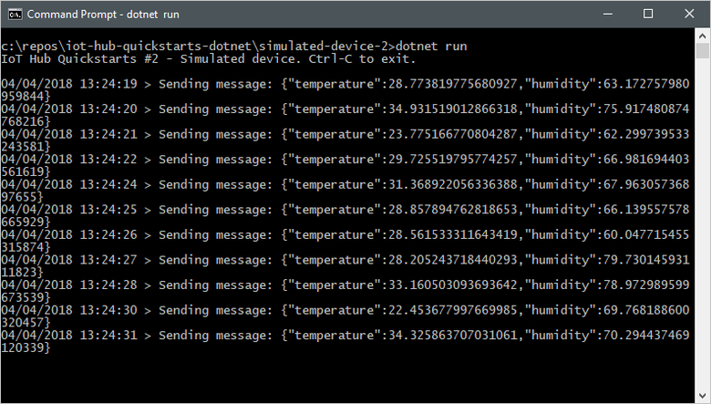

The quickstart uses two pre-written .NET applications:

* A simulated device application that responds to direct methods called from a service application. To receive the direct method calls, this application connects to a device-specific endpoint on your IoT hub.

* A service application that calls the direct methods on the simulated device. To call a direct method on a device, this application connects to service-side endpoint on your IoT hub.

## Prerequisites

* An Azure account with an active subscription. [Create one for free](https://azure.microsoft.com/free/?ref=microsoft.com&utm_source=microsoft.com&utm_medium=docs&utm_campaign=visualstudio).

* The two sample applications you run in this quickstart are written using C#. You need the .NET SDK 6.0 or greater on your development machine.

    You can download the .NET Core SDK for multiple platforms from [.NET](https://dotnet.microsoft.com/download).

    You can verify the current version of C# on your development machine using the following command:

    ```cmd/sh
    dotnet --version
    ```

* Clone or download the [Azure IoT C# SDK](https://github.com/Azure/azure-iot-sdk-csharp) from GitHub.

* Make sure that port 8883 is open in your firewall. The device sample in this quickstart uses MQTT protocol, which communicates over port 8883. This port may be blocked in some corporate and educational network environments. For more information and ways to work around this issue, see [Connecting to IoT Hub (MQTT)](../articles/iot/iot-mqtt-connect-to-iot-hub.md#connecting-to-iot-hub).

[!INCLUDE [azure-cli-prepare-your-environment.md](~/reusable-content/azure-cli/azure-cli-prepare-your-environment-no-header.md)]

[!INCLUDE [iot-hub-cli-version-info](iot-hub-cli-version-info.md)]

[!INCLUDE [iot-hub-include-create-hub-cli](iot-hub-include-create-hub-cli.md)]

## Retrieve the service connection string

You also need your IoT hub's _service connection string_ to enable the service application to connect to the hub and retrieve the messages. The service connection string is for your IoT hub as a whole, and is different from the device connection string you retrieved in the previous section.

The following command retrieves the service connection string for your IoT hub:

```azurecli-interactive
az iot hub connection-string show --policy-name service --hub-name {YourIoTHubName} --output table
```

Make a note of the service connection string, which looks like:

   `HostName={YourIoTHubName}.azure-devices.net;SharedAccessKeyName=service;SharedAccessKey={YourSharedAccessKey}`

You use this value later in the quickstart.

## Simulate a device

The simulated device application connects to a device-specific endpoint on your IoT hub, sends simulated telemetry, and listens for direct method calls from your hub. In this quickstart, the direct method call from the hub tells the device to change the interval at which it sends telemetry. The simulated device sends an acknowledgment back to your hub after it executes the direct method.

1. In a local terminal window, navigate to the root folder of the sample C# project. Then navigate to the **iothub\device\samples\getting started\SimulatedDeviceWithCommand** folder.

2. Run the following command to install the required packages for simulated device application:

    ```cmd/sh
    dotnet restore
    ```

3. Run the following command to build and run the simulated device application.

    `{DeviceConnectionString}`: Replace this placeholder with the device connection string you noted previously.

    ```cmd/sh
    dotnet run -- -c "{DeviceConnectionString}"
    ```

    The following screenshot shows the output as the simulated device application sends telemetry to your IoT hub:

    

## Call the direct method

The service application connects to a service-side endpoint on your IoT Hub. The application makes direct method calls to a device through your IoT hub and listens for acknowledgments. An IoT Hub service application typically runs in the cloud.

1. In another local terminal window, navigate to the root folder of the sample C# project. Then navigate to the **iothub\service\samples\getting started\InvokeDeviceMethod** folder.

2. In the local terminal window, run the following commands to install the required libraries for the service application:

    ```cmd/sh
    dotnet build
    ```

3. In the local terminal window, run the following commands to build and run the service application.

    `{ServiceConnectionString}`: Replace this placeholder with the IoT Hub service connection string you noted previously.

    `{DeviceName}`: Replace this placeholder with the name of the device you registered.

    ```cmd/sh
    dotnet run -- -c "{ServiceConnectionString}" -d {DeviceName}
    ```

    The following screenshot shows the output as the application makes a direct method call to the device and receives an acknowledgment:

    

    After you run the service application, you see a message in the console window running the simulated device, and the rate at which it sends messages changes:

    
