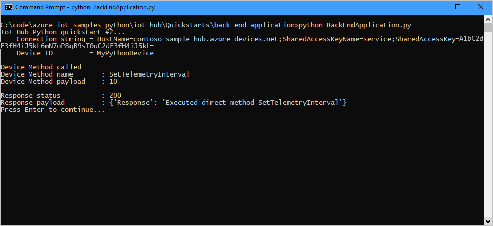
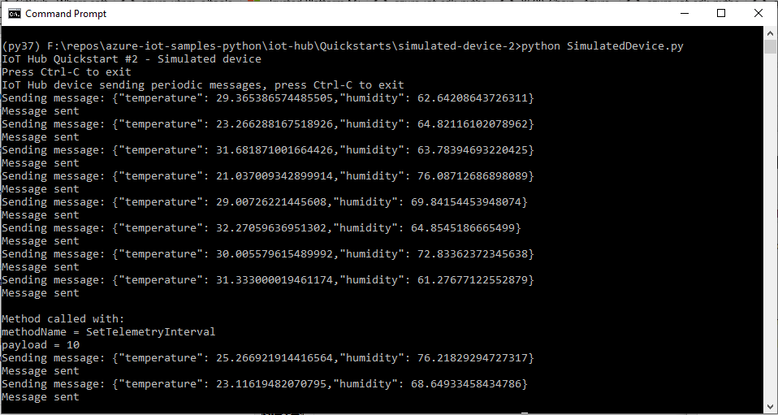

This quickstart uses two Python applications: 

* A simulated device application that responds to direct methods called from a back-end application.
* A back-end application that calls the direct methods on the simulated device.

## Prerequisites

* An Azure account with an active subscription. [Create one for free](https://azure.microsoft.com/free/?ref=microsoft.com&utm_source=microsoft.com&utm_medium=docs&utm_campaign=visualstudio).

* [Python 3.7+](https://www.python.org/downloads/). For other versions of Python supported, see [Azure IoT Device Features](https://github.com/Azure/azure-iot-sdk-python/tree/main/azure-iot-device#azure-iot-device-features).

* Clone or download the [Azure IoT Python samples](https://github.com/Azure-Samples/azure-iot-samples-python/) from github.

* Make sure port 8883 is open in your firewall. The device sample in this quickstart uses MQTT protocol, which communicates over port 8883. This port may be blocked in some corporate and educational network environments. For more information and ways to work around this issue, see [Connecting to IoT Hub (MQTT)](../articles/iot-hub/iot-hub-mqtt-support.md#connecting-to-iot-hub).

[!INCLUDE [azure-cli-prepare-your-environment.md](azure-cli-prepare-your-environment-no-header.md)]

[!INCLUDE [iot-hub-cli-version-info](iot-hub-cli-version-info.md)]

[!INCLUDE [iot-hub-include-create-hub](iot-hub-include-create-hub-quickstart.md)]

## Register a device

A device must be registered with your IoT hub before it can connect. In this quickstart, you use the Azure Cloud Shell to register a simulated device.

If you already have a device registered in your IoT hub, you can skip this section.

1. Run the [az iot hub device-identity create](/cli/azure/iot/hub/device-identity#az-iot-hub-device-identity-create) command in Azure Cloud Shell to create the device identity.

    **YourIoTHubName**: Replace this placeholder below with the name you chose for your IoT hub.

    **MyPythonDevice**: This is the name of the device you're registering. It's recommended to use **MyPythonDevice** as shown. If you choose a different name for your device, you also need to use that name throughout this article, and update the device name in the sample applications before you run them.

    ```azurecli-interactive
    az iot hub device-identity create --hub-name {YourIoTHubName} --device-id MyPythonDevice
    ```

2. Run the [az iot hub device-identity connection-string show](/cli/azure/iot/hub/device-identity/connection-string#az-iot-hub-device-identity-connection-string-show) command in Azure Cloud Shell to get the _device connection string_ for the device you just registered:

    **YourIoTHubName**: Replace this placeholder below with the name you chose for your IoT hub.

    ```azurecli-interactive
    az iot hub device-identity connection-string show --hub-name {YourIoTHubName} --device-id MyPythonDevice --output table
    ```

    Make a note of the device connection string, which looks like:

   `HostName={YourIoTHubName}.azure-devices.net;DeviceId=MyNodeDevice;SharedAccessKey={YourSharedAccessKey}`

    You use this value later in the quickstart.

## Retrieve the service connection string

You also need a _service connection string_ to enable the back-end application to connect to your IoT hub and retrieve the messages. The following command retrieves the service connection string for your IoT hub:

**YourIoTHubName**: Replace this placeholder below with the name you choose for your IoT hub.

```azurecli-interactive
az iot hub connection-string show \
  --policy-name service \
  --hub-name {YourIoTHubName} \
  --output table
```

Make a note of the service connection string, which looks like:

`HostName={YourIoTHubName}.azure-devices.net;SharedAccessKeyName=service;SharedAccessKey={YourSharedAccessKey}`

You use this value later in the quickstart. This service connection string is different from the device connection string you noted in the previous step.

## Simulate a device

The simulated device application connects to a device-specific endpoint on your IoT hub, sends simulated telemetry, and listens for direct method calls from your hub. In this quickstart, the direct method call from the hub tells the device to change the interval at which it sends telemetry. The simulated device sends an acknowledgment back to your hub after it executes the direct method.

1. In a local terminal window, navigate to the root folder of the sample Python project. Then navigate to the **iot-hub\Quickstarts\simulated-device-2** folder.

1. Open the **SimulatedDevice.py** file in a text editor of your choice.

    Replace the value of the `CONNECTION_STRING` variable with the device connection string you made a note of earlier. Then save your changes to **SimulatedDevice.py**.

1. In the local terminal window, run the following commands to install the required libraries for the simulated device application:

    ```cmd/sh
    pip install azure-iot-device
    ```

1. In the local terminal window, run the following commands to run the simulated device application:

    ```cmd/sh
    python SimulatedDevice.py
    ```

    The following screenshot shows the output as the simulated device application sends telemetry to your IoT hub:

    

## Call the direct method

The back-end application connects to a service-side endpoint on your IoT Hub. The application makes direct method calls to a device through your IoT hub and listens for acknowledgments. An IoT Hub back-end application typically runs in the cloud.

1. In another local terminal window, navigate to the root folder of the sample Python project. Then navigate to the **iot-hub\Quickstarts\back-end-application** folder.

1. Open the **BackEndApplication.py** file in a text editor of your choice.

    Replace the value of the `CONNECTION_STRING` variable with the service connection string you made a note of earlier. Then save your changes to **BackEndApplication.py**.

1. In the local terminal window, run the following commands to install the required libraries for the simulated device application:

    ```cmd/sh
    pip install azure-iot-hub
    ```

1. In the local terminal window, run the following commands to run the back-end application:

    ```cmd/sh
    python BackEndApplication.py
    ```

    The following screenshot shows the output as the application makes a direct method call to the device and receives an acknowledgment:

    

    After you run the back-end application, you see a message in the console window running the simulated device, and the rate at which it sends messages changes:

    
