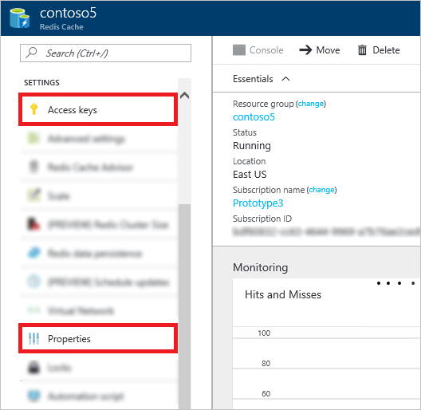
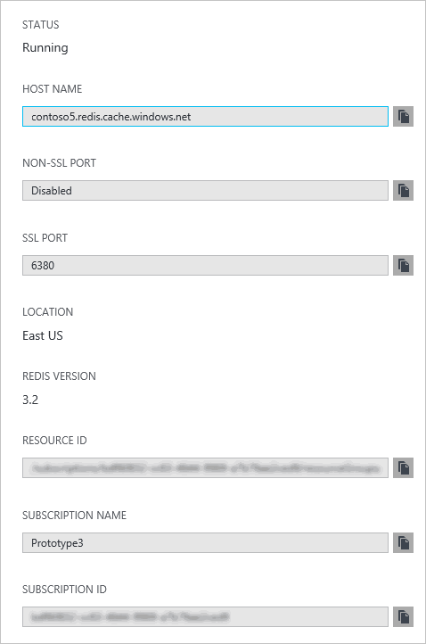

To connect to an Azure Redis Cache instance, cache clients need the host name, ports, and keys of the cache. Some clients may refer to these items by slightly different names. To retrieve these items, [browse](../articles/redis-cache/cache-configure.md#configure-redis-cache-settings) to your cache in the [Azure portal](https://portal.azure.com) and click **Settings** or **All settings**.

### Host name and ports

To access the host name and ports click **Properties**.

### Access keys

To retrieve the access keys, click **Access keys**.

