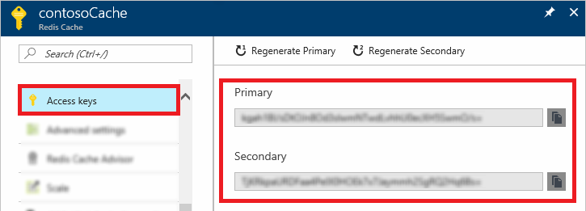
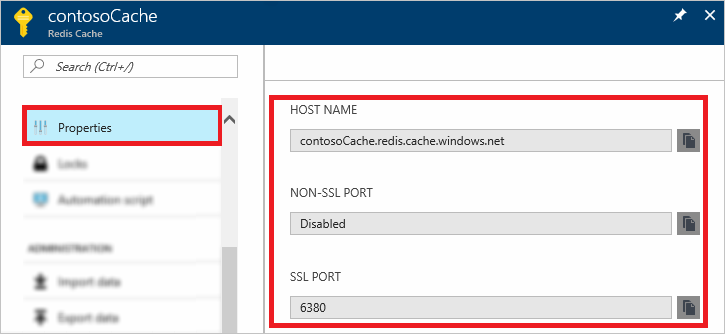

### Retrieve host name, ports, and access keys by using the Azure portal

When connecting to an Azure Cache for Redis instance, cache clients need the host name, ports, and a key for the cache. Some clients might refer to these items by slightly different names. You can retrieve this information in the Azure portal.

#### To retrieve the access keys and host name

1. To retrieve the access keys by using the [Azure portal](https://portal.azure.com), browse to your cache and select **Access keys**. 

    

2. To retrieve the host name and ports, select **Properties**.

    

