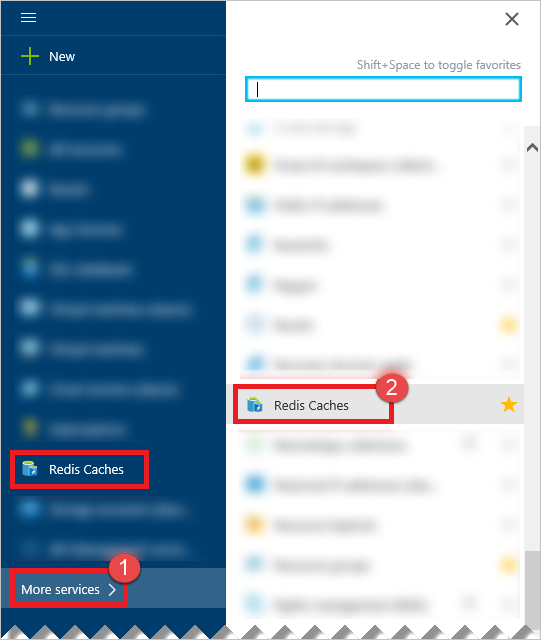
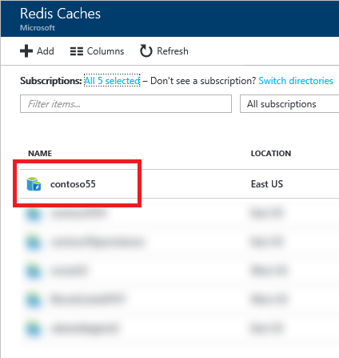
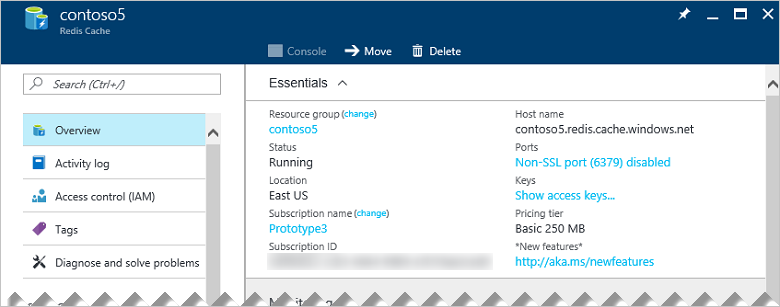

If you did not pin your cache to the dashboard, find your cache in the [Azure portal](https://portal.azure.com) using **All services**.

To view your caches, click **All services** and search for **Azure Cache for Redis**. 

Select the desired cache to view and configure the settings for that cache.

You can view and configure your cache from the **Azure Cache for Redis** blade.

