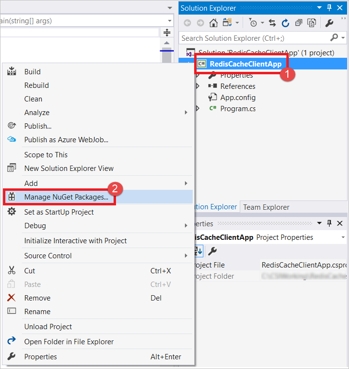
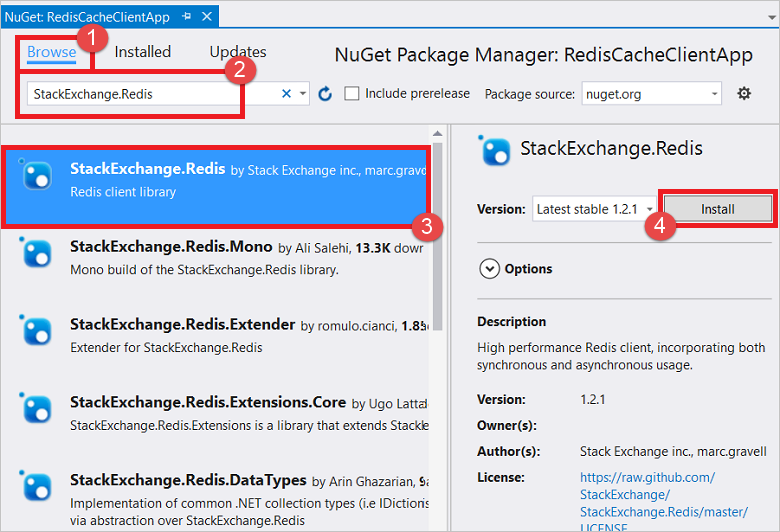

.NET applications can use the **StackExchange.Redis** cache client, which can be configured in Visual Studio using a NuGet package that simplifies the configuration of cache client applications. 

> [!NOTE]
> For more information, see the [StackExchange.Redis](http://github.com/StackExchange/StackExchange.Redis) GitHub page and the [StackExchange.Azure Cache for Redis client documentation](http://github.com/StackExchange/StackExchange.Redis#documentation).
>
>

To configure a client application in Visual Studio using the StackExchange.Redis NuGet package, right-click the project in **Solution Explorer** and choose **Manage NuGet Packages**. 



Type **StackExchange.Redis** or **StackExchange.Redis.StrongName** into the search text box, select the desired version from the results, and click **Install**.

> [!NOTE]
> If you prefer to use a strong-named version of the **StackExchange.Redis** client library, choose **StackExchange.Redis.StrongName**; otherwise choose **StackExchange.Redis**.
>
>



The NuGet package downloads and adds the required assembly references for your client application to access Azure Cache for Redis with the StackExchange.Azure Cache for Redis client.

> [!NOTE]
> If you have previously configured your project to use StackExchange.Redis, you can check for updates to the package from the **NuGet Package Manager**. To check for and install updated versions of the StackExchange.Redis NuGet package, click **Updates** in the **NuGet Package Manager** window. If an update to the StackExchange.Redis NuGet package is available, you can update your project to use the updated version.
>
>

You can also install the StackExchange.Redis NuGet package by clicking **NuGet Package Manager**, **Package Manager Console** from the **Tools** menu, and running the following command from the **Package Manager Console** window.

```
Install-Package StackExchange.Redis
```
