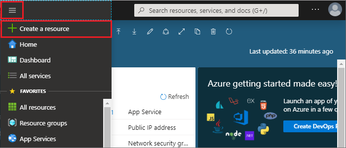

1. To create a cache, sign in to the [Azure portal](https://portal.azure.com) and select **Create a resource**. 
   
   
   
1. On the **New** page, select **Databases** and then select **Azure Cache for Redis**.
   
   
   
1. On the **New Redis Cache** page, configure the settings for your new cache.
   
   | Setting      | Suggested value  | Description |
   | ------------ |  ------- | -------------------------------------------------- |
   | **DNS name** | Enter a globally unique name. | The cache name must be a string between 1 and 63 characters that contains only numbers, letters, or hyphens. The name must start and end with a number or letter, and can't contain consecutive hyphens. Your cache instance's *host name* will be *\<DNS name>.redis.cache.windows.net*. | 
   | **Subscription** | Drop down and select your subscription. | The subscription under which to create this new Azure Cache for Redis instance. | 
   | **Resource group** | Drop down and select a resource group, or select **Create new** and enter a new resource group name. | Name for the resource group in which to create your cache and other resources. By putting all your app resources in one resource group, you can easily manage or delete them together. | 
   | **Location** | Drop down and select a location. | Select a [region](https://azure.microsoft.com/regions/) near other services that will use your cache. |
   | **Pricing tier** | Drop down and select a [Pricing tier](https://azure.microsoft.com/pricing/details/cache/). |  The pricing tier determines the size, performance, and features that are available for the cache. For more information, see [Azure Cache for Redis Overview](../articles/azure-cache-for-redis/cache-overview.md). |
   
1. Select **Create**. 
   
    
   
   It takes a while for the cache to create. You can monitor progress on the Azure Cache for Redis **Overview** page. When **Status** shows as **Running**, the cache is ready to use.
   
   

