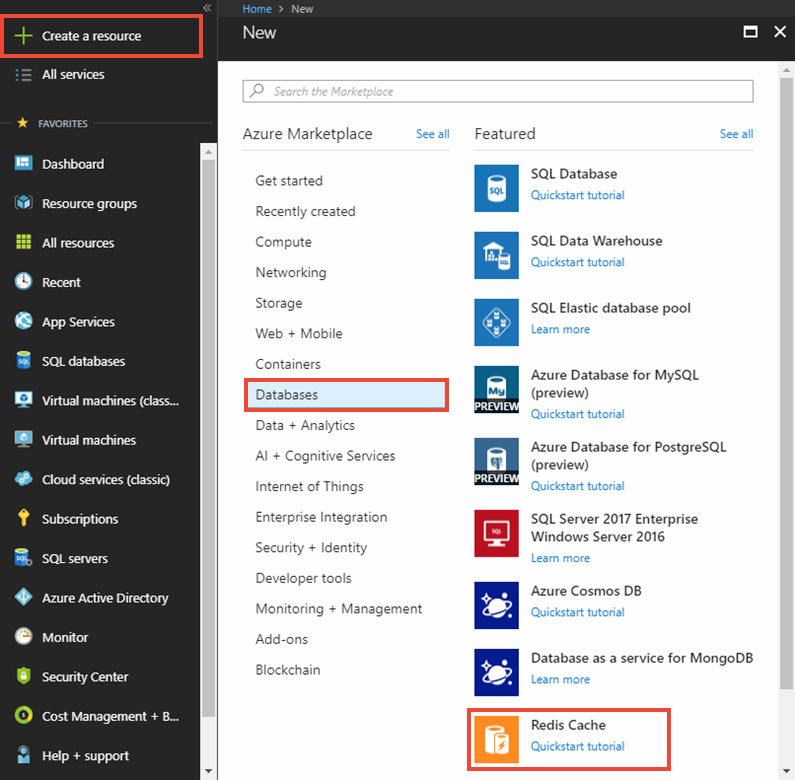
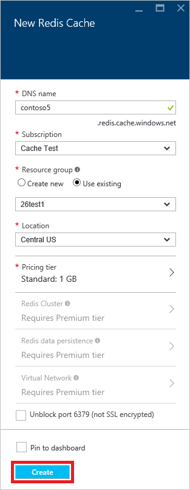
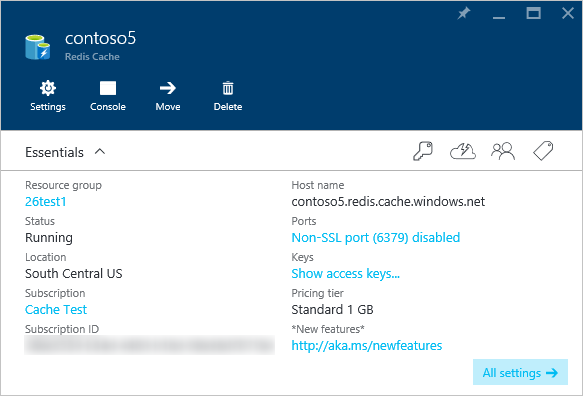

1. To create a cache, first sign in to the [Azure portal](https://portal.azure.com). Then select **Create a resource** > **Databases** > **Azure Cache for Redis**.

    

2. In **New Azure Cache for Redis**, configure the settings for your new cache.

    | Setting      | Suggested value  | Description |
    | ------------ |  ------- | -------------------------------------------------- |
    | **DNS name** | Globally unique name | The cache name. It must be a string between 1 and 63 characters and contain only numbers, letters, and the `-` character. The cache name cannot start or end with the `-` character, and consecutive `-` characters are not valid.  | 
    | **Subscription** | Your subscription | The subscription under which this new Azure Cache for Redis instance is created. | 
    | **Resource group** |  *TestResources* | Name for the new resource group in which to create your cache. By putting all the resources for an app in a group, you can manage them together. For example, deleting the resource group deletes all resources that are associated with the app. | 
    | **Location** | East US | Choose a [region](https://azure.microsoft.com/regions/) near to other services that will use your cache. |
    | **[Pricing tier](https://azure.microsoft.com/pricing/details/cache/)** |  Basic C0 (250 MB Cache) |  The pricing tier determines the size, performance, and features that are available for the cache. For more information, see [Azure Cache for Redis Overview](../articles/azure-cache-for-redis/cache-overview.md). |
    | **Pin to dashboard** |  Selected | Pin the new cache to your dashboard to make    it easy to find. |

     

3. After the new cache settings are configured, select **Create**. 

    It can take a few minutes for the cache to be created. To check the status, you can monitor the progress on the dashboard. After the cache has been created, it shows the status **Running**, and is ready for use.

    

