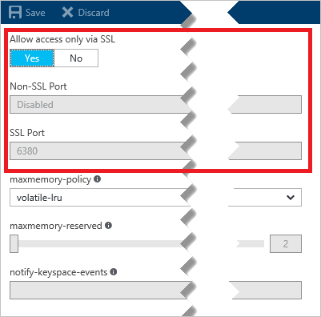

To enable the non-SSL port, [browse](../articles/redis-cache/cache-configure.md#configure-redis-cache-settings) to your cache in the [Azure portal](https://portal.azure.com) and click **Settings > Access Ports**. Click **No** to enable the non-SSL port, and click **Save**.

