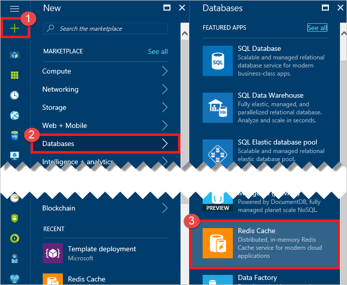
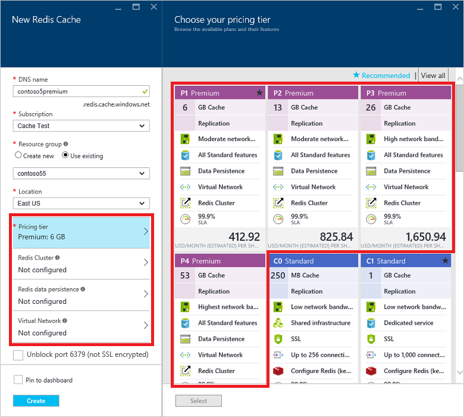

To create a premium cache, sign in to the [Azure portal](https://portal.azure.com) and click **Create a resource** > **Databases** > **Azure Cache for Redis**.

> [!NOTE]
> In addition to creating caches in the Azure portal, you can also create them using Resource Manager templates, PowerShell, or Azure CLI. For more information about creating an Azure Cache for Redis, see [Create a cache](../articles/azure-cache-for-redis/cache-dotnet-how-to-use-azure-redis-cache.md#create-a-cache).
> 
> 

To configure premium features, first select one of the premium pricing tiers in the **Pricing tier** drop-down list. For more information about each pricing tier, click **View full pricing details** and select a pricing tier from the **Choose your pricing tier** blade.

