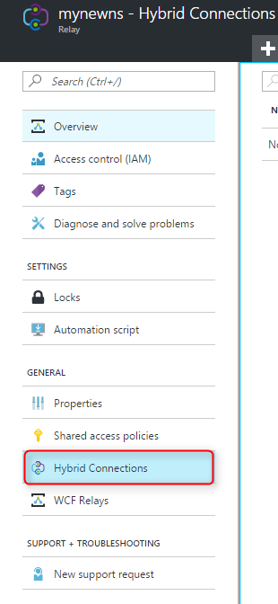
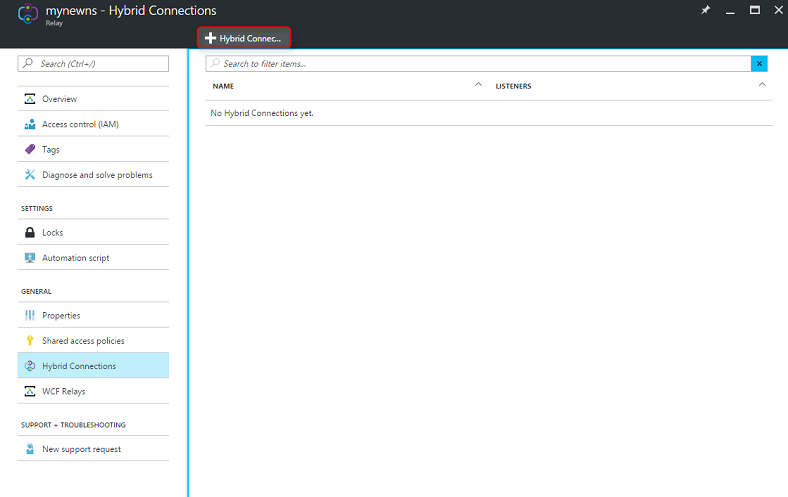
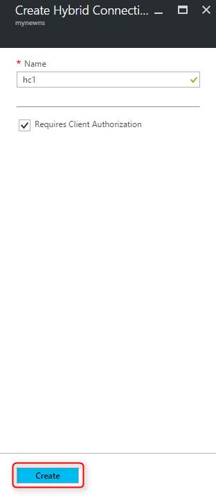

Ensure that you have already [created a Relay namespace][namespace-how-to].

1. Sign in to the [Azure portal](https://portal.azure.com).
2. In the left menu, select **All resources**.
3. Select the namespace where you want to create the hybrid connection. In this case, it is **mynewns**.  
4. Under **Relay namespace**, select **Hybrid Connections**.

    

5. In the namespace overview window, select **+ Hybrid Connection**
   
    
6. Under **Create Hybrid Connection**, enter a value for the hybrid connection name. Leave the other default values.
   
    
7. Select **Create**.

[namespace-how-to]: ../articles/service-bus-relay/relay-create-namespace-portal.md 