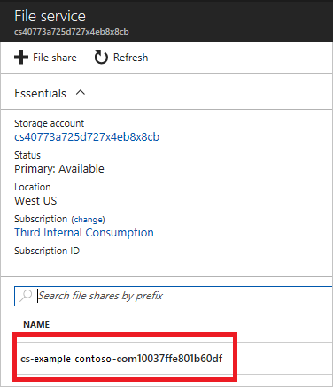
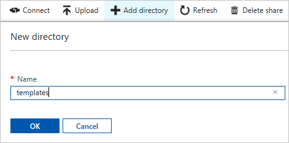
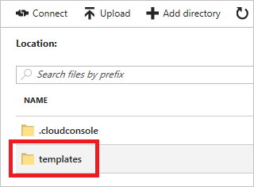
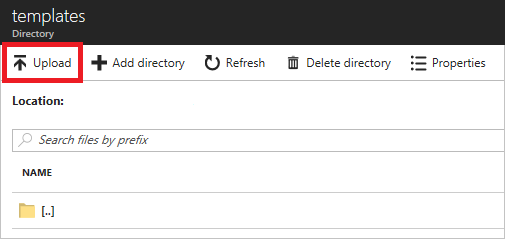
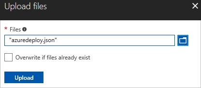

## Deploy template from Cloud Shell

You can use [Cloud Shell](../articles/cloud-shell/overview.md) to deploy your template. However, you must first load your template into the file share for your Cloud Shell. If you have not used Cloud Shell, see [Overview of Azure Cloud Shell](../articles/cloud-shell/overview.md) for information about setting it up.

1. Log in to the [Azure portal](https://portal.azure.com).

1. Select your Cloud Shell resource group. The name pattern is `cloud-shell-storage-<region>`.

   

1. Select the storage account for your Cloud Shell.

   

1. Select **Files**.

   

1. Select the file share for Cloud Shell. The name pattern is `cs-<user>-<domain>-com-<uniqueGuid>`.

   

1. Select **Add directory**.

   

1. Name it **templates**, and select **Okay**.

   

1. Select your new directory.

   

1. Select **Upload**.

   

1. Find and upload your template.

   

1. Open the prompt.

   
