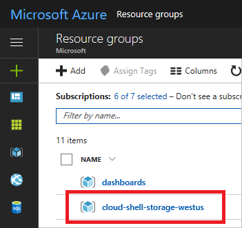
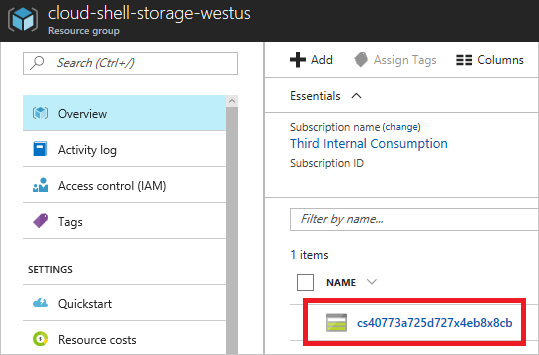
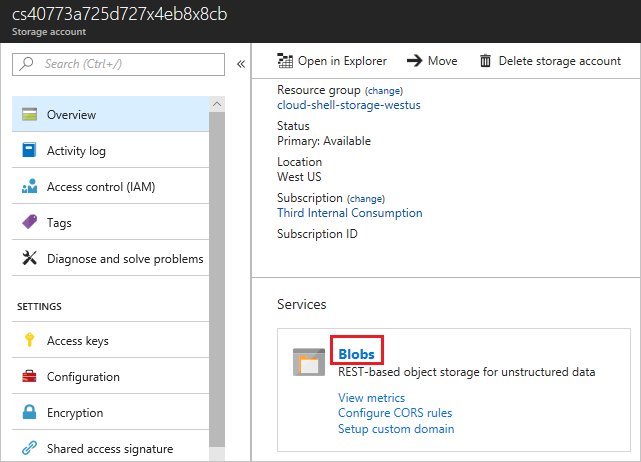
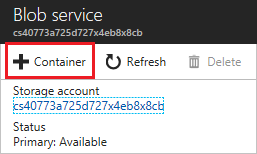
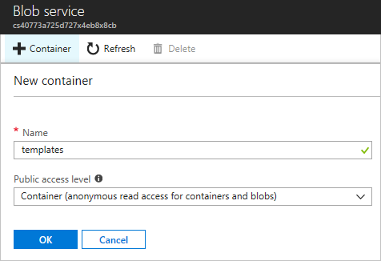
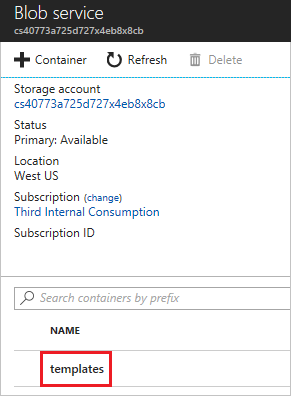
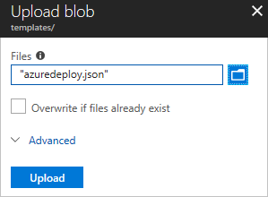
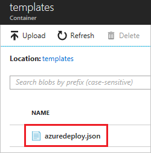
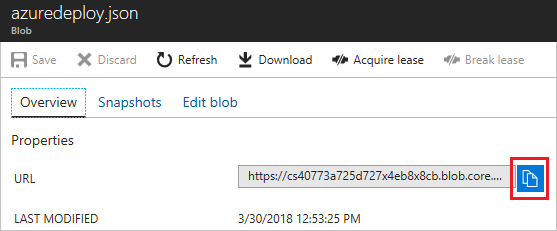

## Deploy template from Cloud Shell

You can use [Cloud Shell](../articles/cloud-shell/overview.md) to deploy your template. To deploy an external template, provide the URI of the template exactly as you would for any external deployment. To deploy a local template, you must first load your template into the storage account for your Cloud Shell. This section describes how to load the template to your cloud shell account, and deploy it as a local file. If you haven't used Cloud Shell, see [Overview of Azure Cloud Shell](../articles/cloud-shell/overview.md) for information about setting it up.

1. Sign in to the [Azure portal](https://portal.azure.com).

1. Select your Cloud Shell resource group. The name pattern is `cloud-shell-storage-<region>`.

   

1. Select the storage account for your Cloud Shell.

   

1. Select **Blobs**.

   

1. Select **+ Container**.

   

1. Give your container a name and an access level. The sample template in this article contains no sensitive information, so allow anonymous read access. Select **OK**.

   

1. Select the container you created.

   

1. Select **Upload**.

   

1. Find and upload your template.

   

1. After it has uploaded, select the template.

   

1. Copy the URL.

   

1. Open the prompt.

   
