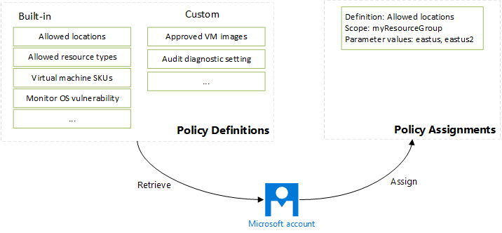

[Azure policies](/azure/azure-policy/) help you make sure all resources in subscription meet corporate standards. Use policies to reduce your costs by restricting deployment options to only those resource types and SKUs that are approved. You define rules and actions for your resources and those rules are automatically enforced during deployment. For example, you can control the types of resources that are deployed. Or, you can restrict the approved locations for resources. Some policies deny an action, and some policies set up auditing of an action.

Policy is complementary to role-based access control (RBAC). RBAC focuses on user access, and is a default deny and explicit allow system. Policy focuses on resource properties during and after deployment. It's a default allow and explicit deny system.

There are two concepts to understand with policies - *policy definitions* and *policy assignments*. A policy definition describes the management conditions you want to enforce. A policy assignment puts a policy definition into action for a particular scope.

Azure provides several built-in policy definitions you can use without any modification. You pass parameter values to specify the values that are permitted in your scope. If built-in policy definition don't fulfill your requirements, you can [create custom policy definitions](../articles/azure-policy/create-manage-policy.md).
