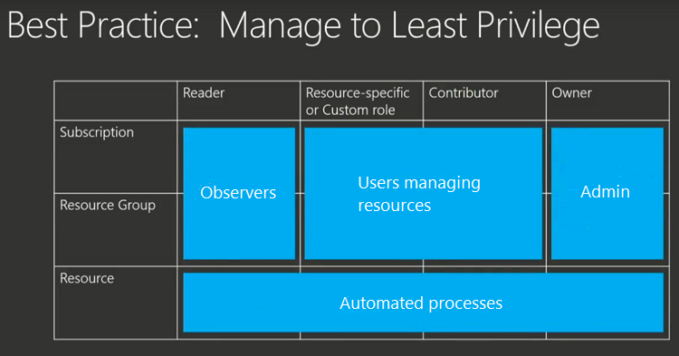

You want to make sure users in your organization have the right level of access to these resources. You don't want to grant unlimited access to users, but you also need to make sure they can do their work. Role-based access control (RBAC) enables you to manage which users have permission to complete specific actions at a scope. A role defines a set of permitted actions. You assign the role to a scope, and specify which users belong to that role for the scope.

When planning your access control strategy, grant users the least privilege to get their work done. The following image shows a suggested pattern for assigning RBAC.

There are three roles that apply to all resources - Owner, Contributor, and Reader. Any accounts assigned to the Owner role should be tightly controlled and rarely used. Users that only need to observe the state of solutions should be granted the Reader role.

Most users are granted [resource-specific roles](../articles/role-based-access-control/built-in-roles.md) or [custom roles](../articles/role-based-access-control/custom-roles.md) at either the subscription or resource group level. These roles tightly define the permitted actions. By assigning users to these roles, you grant the required access for users without permitting too much control. You can assign an account to more than one role, and that user gets the combined permissions of the roles. Granting access at the resource level is often too restrictive for users, but may work for an automated process designed for specific task.

### Who can assign roles

To create and remove role assignments, users must have `Microsoft.Authorization/roleAssignments/*` access. This access is granted through the Owner or User Access Administrator roles.