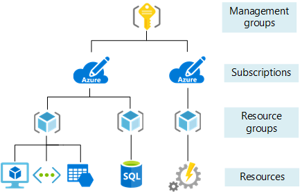

Before creating any items, let's review the concept of scope. Azure provides four levels of management: management groups, subscription, resource group, and resource. [Management groups](../articles/billing/billing-enterprise-mgmt-group-overview.md) are in a preview release. The following image shows an example of these layers.

You apply management settings at any of these levels of scope. The level you select determines how widely the setting is applied. Lower levels inherit settings from higher levels. When you apply a setting to the subscription, that setting is applied to all resource groups and resources in your subscription. When you apply a setting on the resource group, that setting is applied the resource group and all its resources. However, another resource group does not have that setting.

Usually, it makes sense to apply critical settings at higher levels and project-specific requirements at lower levels. For example, you might want to make sure all resources for your organization are deployed to certain regions. To accomplish this requirement, apply a policy to the subscription that specifies the allowed locations. As other users in your organization add new resource groups and resources, the allowed locations are automatically enforced. 
