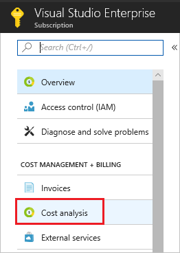
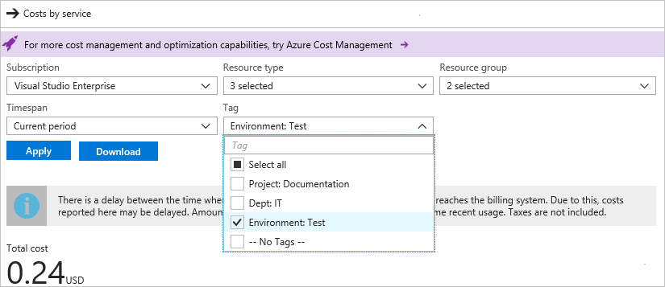

After applying tags to resources, you can view costs for resources with those tags. It takes a while for cost analysis to show the latest usage, so you may not see the costs yet. When the costs are available, you can view costs for resources across resource groups in your subscription. Users must have [subscription level access to billing information](../articles/billing/billing-manage-access.md) to see the costs.

To view costs by tag in the portal, select your subscription and select **Cost Analysis**.

Then, filter by the tag value, and select **Apply**.

You can also use the [Azure Billing APIs](../articles/billing/billing-usage-rate-card-overview.md) to programmatically view costs.
