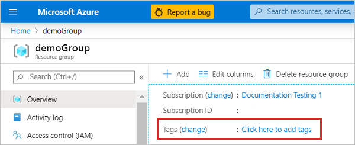
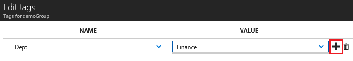
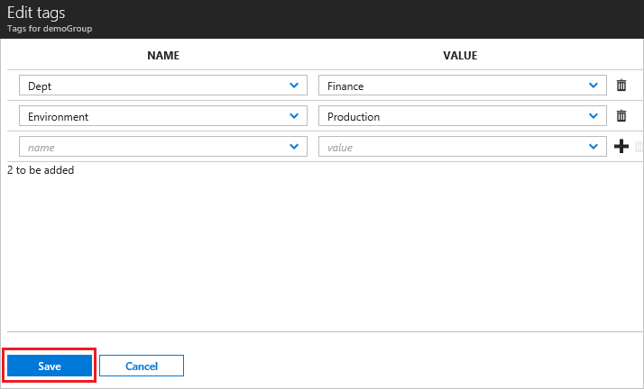
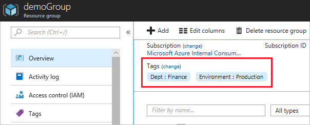
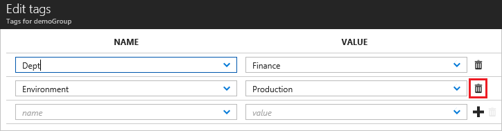
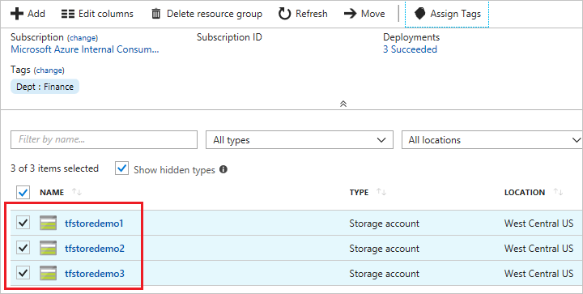
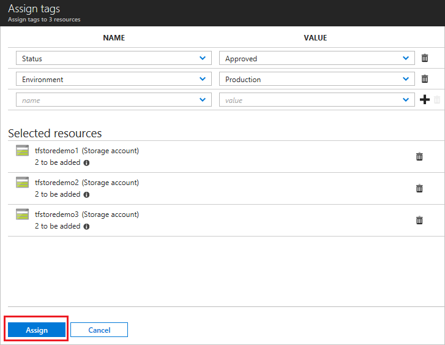
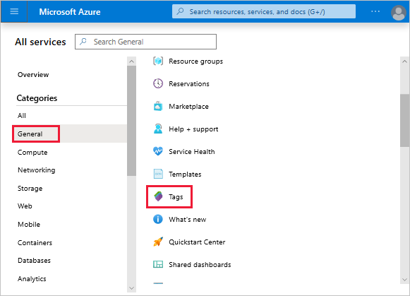
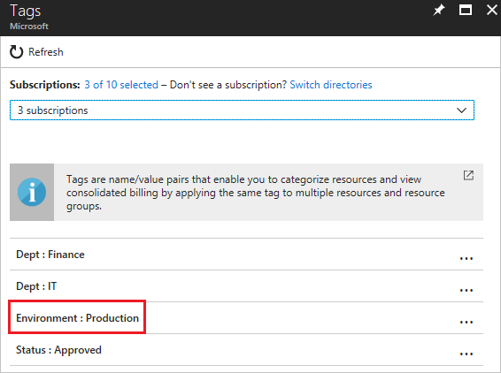
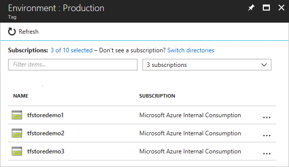

If a user doesn't have the required access for applying tags, you can assign the **Tag Contributor** role to the user. For more information, see [Tutorial: Grant a user access to Azure resources using RBAC and the Azure portal](../articles/role-based-access-control/quickstart-assign-role-user-portal.md).

1. To view the tags for a resource or a resource group, look for existing tags in the overview. If you have not previously applied tags, the list is empty.

   

1. To add a tag, select **Click here to add tags**.

1. Provide a name and value.

   

1. Continue adding tags as needed. When done, select **Save**.

   

1. The tags are now displayed in the overview.

   

1. To add or delete a tag, select **change**.

1. To delete a tag, select the trash icon. Then, select **Save**.

   

To bulk assign tags to multiple resources:

1. From any list of resources, select the checkbox for the resources you want to assign the tag. Then, select **Assign tags**.

   

1. Add names and values. When done, select **Save**.

   

To view all resources with a tag:

1. On the Azure portal menu, search for **tags**. Select it from the available options.

   

1. Select the tag for viewing resources.

   

1. All resources with that tag are displayed.

   
