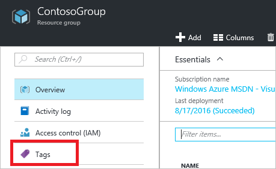
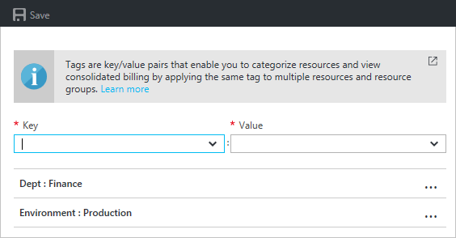
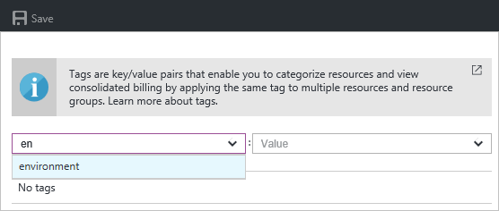
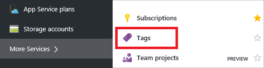
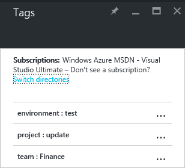
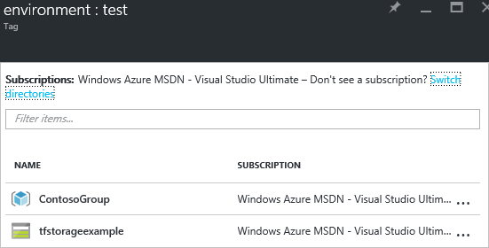
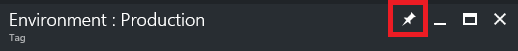
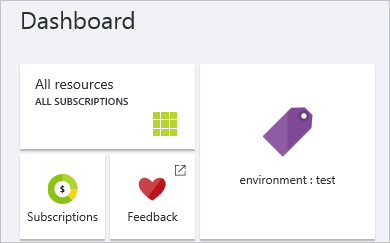

1. To view the tags for a resource or resource group, select the **Tags** icon. 
   
     
2. You see the existing tags for the resource. If you have not previously applied tags, the list is empty. 

     
3. To add a tag, type a key and value, or select an existing one from the dropdown menu. Select **Save**.

     
3. To view all the resources with a tag value, select **>** (More services), and enter the word **Tags** into the filter text box. Select **Tags** from the available options.
   
     
4. You see a summary of the tags in your subscriptions.
   
     
5. Select any of the tags to display the resources and resource groups with that tag.
   
     
6. Select **Pin blade to dashboard** for quick access.
   
     
7. You can select the pinned tag from the dashboard to see the resources with that tag.

     
