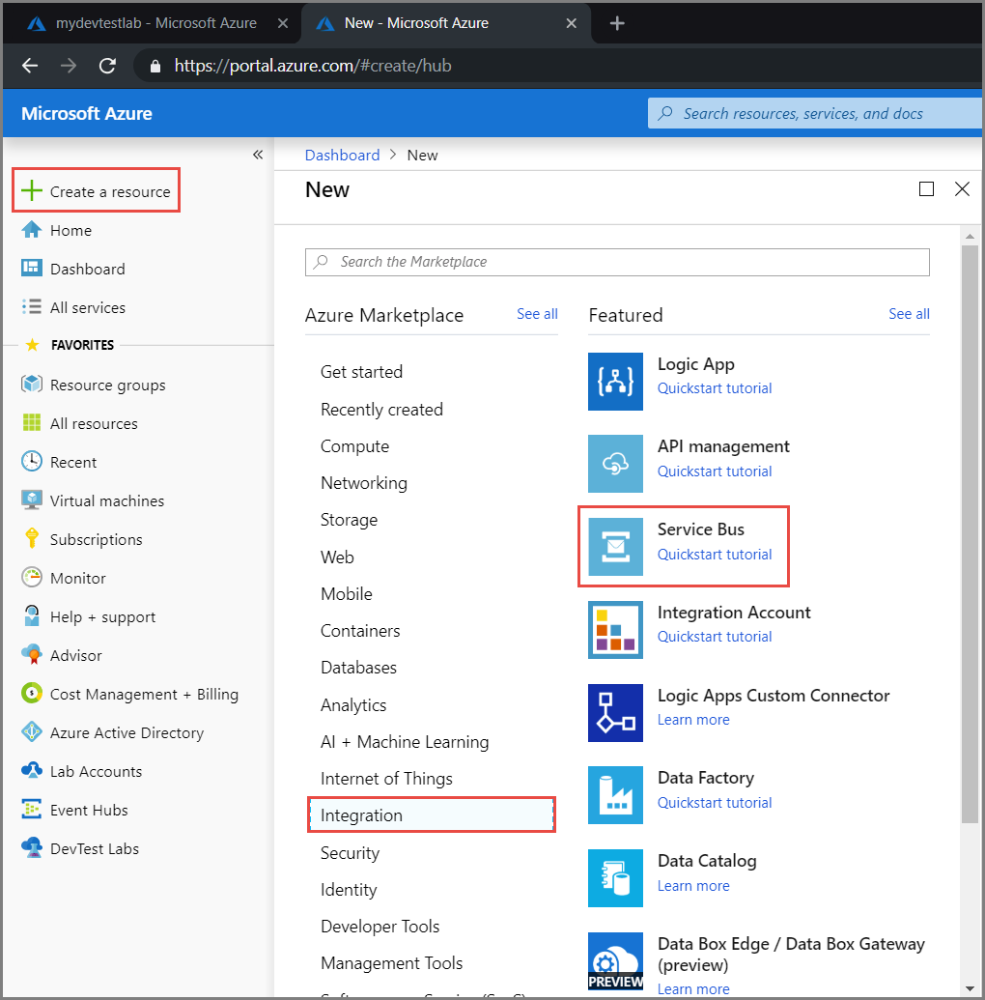
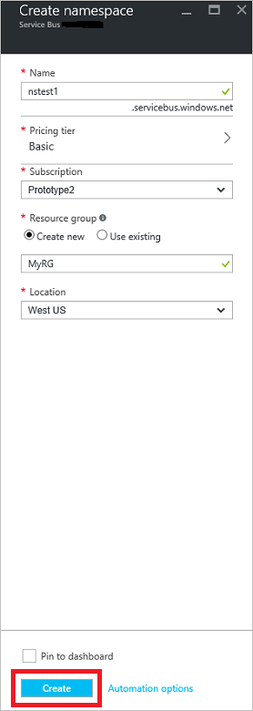
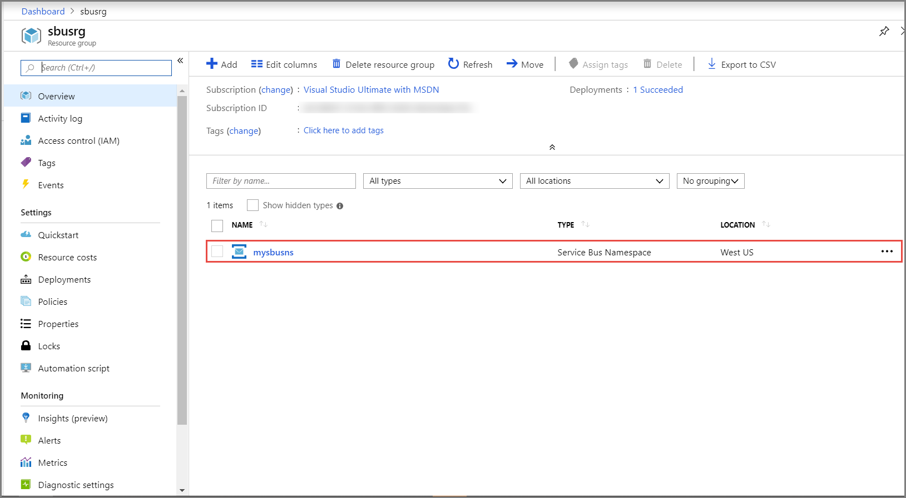
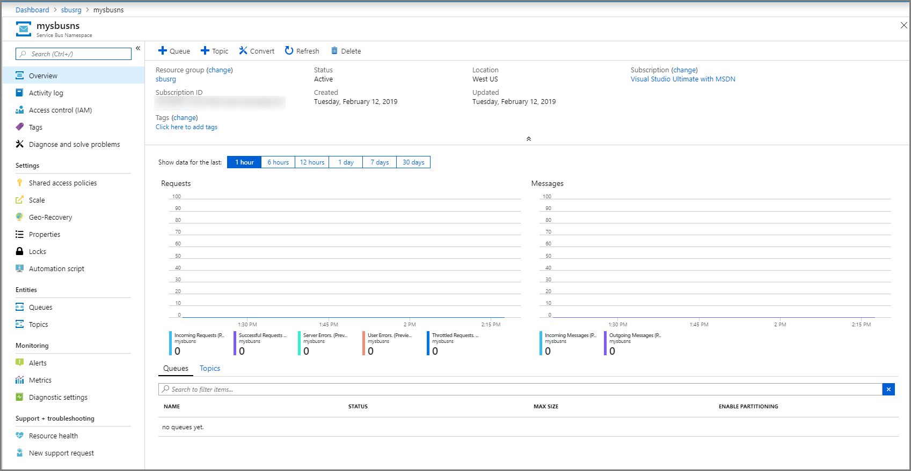
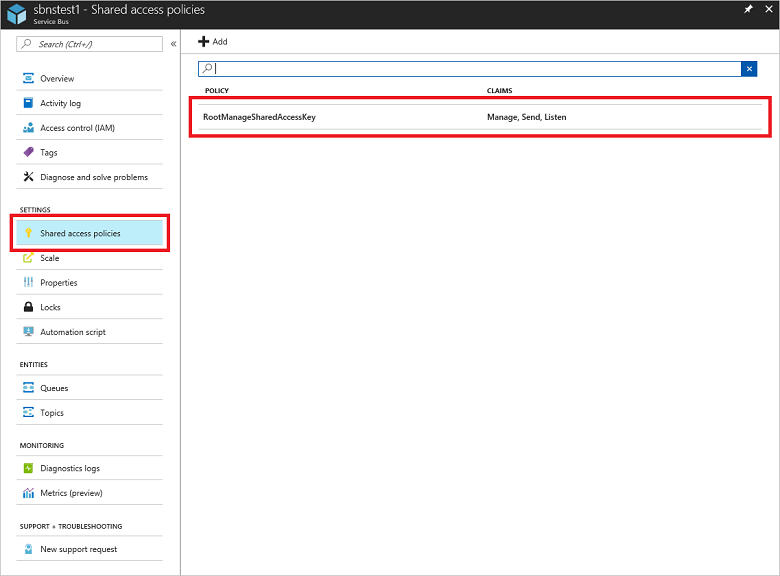
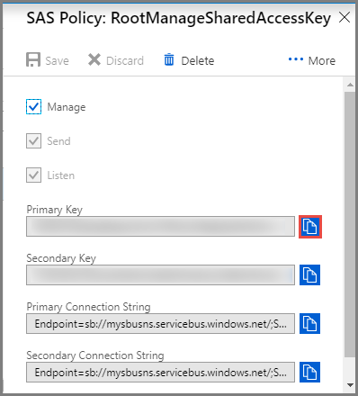

## Create a namespace in the Azure portal
To begin using Service Bus messaging entities in Azure, you must first create a namespace with a name that is unique across Azure. A namespace provides a scoping container for addressing Service Bus resources within your application.

To create a namespace:

1. Sign in to the [Azure portal](https://portal.azure.com)
2. In the left navigation pane of the portal, select **+ Create a resource**, select **Integration**, and then select **Service Bus**.

    
3. In the **Create namespace** dialog, do the following steps: 
    1. Enter a **name for the namespace**. The system immediately checks to see if the name is available. For a list of rules for naming namespaces, see [Create Namespace REST API](/rest/api/servicebus/create-namespace).
    2. Select the pricing tier (Basic, Standard, or Premium) for the namespace. If you want to use [topics and subscriptions](../articles/service-bus-messaging/service-bus-queues-topics-subscriptions.md#topics-and-subscriptions), choose either Standard or Premium. Topics/subscriptions are not supported in the Basic pricing tier.
    3. If you selected the **Premium** pricing tier, follow these steps: 
        1. Specify the number of **messaging units**. The premium tier provides resource isolation at the CPU and memory level so that each workload runs in isolation. This resource container is called a messaging unit. A premium namespace has at least one messaging unit. You can select 1, 2, or 4 messaging units for each Service Bus Premium namespace. For more information, see [Service Bus Premium Messaging](../articles/service-bus-messaging/service-bus-premium-messaging.md).
        2. Specify whether you want to make the namespace **zone redundant**. The zone redundancy provides enhanced availability by spreading replicas across availability zones within one region at no additional cost. For more information, see [Availability zones in Azure](../articles/availability-zones/az-overview.md).
    4. For **Subscription**, choose an Azure subscription in which to create the namespace.
    5. For **Resource group**, choose an existing resource group in which the namespace will live, or create a new one.      
    6. For **Location**, choose the region in which your namespace should be hosted.
    7. Select **Create**. The system now creates your namespace and enables it. You might have to wait several minutes as the system provisions resources for your account.
   
        
4. Confirm that the service bus namespace is deployed successfully. To see the notifications, select the **bell icon (Alerts)** on the toolbar. Select the **name of the resource group** in the notification as shown in the image. You see the resource group that contains the service bus namespace.

    
5. On the **Resource group** page for your resource group, select your **service bus namespace**. 

    
6. You see the home page for your service bus namespace. 

    

## Get the connection string 
Creating a new namespace automatically generates an initial Shared Access Signature (SAS) rule with an associated pair of primary and secondary keys that each grant full control over all aspects of the namespace. See [Service Bus authentication and authorization](../articles/service-bus-messaging/service-bus-authentication-and-authorization.md) for information about how to create rules with more constrained rights for regular senders and receivers. To copy the primary and secondary keys for your namespace, follow these steps: 

1. Click **All resources**, then click the newly created namespace name.
2. In the namespace window, click **Shared access policies**.
3. In the **Shared access policies** screen, click **RootManageSharedAccessKey**.
   
    
4. In the **Policy: RootManageSharedAccessKey** window, click the copy button next to **Primary Connection String**, to copy the connection string to your clipboard for later use. Paste this value into Notepad or some other temporary location.
   
    
5. Repeat the previous step, copying and pasting the value of **Primary key** to a temporary location for later use.

<!--Image references-->

