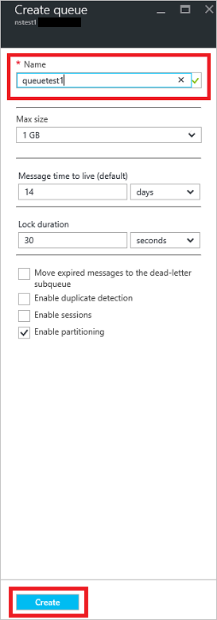

## Create a queue in the Azure portal
4. On the **Service Bus Namespace** page, select **Queues** in the left navigational menu.
5. On the **Queues** page, select **+ Queue** on the toolbar.
5. Enter a **name** for the queue, and leave the other values with their defaults.
6. Now, select **Create**.
 
    

