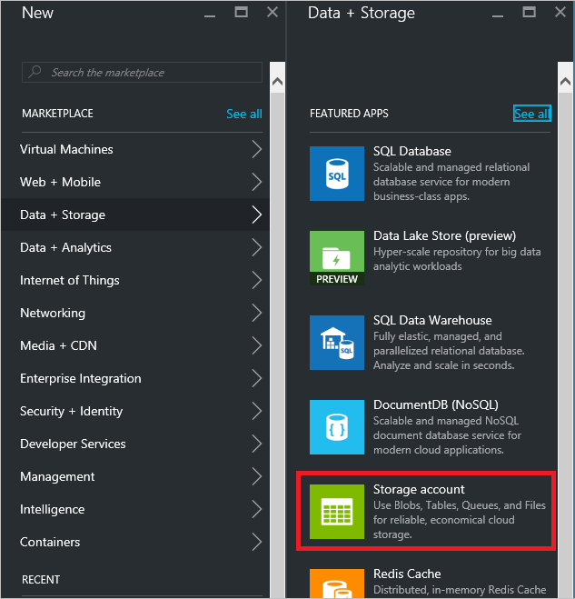
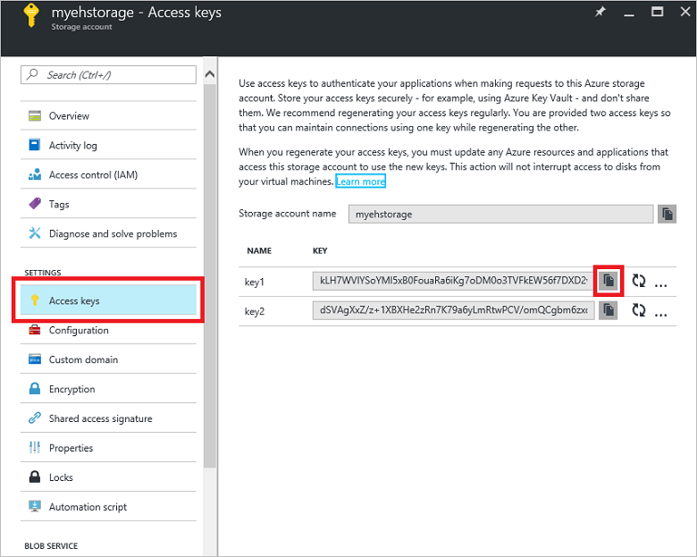
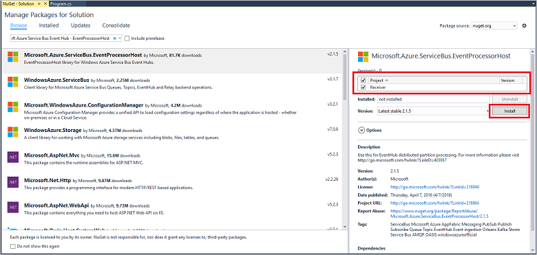

## Receive messages with EventProcessorHost

[EventProcessorHost][] is a .NET class that simplifies receiving events from Event Hubs by managing persistent checkpoints and parallel receives from those Event Hubs. Using [EventProcessorHost][], you can split events across multiple receivers, even when hosted in different nodes. This example shows how to use [EventProcessorHost][] for a single receiver. The [Scaled out event processing][] sample shows how to use [EventProcessorHost][] with multiple receivers.

To use [EventProcessorHost][], you must have an [Azure Storage account][]:

1. Log on to the [Azure portal][], and click **New** at the top left of the screen.

2. Click **Data + Storage**, then click **Storage account**.

    

3. In the **Create storage account** blade, type a name for the storage account. Choose an Azure subscription, resource group, and location in which to create the resource. Then click **Create**.

    

4. In the list of storage accounts, click the newly-created storage account.

5. In the storage account blade, click **Access keys**. Copy the value of **key1** to use later in this tutorial.

	

4. In Visual Studio, create a new Visual C# Desktop App project using the **Console  Application** project template. Name the project **Receiver**.

    

5. In Solution Explorer, right-click the solution, and then click **Manage NuGet Packages for Solution**.

6. Click the **Browse** tab, then search for `Microsoft Azure Service Bus Event Hub - EventProcessorHost`. Ensure that the project name (**Receiver**) is specified in the **Version(s)** box. Click **Install**, and accept the terms of use.

    

	Visual Studio downloads, installs, and adds a reference to the [Azure Service Bus Event Hub - EventProcessorHost NuGet package](https://www.nuget.org/packages/Microsoft.Azure.ServiceBus.EventProcessorHost), with all its dependencies.

7. Right-click the **Receiver** project, click **Add**, and then click **Class**. Name the new class **SimpleEventProcessor**, and then click **Add** to create the class.

	

8. Add the following statements at the top of the SimpleEventProcessor.cs file:

	```
	using Microsoft.ServiceBus.Messaging;
	using System.Diagnostics;
	```

	Then, substitute the following code for the body of the class:

	```
    class SimpleEventProcessor : IEventProcessor
	{
	    Stopwatch checkpointStopWatch;

	    async Task IEventProcessor.CloseAsync(PartitionContext context, CloseReason reason)
	    {
	        Console.WriteLine("Processor Shutting Down. Partition '{0}', Reason: '{1}'.", context.Lease.PartitionId, reason);
	        if (reason == CloseReason.Shutdown)
	        {
	            await context.CheckpointAsync();
	        }
	    }

	    Task IEventProcessor.OpenAsync(PartitionContext context)
	    {
	        Console.WriteLine("SimpleEventProcessor initialized.  Partition: '{0}', Offset: '{1}'", context.Lease.PartitionId, context.Lease.Offset);
	        this.checkpointStopWatch = new Stopwatch();
	        this.checkpointStopWatch.Start();
	        return Task.FromResult<object>(null);
	    }

	    async Task IEventProcessor.ProcessEventsAsync(PartitionContext context, IEnumerable<EventData> messages)
	    {
	        foreach (EventData eventData in messages)
	        {
	            string data = Encoding.UTF8.GetString(eventData.GetBytes());

	            Console.WriteLine(string.Format("Message received.  Partition: '{0}', Data: '{1}'",
	                context.Lease.PartitionId, data));
	        }

	        //Call checkpoint every 5 minutes, so that worker can resume processing from 5 minutes back if it restarts.
	        if (this.checkpointStopWatch.Elapsed > TimeSpan.FromMinutes(5))
            {
                await context.CheckpointAsync();
                this.checkpointStopWatch.Restart();
            }
	    }
	}
    ```

	This class will be called by the **EventProcessorHost** to process events received from the Event Hub. Note that the `SimpleEventProcessor` class uses a stopwatch to periodically call the checkpoint method on the **EventProcessorHost** context. This ensures that, if the receiver is restarted, it will lose no more than five minutes of processing work.

9. In the **Program** class, add the following `using` statement at the top of the file:

	```
	using Microsoft.ServiceBus.Messaging;
	```

	Then, replace the `Main` method in the `Program` class with the following code, substituting the Event Hub name and the namespace-level connection string that you saved previously, and the storage account and key that you copied in the previous sections. 

    ```
	static void Main(string[] args)
    {
      string eventHubConnectionString = "{Event Hub connection string}";
      string eventHubName = "{Event Hub name}";
      string storageAccountName = "{storage account name}";
      string storageAccountKey = "{storage account key}";
      string storageConnectionString = string.Format("DefaultEndpointsProtocol=https;AccountName={0};AccountKey={1}", storageAccountName, storageAccountKey);

      string eventProcessorHostName = Guid.NewGuid().ToString();
      EventProcessorHost eventProcessorHost = new EventProcessorHost(eventProcessorHostName, eventHubName, EventHubConsumerGroup.DefaultGroupName, eventHubConnectionString, storageConnectionString);
      Console.WriteLine("Registering EventProcessor...");
      var options = new EventProcessorOptions();
      options.ExceptionReceived += (sender, e) => { Console.WriteLine(e.Exception); };
      eventProcessorHost.RegisterEventProcessorAsync<SimpleEventProcessor>(options).Wait();

      Console.WriteLine("Receiving. Press enter key to stop worker.");
      Console.ReadLine();
      eventProcessorHost.UnregisterEventProcessorAsync().Wait();
    }
	```

> [AZURE.NOTE] This tutorial uses a single instance of [EventProcessorHost][]. To increase throughput, it is recommended that you run multiple instances of [EventProcessorHost][], as shown in the [Scaled out event processing][] sample. In those cases, the various instances automatically coordinate with each other to load balance the received events. If you want multiple receivers to each process *all* the events, you must use the **ConsumerGroup** concept. When receiving events from different machines, it might be useful to specify names for [EventProcessorHost][] instances based on the machines (or roles) in which they are deployed. For more information about these topics, see the [Event Hubs Overview][] and [Event Hubs Programming Guide][] topics.

<!-- Links -->
[Event Hubs Overview]: event-hubs-overview.md
[Event Hubs Programming Guide]: event-hubs-programming-guide.md
[Scaled out event processing]: https://code.msdn.microsoft.com/Service-Bus-Event-Hub-45f43fc3
[Azure Storage account]: ../storage/storage-create-storage-account.md
[EventProcessorHost]: http://msdn.microsoft.com/library/azure/microsoft.servicebus.messaging.eventprocessorhost(v=azure.95).aspx
[Azure portal]: https://portal.azure.com