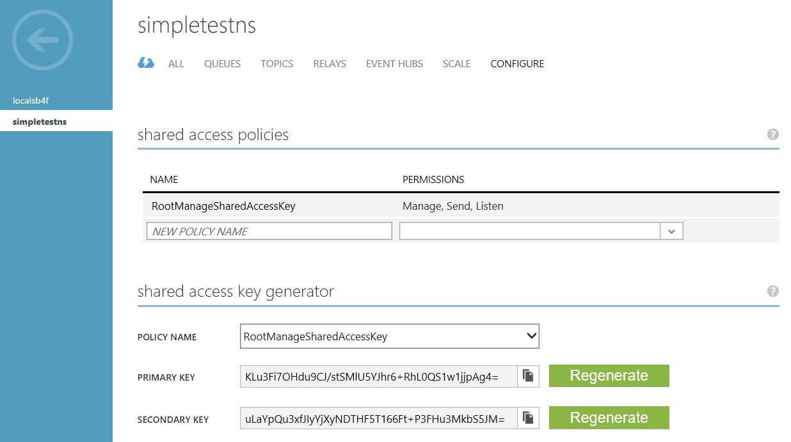

## What are Service Bus Topics and Subscriptions?

Service Bus topics and subscriptions support a *publish/subscribe*
messaging communication model. When using topics and subscriptions,
components of a distributed application do not communicate directly with
each other; instead they exchange messages via a topic, which acts as an
intermediary.

In contrast with Service Bus queues, in which each message is processed by a
single consumer, topics and subscriptions provide a "one-to-many" form
of communication, using a publish/subscribe pattern. It is possible to
register multiple subscriptions to a topic. When a message is sent to a
topic, it is then made available to each subscription to handle/process
independently.

A subscription to a topic resembles a virtual queue that receives copies of
the messages that were sent to the topic. You can optionally register
filter rules for a topic on a per-subscription basis, which allows you
to filter/restrict which messages to a topic are received by which topic
subscriptions.

Service Bus topics and subscriptions enable you to scale to process a
very large number of messages across a very large number of users and
applications.

## Create a service namespace

To begin using Service Bus topics and subscriptions in Azure,
you must first create a service namespace. A service namespace provides
a scoping container for addressing Service Bus resources within your
application.

To create a service namespace:

1.  Log on to the [Azure Management Portal][].

2.  In the left navigation pane of the Management Portal, click
    **Service Bus**.

3.  In the lower pane of the Management Portal, click **Create**.
    ![][0]

4.  In the **Add a new namespace** dialog, enter a namespace name.
    The system immediately checks to see if the name is available.
    ![][2]

5.  After making sure the namespace name is available, choose the
    country or region in which your namespace should be hosted (make
    sure you use the same country/region in which you are deploying your
    compute resources).

	IMPORTANT: Pick the **same region** that you intend to choose for
    deploying your application. This will give you the best performance.

6. 	Leave the other fields in the dialog with their default values (**Messaging** and **Standard Tier**), then click the check mark. The system now creates your service
    namespace and enables it. You might have to wait several minutes as
    the system provisions resources for your account.

	![][6]

## Obtain the default management credentials for the namespace

In order to perform management operations, such as creating a topic or
subscription on the new namespace, you must obtain the management
credentials for the namespace. You can obtain these credentials from the Azure management portal.

### To obtain management credentials from the portal

1.  In the left navigation pane, click the **Service Bus** node to
    display the list of available namespaces:
    ![][0]

2.  Click on the namespace you just created from the list shown:
    ![][3]

3.  Click **Configure** to view the shared access policies for your namespace.
	

4.  Make a note of the primary key, or copy it to the clipboard.

  [Azure Management Portal]: http://manage.windowsazure.com
  [0]: ./media/service-bus-java-how-to-create-topic/sb-queues-13.png
  [2]: ./media/service-bus-java-how-to-create-topic/sb-queues-04.png
  [3]: ./media/service-bus-java-how-to-create-topic/sb-queues-09.png
  [4]: ./media/service-bus-java-how-to-create-topic/sb-queues-06.png

  [6]: ./media/service-bus-java-how-to-create-topic/getting-started-multi-tier-27.png
  [34]: ./media/service-bus-java-how-to-create-topic/VSProperties.png
