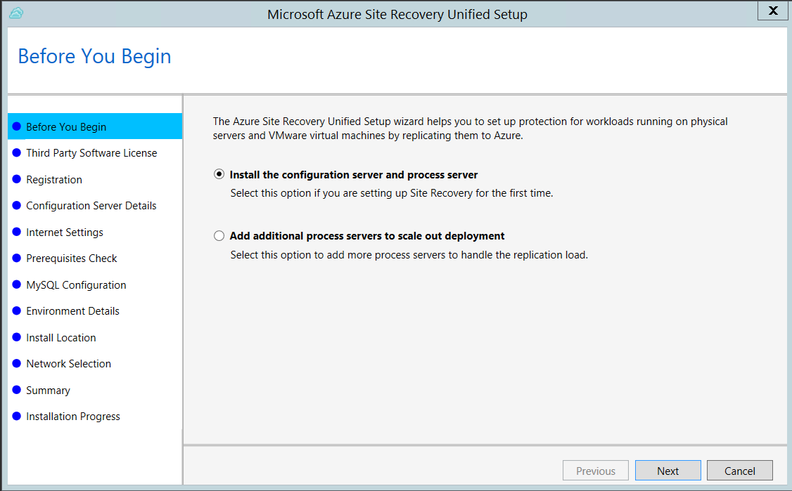
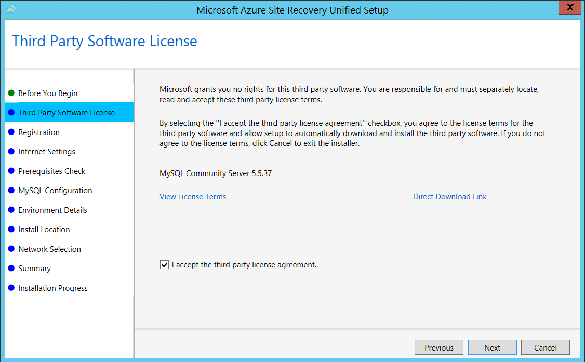
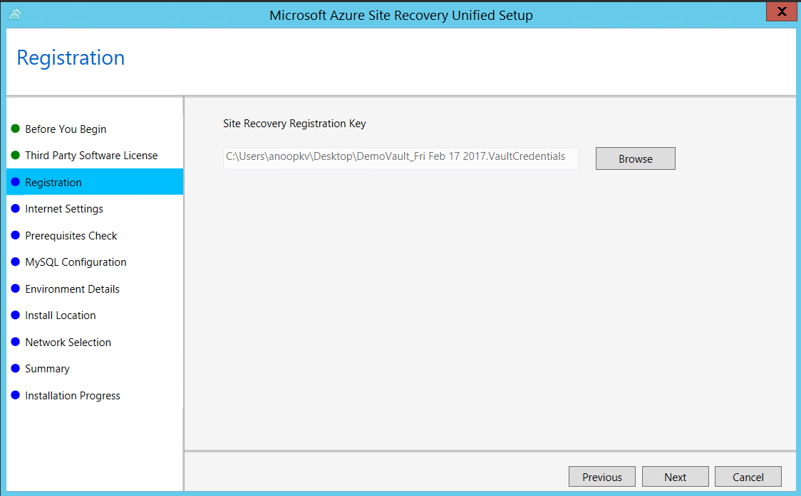
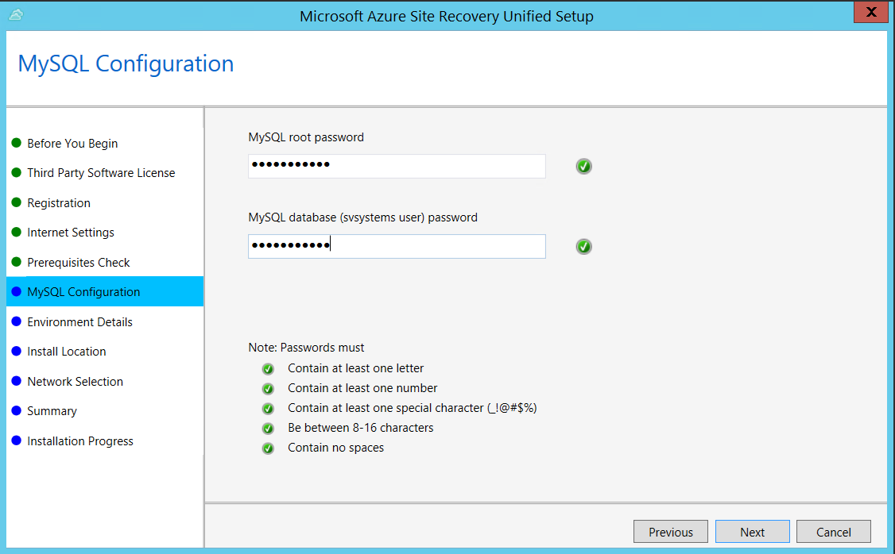
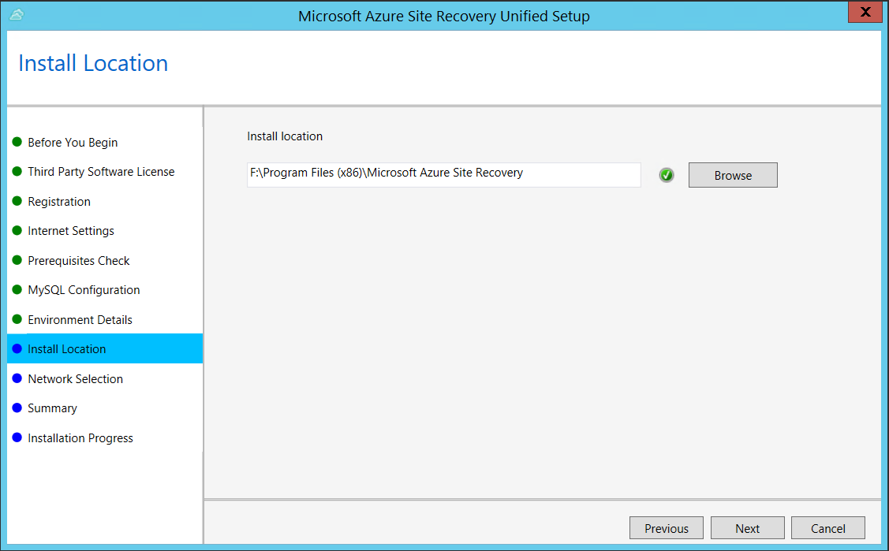
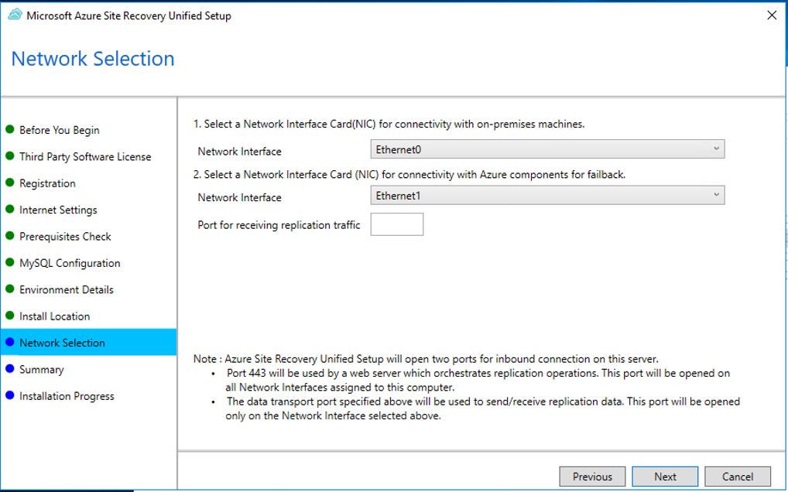
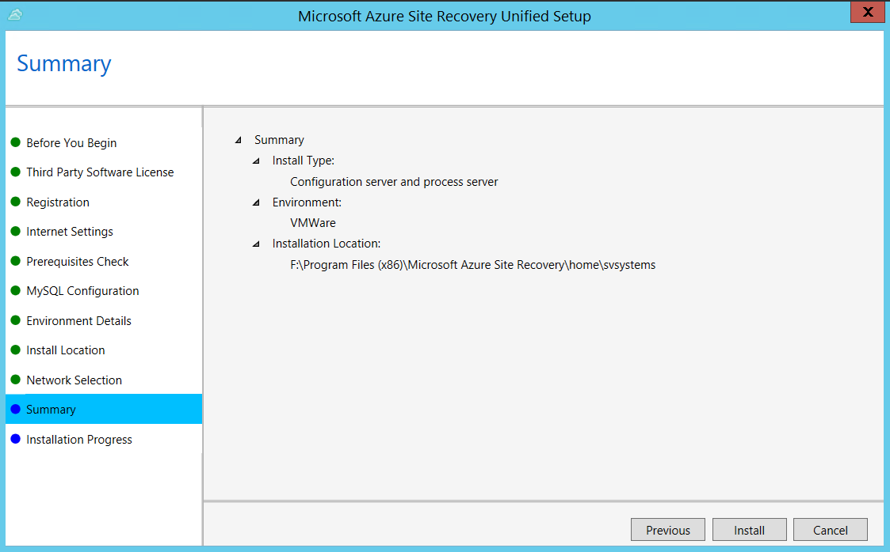

1. Run the Unified Setup installation file.
2. In **Before You Begin**, select **Install the configuration server and process server**.

	

3. In **Third Party Software License**, click **I Accept** to download and install MySQL.

    
4. In **Registration**, select the registration key you downloaded from the vault.

    
5. In **Internet Settings**, specify how the Provider running on the configuration server connects to Azure Site Recovery over the Internet. Make sure you've allowed the required URLs.

    - If you want to connect with the proxy that's currently set up on the machine, select **Connect to Azure Site Recovery using a proxy server**.
    - If you want the Provider to connect directly, select **Connect directly to Azure Site Recovery without a proxy server**.
    - If the existing proxy requires authentication, or if you want to use a custom proxy for the Provider connection, select **Connect with custom proxy settings**, and specify the address, port, and credentials.
     
6. In **Prerequisites Check**, Setup runs a check to make sure that installation can run. If a warning appears about the **Global time sync check**, verify that the time on the system clock (**Date and Time** settings) is the same as the time zone.

    
7. In **MySQL Configuration**, create credentials for logging on to the MySQL server instance that is installed.

    
8. In **Environment Details**, select No if you're replicating Azure Stack VMs or physical servers. 
9. In **Install Location**, select where you want to install the binaries and store the cache. The drive you select must have at least 5 GB of disk space available, but we recommend a cache drive with at least 600 GB of free space.

    
10. In **Network Selection**, specify the listener (network adapter and SSL port) on which the configuration server sends and receives replication data. Port 9443 is the default port used for sending and receiving replication traffic, but you can modify this port number to suit your environment's requirements. In addition to the port 9443, we also open port 443, which is used by a web server to orchestrate replication operations. Do not use port 443 for sending or receiving replication traffic.

    

11. In **Summary**, review the information and click **Install**. When installation finishes, a passphrase is generated. You will need this when you enable replication, so copy it and keep it in a secure location.

	

After registration finishes, the server is displayed on the **Settings** > **Servers** blade in the vault.
