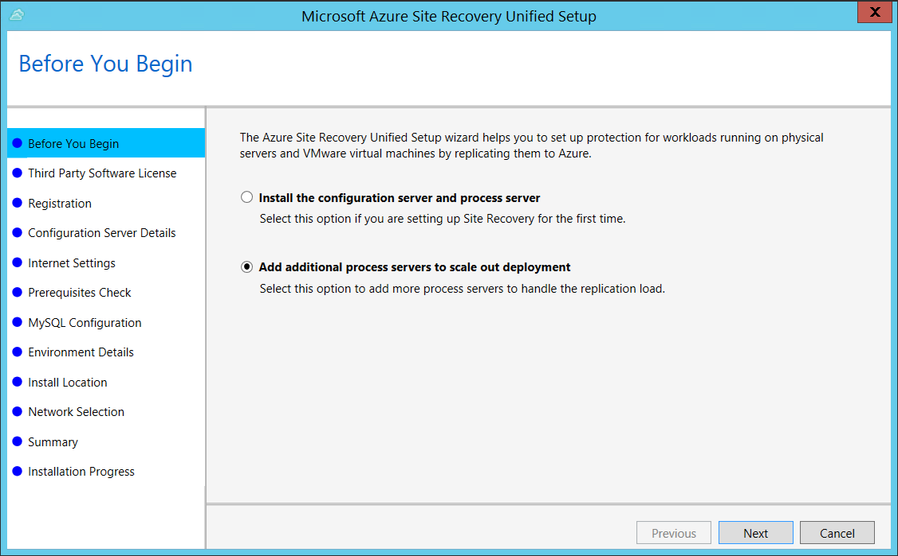
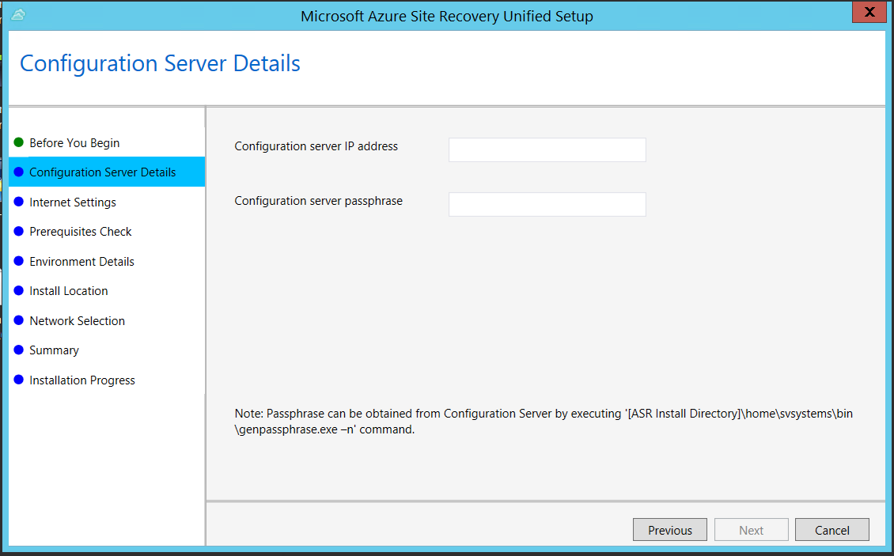
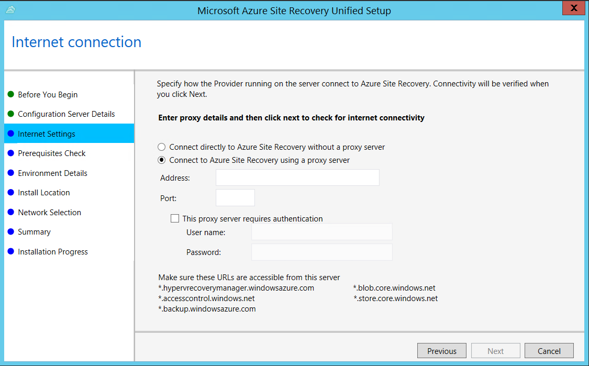
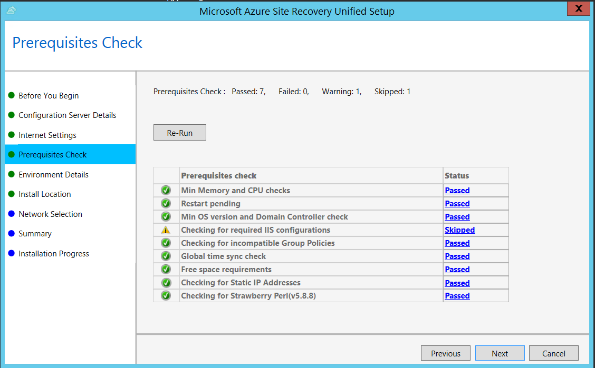
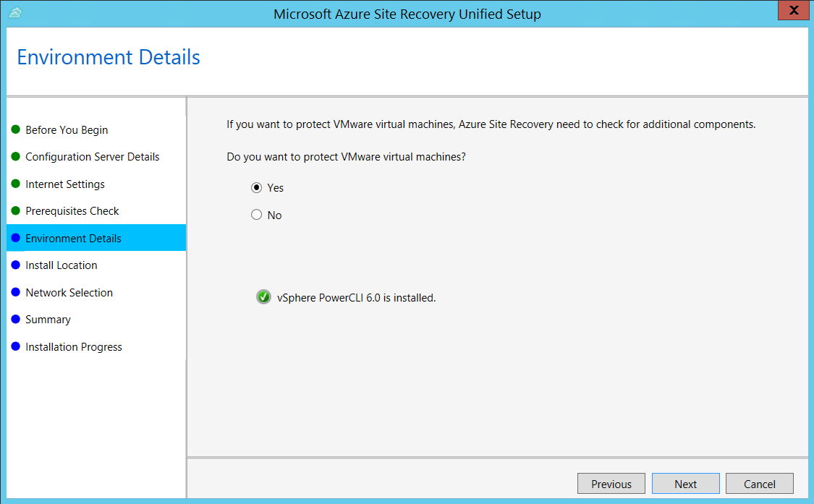
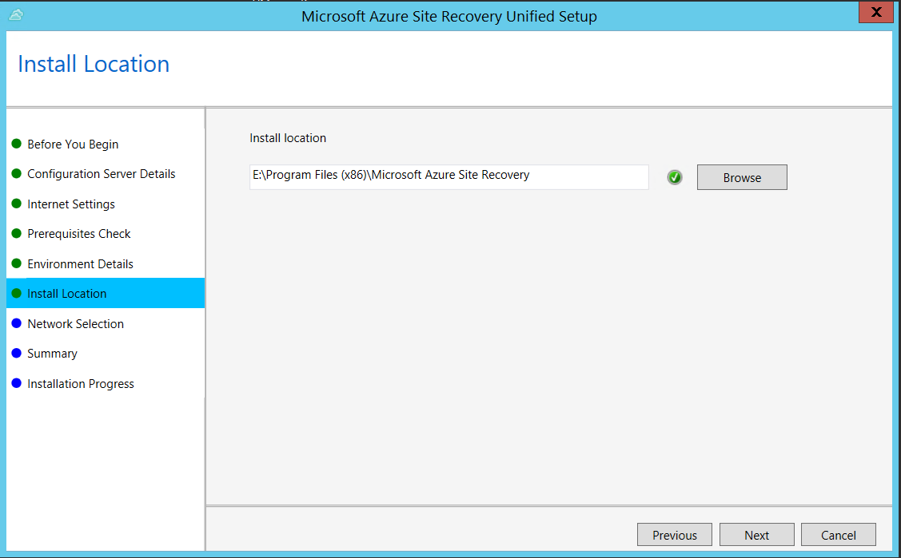
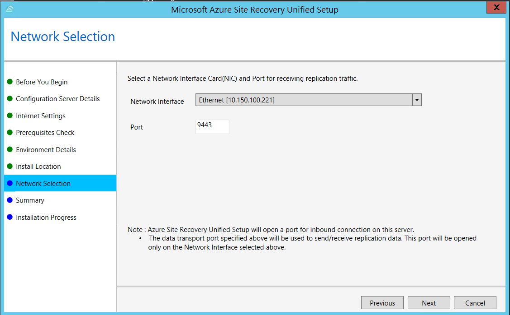
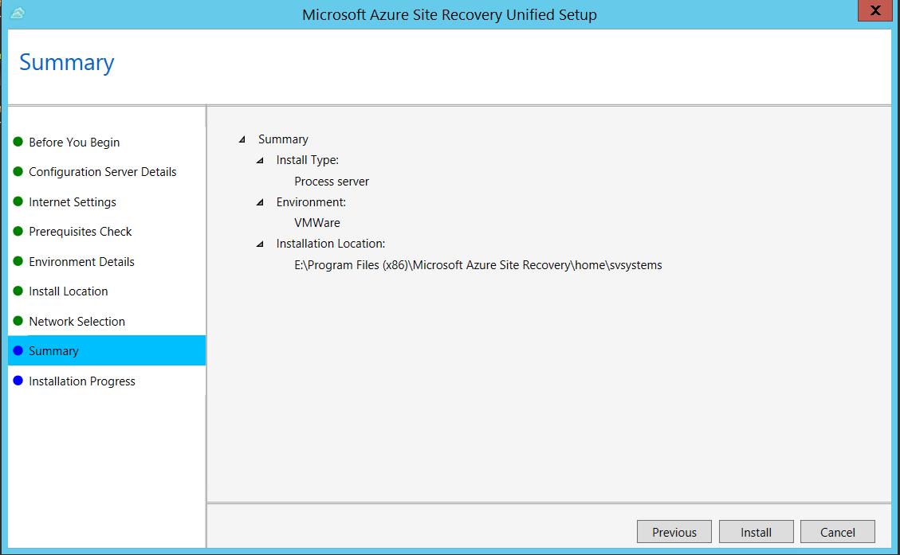

1. Launch the Azure Site Recovery UnifiedSetup.exe
2. In **Before you begin**, select **Add additional process servers to scale out deployment**.

   

3. In **Configuration Server Details**, specify the IP address of the Configuration Server, and the passphrase.

   
4. In **Internet Settings**, specify how the Provider running on the Configuration Server connects to Azure Site Recovery over the Internet.

   

   * If you want to connect with the proxy that's currently set up on the machine, select **Connect with existing proxy settings**.
   * If you want the Provider to connect directly, select **Connect directly without a proxy**.
   * If the existing proxy requires authentication, or if you want to use a custom proxy for the Provider connection, select **Connect with custom proxy settings**.

     * If you use a custom proxy, you need to specify the address, port, and credentials.
     * If you're using a proxy, you should have already allowed access to the service urls.

5. In **Prerequisites Check**, Setup runs a check to make sure that installation can run. If a warning appears about the **Global time sync check**, verify that the time on the system clock (**Date and Time** settings) is the same as the time zone.

     

6. In **Environment Details**, select whether you're going to replicate VMware VMs. If you are, then setup checks that PowerCLI 6.0 is installed.

     

7. In **Install Location**, select where you want to install the binaries and store the cache. The drive you select must have at least 5 GB of disk space available, but we recommend a cache drive with at least 600 GB of free space.
     

8. In **Network Selection**, specify the listener (network adapter and SSL port) on which the Configuration Server sends and receives replication data. Port 9443 is the default port used for sending and receiving replication traffic, but you can modify this port number to suit your environment's requirements. In addition to the port 9443, we also open port 443, which is used by a web server to orchestrate replication operations. Do not use Port 443 for sending or receiving replication traffic.

     
9. In **Summary**, review the information and click **Install**. When installation finishes, a passphrase is generated. You will need this when you enable replication, so copy it and keep it in a secure location.

     
