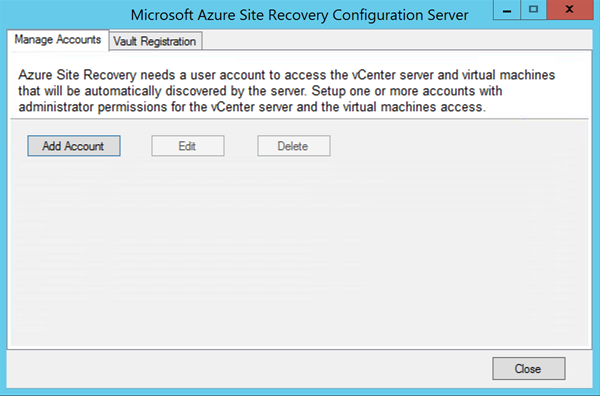

1. On your configuration server, launch CSPSConfigtool.exe. It is available as a shortcut on the desktop and located in the *install location*\home\svsystems\bin folder.
2. Click **Manage Accounts** > **Add Account**.

    
3. In **Account Details**, add the account that will be used for automatic discovery.

    

	> [!Note]
  > It can take 15 minutes or more for the account name to appear in the portal. To update immediately, click **Configuration Servers** > ***server name*** > **Refresh Server**.
