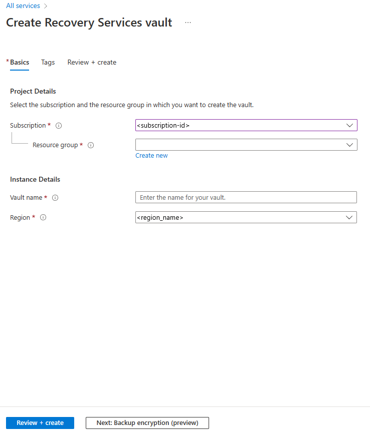

1. Sign in to the [Azure portal](https://portal.azure.com) > **Recovery Services**.
2. Click **Create a resource** > **Monitoring + Management** > **Backup and Site Recovery**.
3. In **Name**, specify a friendly name to identify the vault. If you have more than one
   subscription, select the appropriate one.
4. [Create a resource group](../articles/azure-resource-manager/templates/deploy-portal.md),
   or select an existing one. Specify an Azure region. 
5. To quickly access the vault from the dashboard, click **Pin to dashboard** > **Create**.

   

   The new vault will appear on the **Dashboard** > **All resources**, and on the main **Recovery Services vaults** page.
