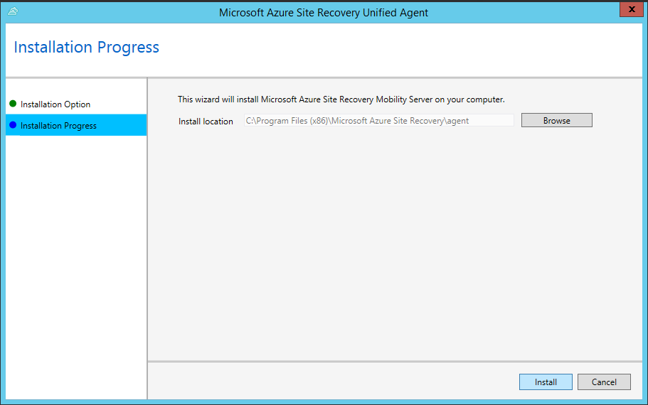
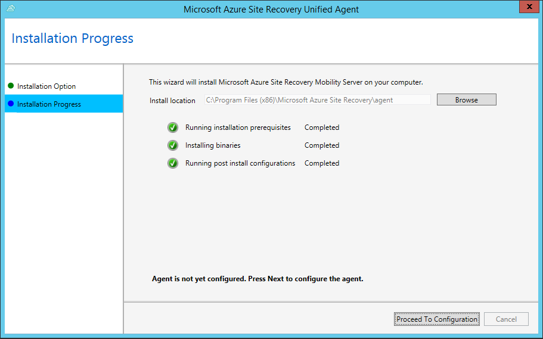

1. Copy the installation to the server, and then open the installer.
2. On the **Installation Option** blade, select **Install Mobility Service**.

    
3. Select the install location  and click **Install** to being the installation procedure.

    
4. You can use **Installation Progress** page to monitor the installer's progress.
    

5. Once installation is complete, click the **Proceed to Configuration** button to register the Mobility Service with your Configuration server.
    

6. Click on the **Register** button to complete the registration.
    
