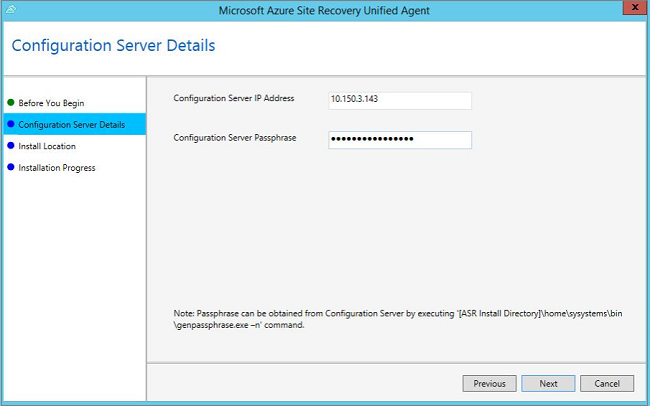

1. Copy the installation to the server, and then open the installer.
2. On the **Before You Begin** blade, select **Install Mobility Service**.

    
3. On the **Configuration Server Details** blade, enter the IP address and passphrase of the configuration server.

    
4. On the **Install Location** blade, keep the default settings, and then select **Next** to begin the installation.
5. On the **Installation Progress** blade, monitor the installation. If prompted, restart the computer. After the service is installed, it can take about 15 minutes for the status to update in the Azure portal.

