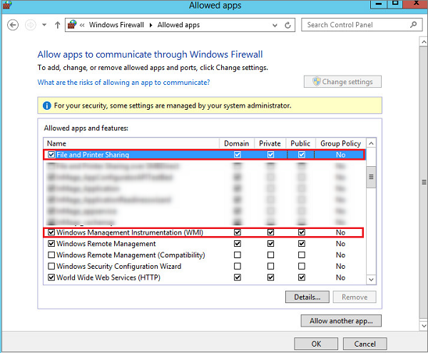

### Install the Mobility service
The first step in enabling protection for virtual machines and physical servers is to install the Mobility service. You can do this in a couple of ways:

* **Process server push**: When you enable replication on a machine, push and install the Mobility service component from the process server. 
*Note* that push installation won't occur if machines are already running an up-to-date version of the component.
* **Enterprise push**: Automatically install the component using your enterprise push process such as WSUS or System Center Configuration Manager or [Azure Automation and Desired State configuration](site-recovery-automate-mobility-service-install.md). Set up the configuration server before you do this.
* **Manual installation**: Install the component manually on each machine that you want to replicate. Set up the configuration server before you do this.

#### Prepare for automatic push on Windows machines
Here's how to prepare Windows machines so that the Mobility service can be automatically installed by the process server.

1. Create an account that can be used by the process server to access the machine. The account should have administrator privileges (local or domain), and is only used for the push installation.

   > [!NOTE]
   > If you're not using a domain account, you need to disable Remote User Access control on the local machine. To do this, in the register under HKEY_LOCAL_MACHINE\SOFTWARE\Microsoft\Windows\CurrentVersion\Policies\System add the DWORD entry LocalAccountTokenFilterPolicy with a value of 1. To add the registry entry from a CLI type **`REG ADD HKEY_LOCAL_MACHINE\SOFTWARE\Microsoft\Windows\CurrentVersion\Policies\System /v LocalAccountTokenFilterPolicy /t REG_DWORD /d 1`**.
   >
   >
2. On the Windows Firewall of the machine you want to protect, select **Allow an app or feature through Firewall**. Enable **File and Printer Sharing** and **Windows Management Instrumentation**. For machines that belong to a domain, you can configure the firewall settings with a GPO.

   
3. Add the account you created:

   * Open **cspsconfigtool**. It's available as a shortcut on the desktop, and located in the [INSTALL LOCATION]\home\svsystems\bin folder.
   * In the **Manage Accounts** tab, click **Add Account**.
   * Add the account you created. After adding the account, you need to provide the credentials when you enable replication for a machine.

#### Prepare for automatic push on Linux servers
1. Make sure that the Linux machine you want to protect is supported as described in [protected machine prerequisites](#protected-machine-prerequisites). Ensure there’s network connectivity between the Linux machine and the process server.
2. Create an account that can be used by the process server to access the machine. The account should be a root user on the source Linux server, and is only used for the push installation.

   * Open **cspsconfigtool**. It's available as a shortcut on the desktop, and located in the [INSTALL LOCATION]\home\svsystems\bin folder.
   * In the **Manage Accounts** tab, click **Add Account**.
   * Add the account you created. After adding the account, you need to provide the credentials when you enable replication for a machine.
3. Check that the /etc/hosts file on the source Linux server contains entries that map the local hostname to IP addresses associated with all network adapters.
4. Install the latest openssh, openssh-server, openssl packages on the machine you want to replicate.
5. Ensure SSH is enabled and running on port 22.
6. Enable SFTP subsystem and password authentication in the sshd_config file as follows:

   * Log in as root.
   * In the file /etc/ssh/sshd_config file, find the line that begins with **PasswordAuthentication**.
   * Uncomment the line and change the value from **no** to **yes**.
   * Find the line that begins with **Subsystem** and uncomment the line.

     

### Install the Mobility Service manually
The installers are available on the Configuration server in **C:\Program Files (x86)\Microsoft Azure Site Recovery\home\svsystems\pushinstallsvc\repository**.

| Source operating system | Mobility service installation file |
| --- | --- |
| Windows Server (64 bit only) |Microsoft-ASR_UA_9.*.0.0_Windows_* release.exe |
| CentOS 6.4, 6.5, 6.6 (64 bit only) |Microsoft-ASR_UA_9.*.0.0_RHEL6-64_*release.tar.gz |
| SUSE Linux Enterprise Server 11 SP3 (64 bit only) |Microsoft-ASR_UA_9.*.0.0_SLES11-SP3-64_*release.tar.gz |
| Oracle Enterprise Linux 6.4, 6.5 (64 bit only) |Microsoft-ASR_UA_9.*.0.0_OL6-64_*release.tar.gz |

#### Install Mobility Service on a Windows Server
1. Download and run the relevant installer.
2. In **Before you begin**, select **Mobility service**.

    
3. In **Configuration Server Details**, specify the IP address of the configuration server, and the passphrase that was generated when you ran Unified Setup. You can retrieve the passphrase by running: **<SiteRecoveryInstallationFolder>\home\sysystems\bin\genpassphrase.exe –v** on the configuration server.

    
4. In **Install Location**, leave the default setting and click **Next** to begin installation.
5. In **Installation Progress**, monitor installation and restart the machine if prompted. After installing the service, it can take around 15 minutes for status to update in the portal.

#### Install Mobility Service on a Windows server using the Command prompt
1. Copy the installer to a local folder (say C:\Temp) on the server that you want to protect. The installer can be found on the configuration server, under **[Install Location]\home\svsystems\pushinstallsvc\repository**. The package for Windows Operating Systems has name similar to Microsoft-ASR_UA_9.3.0.0_Windows_GA_17thAug2016_release.exe
2. Rename this file to MobilitySvcInstaller.exe
3. Run the following command to extract the MSI installer:

    ``C:\> cd C:\Tempww
    ``C:\Temp> MobilitySvcInstaller.exe /q /xC:\Temp\Extracted``
    ``C:\Temp> cd Extracted``
    ``C:\Temp\Extracted> UnifiedAgent.exe /Role "Agent" /CSEndpoint "IP Address of Configuration Server" /PassphraseFilePath <Full path to the passphrase file>``

##### Full command-line syntax
    UnifiedAgent.exe [/Role <Agent/MasterTarget>] [/InstallLocation <Installation Directory>] [/CSIP <IP address of CS to be registered with>] [/PassphraseFilePath <Passphrase file path>] [/LogFilePath <Log File Path>] 

**Parameters**

* **/Role:** Mandatory. Specifies whether the Mobility service should be installed. Input values Agent|MasterTarget
* **/InstallLocation:** Mandatory. Specifies where to install the service.
* **/PassphraseFilePath:** Mandatory. The configuration server passphrase.
* **/LogFilePath:** Mandatory. Location where the installation log files should be created.

#### Uninstall the Mobility service manually
The mobility service can be uninstalled using Add Remove Programs in the Control Panel, or using this command-line instruction:
    MsiExec.exe /qn /x {275197FC-14FD-4560-A5EB-38217F80CBD1}

#### Install the Mobility Service on a Linux server
1. Copy the appropriate tar archive, based on the table above, to the Linux machine you want to replicate.
2. Open a shell program, and extract the zipped tar archive to a local path by running: `tar -xvzf Microsoft-ASR_UA_8.5.0.0*`
3. Create a passphrase.txt file in the local directory to which you extracted the contents of the tar archive. To do this, copy the passphrase from C:\ProgramData\Microsoft Azure Site Recovery\private\connection.passphrase on the configuration server, and save it in passphrase.txt by running *`echo <passphrase> >passphrase.txt`* in shell.
4. Install the Mobility service by running *`sudo ./install -t both -a host -R Agent -d /usr/local/ASR -i <IP address> -p <port> -s y -c https -P passphrase.txt`*.
5. Specify the internal IP address of the configuration server, and make sure port 443 is selected. After installing the service it can take around 15 minutes for status to update in the portal.

**You can also install from the command-line**:

Copy the passphrase from C:\Program Files (x86)\InMage Systems\private\connection on the configuration server, and save it as "passphrase.txt" on the configuration server. Then run these commands. In our example, the configuration server IP address is 104.40.75.37 and the HTTPS port should be 443:

To install on a production server:

    ./install -t both -a host -R Agent -d /usr/local/ASR -i 104.40.75.37 -p 443 -s y -c https -P passphrase.txt

To install on the master target server:

    ./install -t both -a host -R MasterTarget -d /usr/local/ASR -i 104.40.75.37 -p 443 -s y -c https -P passphrase.txt

