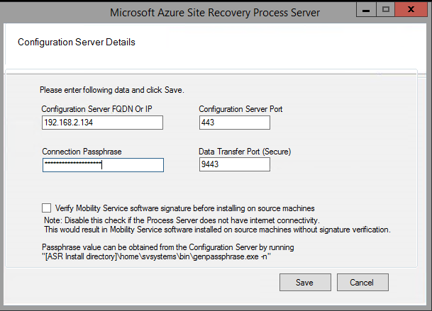

1. Establish a Remote Desktop Connection to the machine running the process server. 
2. Run cspsconfigtool.exe to start the Azure Site Recovery Process Server configuration tool.
    - The tool is launched automatically the first time you sign into the process server.
    - If it doesn't open automatically, click its shortcut on the desktop.

3. In **Configuration server FQDN or IP**, specify the name or IP address of the configuration server with which to register the process server.
4. In **Configuration Server Port**, ensure that 443 is specified. This is the port on which the configuration server listens for requests.
5. In **Connection Passphrase**, specify the passphrase that you specified when you set up the configuration server. To find the passphrase:
    -  On the configuration server, navigate to the Site Recovery installation folder **\home\svssystems\bin\**:
    ```
    cd %ProgramData%\ASR\home\svsystems\bin
    ```
    - Run the below command to print out the current passphrase:
    ```
    genpassphrase.exe -n
    ```

6. In **Data Transfer Port**, leave the default value unless you've specified a custom port.

7. Click **Save** save the settings, and register the process server.

    
    
