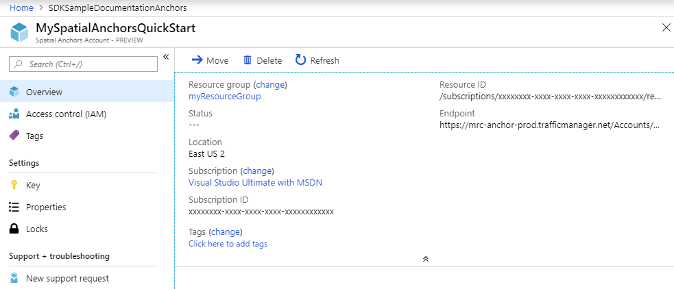

## Create a Spatial Anchors resource

Go to the <a href="https://portal.azure.com" target="_blank">Azure portal</a>.

In the left navigation pane in the Azure portal, select **Create a resource**.

Use the search box to search for **Spatial Anchors**.

   

Select **Spatial Anchors**. In the dialog box, select **Create**.

In the **Spatial Anchors Account** dialog box:

- Enter a unique resource name, using regular alphanumeric characters.
- Select the subscription that you want to attach the resource to.
- Create a resource group by selecting **Create new**. Name it **myResourceGroup** and select **OK**.
      [!INCLUDE [resource group intro text](resource-group.md)]
- Select a location (region) in which to place the resource.
- Select **New** to begin creating the resource.

   

After the resource is created, Azure Portal will show that your deployment is complete. Click **Go to resource**.

Then, you can view the resource properties. Copy the resource's **Account ID** value into a text editor because you'll need it later.

   

Under **Settings**, select **Key**. Copy the **Primary key** value into a text editor. This value is the `Account Key`. You'll need it later.

   
