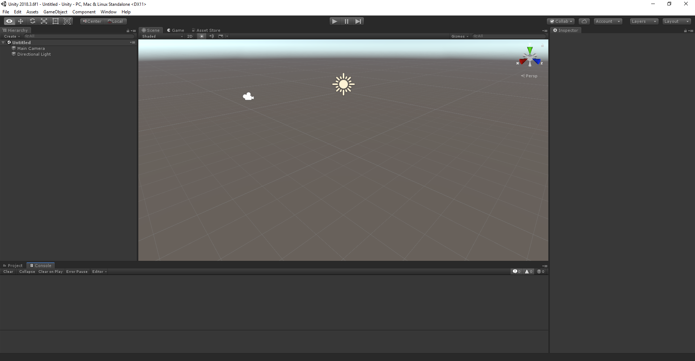

In Unity, open the project in the `Unity` folder. Unity might prompt you about a different Unity version between the project and the one you've installed on your machine. This warning is okay, as long as your version of Unity Editor is newer than the one the project was created with. In that case, just click **Continue**. If your Unity Editor version is older than the one the project needs, click **Quit**, and upgrade your Unity Editor.

