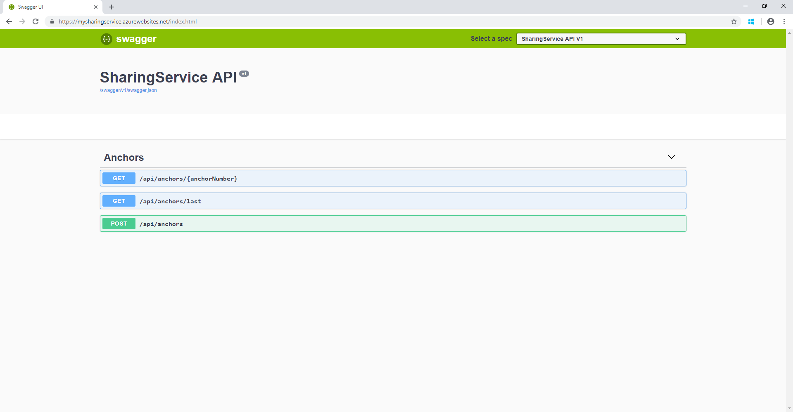

### Open the publish wizard

In **Solution Explorer**, right-click the **SharingService** project and select **Publish**.

The Publish Wizard starts. Select **App Service** > **Publish** to open the **Create App Service** dialog box.

### Sign in to Azure

In the **Create App Service** dialog box, select **Add an account** and sign in to your Azure subscription. If you're already signed in, select the account you want from the drop-down list.

> [!NOTE]
> If you're already signed in, don't select **Create** yet.
>

### Create a resource group

[!INCLUDE [resource group intro text](resource-group.md)]

Next to **Resource Group**, select **New**.

Name the resource group **myResourceGroup** and select **OK**.

### Create an App Service plan

[!INCLUDE [app-service-plan](app-service-plan.md)]

Next to **Hosting Plan**, select **New**.

In the **Configure Hosting Plan** dialog box, use these settings:

| Setting | Suggested value | Description |
|-|-|-|
|App Service Plan| MySharingServicePlan | Name of the App Service plan. |
| Location | West US | The datacenter where the web app is hosted. |
| Size | Free | The [pricing tier](https://azure.microsoft.com/pricing/details/app-service/?ref=microsoft.com&utm_source=microsoft.com&utm_medium=docs&utm_campaign=visualstudio) that determines hosting features. |

Select **OK**.

### Create and publish the web app

In **App Name**, enter a unique app name (valid characters are `a-z`, `0-9`, and `-`), or accept the automatically generated unique name. The URL of the web app is `https://<app_name>.azurewebsites.net`, where `<app_name>` is your app name.

Select **Create** to start creating the Azure resources.

After the wizard finishes, it publishes the ASP.NET Core web app to Azure and then opens the app in your default browser.

The app name you used in this section is used as the URL prefix in the format `https://<app_name>.azurewebsites.net`. Take note of this URL because you'll need it.
