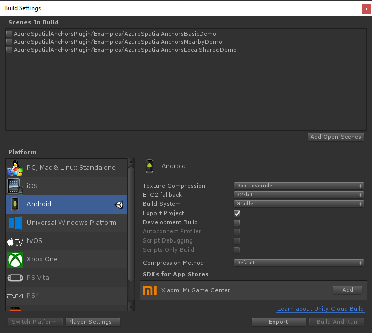

Open **Build Settings** by selecting **File** > **Build Settings**.

In the **Platform** section, select **Android**, and then select **Switch Platform** to change the platform to **Android**. Unity might prompt you to install Android support components if they're missing.  

     

Close the **Build Settings** window.

