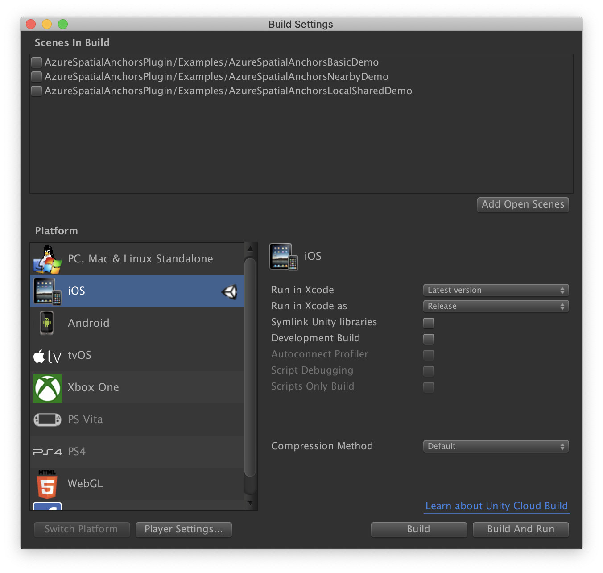

Open **Build Settings** by selecting **File** > **Build Settings**.

In the **Platform** section, select **iOS**.

Select **Switch Platform** to change the platform to **iOS**. Unity might prompt you to install iOS support components if they're missing.

Close the **Build Settings** window.

